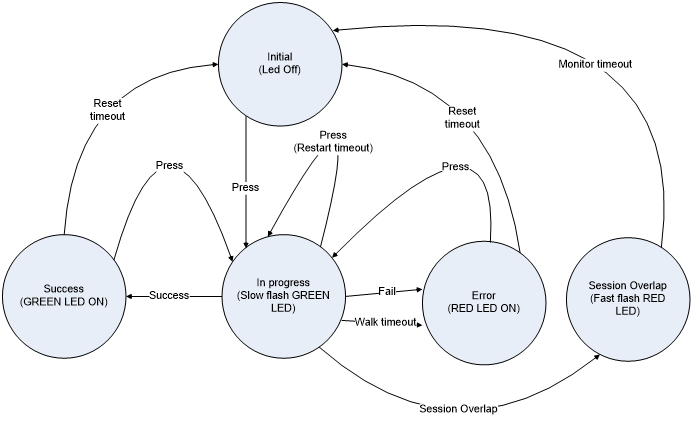

# Residential Gateway Requirements {#req:requirements .new-file .new-page}

## GEN -- General Device Requirements {#req:gen .new-file}

### GEN.DESIGN -- Design {#req:gen.design}

::: {.list-table .requirements-table widths=20,80} :::

* - ID
  - Requirement

* - [GEN.DESIGN.1]{#req:}
  - The RG MUST be compact and have a physical profile suitable for a
    desktop.

* - [GEN.DESIGN.2]{#req:}
  - The RG SHOULD be able to be wall mounted and stand on its side.

* - [GEN.DESIGN.3]{#req:}
  - The RG MAY have the ability to be mounted horizontally or vertically.

* - [GEN.DESIGN.4]{#req:}
  - If wall mounted, the RG SHOULD be oriented so that the cabling is routed
    toward the ground in order to reduce strain on the cabling.

* - [GEN.DESIGN.5]{#req:}
  - A detachable wall-mounting bracket MAY be added to the RG.

* - [GEN.DESIGN.6]{#req:}
  - The power connector at the RG MUST be securely connected to avoid
    accidental disconnect. This means that the connector MUST be either
    secured via a clip to the box or be held in place with significant force
    so that it does not readily pull out by minor pulling on the power cord.

* - [GEN.DESIGN.7]{#req:}
  - If the power supply is external to the RG, it SHOULD be labeled with the
    RG vendor's name and the model number of the RG.

* - [GEN.DESIGN.8]{#req:}
  - If the power supply is external to the RG it SHOULD be either small
    enough, or appropriately positioned on the power cord, so as not to
    block other power outlets.

* - [GEN.DESIGN.9]{#req:}
  - If the power cable includes an AC to DC conversion brick, that brick MAY
    have a light on it.

* - [GEN.DESIGN.10]{#req:}
  - The RG MUST NOT be USB powered.

* - [GEN.DESIGN.11]{#req:}
  - The RG MUST NOT use the local phone loop for power.

* - [GEN.DESIGN.12]{#req:}
  - The model and serial number of the RG MUST be visible via external
    markings on the RG.

* - [GEN.DESIGN.13]{#req:}
  - The model and serial number of the RG MUST be visible via external
    markings on the RG packaging.

* - [GEN.DESIGN.14]{#req:}
  - If a console port used for local technician configuration is provided on
    the RG, it SHOULD NOT be physically accessible to end users (e.g. it
    should not be placed on the outside of the device).

* - [GEN.DESIGN.15]{#req:}
  - The RG MUST have a single function reset button in order to reset the
    device to the default factory settings.

:::

### GEN.OPS -- Device Operation {#req:gen.ops}

::: {.list-table .requirements-table widths=20,80} :::

* - ID
  - Requirement

* - [GEN.OPS.1]{#req:}
  - All RG firmware and associated system files MUST be pre-installed.

* - [GEN.OPS.2]{#req:}
  - The RG MUST operate 24 hours a day, 7 days a week without the need to
    reboot.

* - [GEN.OPS.3]{#req:}
  - The MTBF (Mean Time Between Failures) of the RG and operating system
    SHOULD be equal to or exceed 1 year (e.g. it should not need a reboot
    more than one time per year).

* - [GEN.OPS.4]{#req:}
  - The life expectancy of the RG SHOULD be at least seven years.

* - [GEN.OPS.5]{#req:}
  - The RG SHOULD tolerate power fluctuations and brown-outs, continuing to
    operate normally and maintaining its configuration after these events.

* - [GEN.OPS.6]{#req:}
  - The RG SHOULD be able to detect faults and reset appropriately upon
    detection.

* - [GEN.OPS.7]{#req:}
  - The RG SHOULD include sufficient non-volatile memory to accommodate
    future control and data plane protocol upgrades over a minimum of four
    years. The potential upgrades may include: initiating and terminating
    signaling protocols at IP and ATM layers; logic for packet
    classification, policing, forwarding, traffic shaping and QoS support at
    IP, Ethernet and ATM layers.

* - [GEN.OPS.8]{#req:}
  - The RG MUST preserve local configuration information during power-off
    and power interruption.

* - [GEN.OPS.9]{#req:}
  - The RG MUST complete power up in 60 seconds or less.

* - [GEN.OPS.10]{#req:}
  - The RG SHOULD be self-installable by an end user in under 20 minutes
    assuming the default configuration and mode of operation. This is the
    time from when the box is opened to when the user is using the service
    including any driver installation (assuming no network complications and
    excluding micro-filter installation and customer ordering/registration).

* - [GEN.OPS.11]{#req:}
  - Other than networking drivers (e.g. USB, wireless, etc...), other
    software or drivers MUST NOT be required on computers and other devices
    for proper and full use of the RG.

* - [GEN.OPS.12]{#req:}
  - The RG, its drivers and any packaged software SHOULD support Macintosh
    OS 8.6 and above.

* - [GEN.OPS.13]{#req:}
  - The RG, its drivers and any packaged software SHOULD support all
    Microsoft PC based operating systems that have not yet reached "End of
    Support" status (see <http://support.microsoft.com/lifecycle> for more
    details).

* - [GEN.OPS.14]{#req:}
  - The RG, its drivers and any packaged software MAY support Linux. It is
    especially desirable to do so with an open interface.

* - [GEN.OPS.15]{#req:}
  - The RG MUST preserve its configuration across firmware updates.

* - [GEN.OPS.16]{#req:}
  - All software revisions SHOULD be backward compatible with all previous
    versions. There SHOULD be no loss of existing functionality.

* - [GEN.OPS.17]{#req:}
  - Software revisions MUST NOT require service provider network changes to
    maintain proper operation of previous features.

* - [GEN.OPS.18]{#req:}
  - The RG firmware MUST be identified by a revision number. This revision
    number MUST be formatted using an X.Y.Z incremental numbering format
    where X indicates the major release number, Y indicates the minor
    release number, and Z represents the revision number (e.g. 2.4.1).

* - [GEN.OPS.19]{#req:}
  - The RG vendor SHOULD have a web site where firmware updates and
    documentation are available.

* - [GEN.OPS.20]{#req:}
  - The firmware at the RG vendor's web site SHOULD include all error
    correcting updates for the RG.

* - [GEN.OPS.21]{#req:}
  - The RG MUST NOT allow "back door" entry to the unit (e.g. there must be
    no hidden telnet or web access using secret passwords).
    
    This requirement is not intended to preclude physically secured craft
    access in accordance with [GEN.DESIGN.14](#req:).

* - [GEN.OPS.22]{#req:}
  - All firmware updates MUST be verified using security mechanisms. A
    checksum mechanism is a minimum requirement for achieving this.

* - [GEN.OPS.23]{#req:}
  - All firmware updates SHOULD be signed with a cryptographic "fingerprint"
    of at least 256 bits.

* - [GEN.OPS.24]{#req:}
  - In the event of a failure occurring during an update, the RG MUST be
    able to back off to the prior version of the firmware installed on the
    RG. That is, the prior version of the RG's firmware MUST continue to be
    useable in the event that a firmware update fails to complete.
    
    This is not a requirement for a dual image, although that is one manner
    in which this requirement might be satisfied.

:::

### GEN.NET -- Networking Protocols {#req:gen.net}

::: {.list-table .requirements-table widths=20,80} :::

* - ID
  - Requirement

* - [GEN.NET.1]{#req:}
  - The RG MUST support Ethernet (IEEE 802.3).

* - [GEN.NET.2]{#req:}
  - The RG MUST support IP Version 4.

* - [GEN.NET.3]{#req:}
  - If the RG does not support IPV6, it SHOULD be software configurable or
    upgradeable to support IP Version 6 in the future. This means that the
    processing power, memory and networking components be designed
    appropriately and be sufficiently robust to provide this support.

* - [GEN.NET.4]{#req:}
  - The RG MUST support the TCP, IP, UDP, routing and associated IETF protocols
    identified here:
    
    * RFC 768 [@RFC768] User Datagram Protocol
    
    * RFC 791 [@RFC791] Internet Protocol
    
    * RFC 792 [@RFC792] Internet Control Message Protocol
    
    * RFC 793 [@RFC793] Transmission Control Protocol
    
    * RFC 826 [@RFC826] Ethernet Address Resolution Protocol (ARP)
    
    * RFC 894 [@RFC894] Standards for the Transmission of IP Datagrams over
    Ethernet Networks
    
    * RFC 922 [@RFC922] Broadcasting Internet Datagrams in the Presence of
    Subnets
    
    * RFC 950 [@RFC950] Internet Standard Subnetting Procedure
    
    * RFC 1042 [@RFC1042] Standard for the Transmission of IP Datagrams over IEEE
    802 Networks
    
    * RFC 1112 [@RFC1112] Host Extensions for IP Multicasting
    
    * RFC 1122 [@RFC1122] Requirements for Internet Hosts - Communication Layers
    
    * RFC 1123 [@RFC1123] Requirements for Internet Hosts - Application and
    Support
    
    * RFC 1256 [@RFC1256] ICMP Router Discovery Messages (Router Specification
    only)
    
    * RFC 1812 [@RFC1812] Requirements for IP Version 4 Routers
    
    * RFC 1918 [@RFC1918] Address Allocation for Private Internets
    
    * RFC 4632 [@RFC4632] Classless Inter-domain Routing (CIDR): The Internet
    Address Assignment and Aggregation Plan
    
    IANA Directory of General Assigned Numbers
    (<http://www.iana.org/numbers.html>)

* - [GEN.NET.5]{#req:}
  - The RG MUST support IP over Ethernet.

* - [GEN.NET.6]{#req:}
  - The RG MUST support, at a minimum, a 256 MAC address table for LAN
    devices.

:::

### GEN.NETv6 -- IPv6 Networking Protocols {#req:gen.netv6}

::: {.list-table .requirements-table widths=20,80} :::

* - ID
  - Requirement

* - [GEN.NETv6.1]{#req:}
  - The RG MUST support IP Version 6, which is defined in RFC 2460 [@RFC2460].

* - [GEN.NETv6.2]{#req:}
  - The RG MUST support enabling and disabling of IPv6.

:::

## WAN -- Wide Area Networking {#req:wan .new-file .new-page}

### WAN.ATM -- WAN.ATM {#req:wan.atm}

::: {.list-table .requirements-table widths=20,80} :::

* - ID
  - Requirement

* - [WAN.ATM.1]{#req:}
  - The RG MUST support standard ATM (AAL5) payload format. Note: this
    satisfies Broadband Forum TR-101 R-371.

* - [WAN.ATM.2]{#req:}
  - The RG MUST perform AAL Segmentation and Reassembly (SAR), Convergence
    Sublayer (CS) functions and CRC check.

* - [WAN.ATM.3]{#req:}
  - The RG MUST support encapsulation of bridged Ethernet over AAL5 (without
    FCS) as described in RFC 2684 [@RFC2684].

* - [WAN.ATM.4]{#req:}
  - The RG MUST be able to use both LLC-SNAP and VC-MUX (null) encapsulation
    over AAL5 with all supported protocols. The default MUST be LLC-SNAP.

* - [WAN.ATM.5]{#req:}
  - The RG MAY support encapsulation of IP over AAL5, per RFC 2684 [@RFC2684].

* - [WAN.ATM.6]{#req:}
  - If the RG supports IP over AAL5, it MAY support classical IP according
    to RFC 2225 [@RFC2225].

* - [WAN.ATM.7]{#req:}
  - The RG MUST support ATM CoS. UBR, CBR and VBR-rt MUST be supported, as
    defined in AF-TM-0121.000 [@AF-TM-0121.000].

* - [WAN.ATM.8]{#req:}
  - VBR-nrt and UBR with per VC queuing SHOULD be supported.

* - [WAN.ATM.9]{#req:}
  - The default ATM CoS for the primary VC MUST be UBR.

* - [WAN.ATM.10]{#req:}
  - The RG SHOULD support auto configuration as defined in Broadband Forum
    TR-062 [@TR-062] and ILMI 4.0 and its extensions.

* - [WAN.ATM.11]{#req:}
  - The RG MUST always respond to ATM testing, pings and loopbacks according
    to ITU-T I.610 [@I.610] (F4, F5).

* - [WAN.ATM.12]{#req:}
  - The RG SHOULD support initiating an ATM loopback and receiving the
    reply. This satisfies Broadband Forum TR-101 R-370.

* - [WAN.ATM.13]{#req:}
  - The RG MUST provide a default CPID of all 1s (FFFF). This satisfies
    Broadband Forum TR-101 [@TR-101] R-372.

* - [WAN.ATM.14]{#req:}
  - The RG MUST support 0/35 as the default VPI/VCI for the first PVC or use
    an operator-specific configuration.

* - [WAN.ATM.15]{#req:}
  - The RG MUST be able to perform an auto search for the VPI/VCI settings
    for the first PVC based on a definable search list VPI/VCI sequence
    order.
    
    If the RG reaches a state of session establishment (e.g. IP when the RG
    is responsible for session termination) after performing the auto
    search, the default VPI/VCI settings MUST be set to the newly discovered
    values. The new default pair MUST be stored on the RG across power off
    situations. If an ATM connection cannot be established after power is
    restored, the search process starts over again.

* - [WAN.ATM.16]{#req:}
  - The RG MUST support the following default VPI/VCI auto-search list
    programmed as a factory default setting in the following sequence, or
    use an operator-specific sequence configuration:
    
    0/35, 0/38, 8/35, 0/43, 0/51, 0/59, 8/43, 8/51.
    
    This default list MUST be overwriteable via the methods discussed in
    [WAN.ATM.18](#req:).

* - [WAN.ATM.17]{#req:}
  - The RG MUST be configurable so that the auto-search mechanism can be
    disabled.

* - [WAN.ATM.18]{#req:}
  - The RG MUST allow the auto-search list to be redefined using TR-064i2
    and interfaces.

* - [WAN.ATM.19]{#req:}
  - The default VPI/VCI values for all PVCs MUST be configurable. The
    default value MUST be utilized prior to performing an auto-search but
    should exclude the default value in the auto-search.

* - [WAN.ATM.20]{#req:}
  - The RG MUST support VPI values from 0 to 255

* - [WAN.ATM.21]{#req:}
  - The RG MUST support VCI values from 32 to 65535

:::

#### WAN.ATM.MULTI -- ATM Multi-PVC {#req:wan.atm.multi}

::: {.list-table .requirements-table widths=20,80} :::

* - ID
  - Requirement

* - [WAN.ATM.MULTI.1]{#req:}
  - The RG MUST support eight PVCs. This is in addition to support for any
    implemented ATM UNI control path PVCs (e.g. ILMI auto-configuration PVC,
    etc.).

* - [WAN.ATM.MULTI.2]{#req:}
  - The RG MUST allow the protocol stack (e.g. IP over Ethernet, PPPoE,
    PPPoA, etc.) for each provisioned PVC to be defined separately. If
    necessary, each PVC can use a different stack and set of protocols.

* - [WAN.ATM.MULTI.3]{#req:}
  - There is no default defined VPI/VCI for additional PVCs past the primary
    PVC defined in [WAN.ATM](#req:) above. The RG MUST support auto-search function
    (see [WAN.ATM.16](#req:) through 19) on all PVCs and will use the same
    auto-search sequence identified (skipping over any already in use).

* - [WAN.ATM.MULTI.4]{#req:}
  - The RG MUST NOT require the same VPI value for all supported PVCs.

* - [WAN.ATM.MULTI.5]{#req:}
  - All supported PVCs MUST be able to be active and sending/receiving
    traffic simultaneously. See requirements [LAN.FWD.9](#req:), 10, 11 and 15 for
    more details on interface selection for routing.

* - [WAN.ATM.MULTI.6]{#req:}
  - The RG MUST support the minimum ATM granularity applicable to the
    associated DSL protocol in use on a per VC and VP basis.
    
    For example, ATM granularity of 32 kbps MUST be supported for ADSL on a
    per VC and VP basis.

* - [WAN.ATM.MULTI.7]{#req:}
  - The RG MUST use the same Ethernet MAC address for all interfaces over
    the same AAL5/ATM/DSL connection.

* - [WAN.ATM.MULTI.8]{#req:}
  - The RG MUST support multiple levels of CoS simultaneously across
    separate VCCs (e.g. UBR for PVC 0/35 and CBR for PVC 0/43 where both
    PVCs are active simultaneously).

:::

### WAN.CONNECT -- Connection Establishment {#req:wan.connect}

*Note that this module applies to IPv6 connections as well as IPv4, but
only if the RG has an IPv6 stack.*

::: {.list-table .requirements-table widths=20,80} :::

* - ID
  - Requirement

* - [WAN.CONNECT.1]{#req:}
  - The RG MUST support an "always on" mode for connections. In this mode
    the RG MUST NOT time out connection sessions (ATM, IP and PPP) and MUST
    automatically re-establish any sessions after disconnection, lease
    expiration or loss and restoration of power.

* - [WAN.CONNECT.2]{#req:}
  - *Moved to [WAN.CONNECT.ON-DEMAND.1](#req:) and 4*

* - [WAN.CONNECT.3]{#req:}
  - The RG MUST support a "manual connect" option for connections. In this
    mode the connection to the broadband network is initiated manually
    through the Web GUI or via
    
    TR-064i2 request and, by default, terminates only when done so
    explicitly by the user, due to a power loss or when the connection is
    lost.

* - [WAN.CONNECT.4]{#req:}
  - *Moved to [WAN.CONNECT.ON-DEMAND.6](#req:)*

* - [WAN.CONNECT.5]{#req:}
  - A manual way of disconnecting without waiting for a connection timeout
    MUST be provided.

* - [WAN.CONNECT.6]{#req:}
  - *Moved to [WAN.CONNECT.ON-DEMAND.7](#req:)*

* - [WAN.CONNECT.7]{#req:}
  - The RG MUST follow all standards required to perform an orderly tear
    down of the associated connections involved at the associated network
    levels (e.g. issue a DHCP Release message when using DHCPv4, issue LCP
    Terminate-Request/Terminate-Ack and PADT packet when using PPPoE, etc.)
    and then restart the connections.

* - [WAN.CONNECT.8]{#req:}
  - The RG MUST detect the loss of communications with a network identified
    DNS server as indicated by a failed query, and log the event.

:::

#### WAN.CONNECT.ON-DEMAND -- On-Demand Connection Establishment {#req:wan.connect.on-demand}

The On-demand Connection function applies only to IPv4 connections.
However, when IPv6 is present, its behavior must take the presence of
IPv6 into consideration as described in this module

::: {.list-table .requirements-table widths=20,80} :::

* - ID
  - Requirement

* - [WAN.CONNECT.ON-DEMAND.1]{#req:}
  - The RG MUST support a "connect on demand" option for IPv4 connections
    that run over PPP. In this mode, the connection to the broadband network
    is initiated when outbound traffic is encountered from the local LAN and
    terminated after a timeout period in which no traffic occurs.

* - [WAN.CONNECT.ON-DEMAND.2]{#req:}
  - If the PPP session only contains IPv4, then the RG MUST terminate the
    PPP session in accordance with [WAN.CONNECT.ON-DEMAND.1](#req:), and any
    associated PPPoE session (if applicable).

* - [WAN.CONNECT.ON-DEMAND.3]{#req:}
  - If the PPP session contains IPv4 and IPv6, then the RG MUST terminate
    only the IPv4 session. This is done using IPCP commands.

* - [WAN.CONNECT.ON-DEMAND.4]{#req:}
  - The RG MUST support a "connect on demand" option for IPv4 connections
    that run over Ethernet.

* - [WAN.CONNECT.ON-DEMAND.5]{#req:}
  - To determine whether a connection has IPv4 activity during a timeout
    interval, the RG MUST consider only traffic with an IPv4 ethertype.

* - [WAN.CONNECT.ON-DEMAND.6]{#req:}
  - The interval after which a connection timeout occurs MUST be able to be
    configured.

* - [WAN.CONNECT.ON-DEMAND.7]{#req:}
  - A default timeout of 20 minutes SHOULD be used for connection timeouts
    or use an operator-specific configuration.

* - [WAN.CONNECT.ON-DEMAND.8]{#req:}
  - If the RG has an active IPv6 connection, and does not have addresses for
    DNS recursive name servers to be accessed over IPv6, then the "connect
    on demand" option MUST be disabled.

:::

### WAN.ETHOAM -- Ethernet OAM {#req:wan.ethoam}

::: {.list-table .requirements-table widths=20,80} :::

* - ID
  - Requirement

* - [WAN.ETHOAM.1]{#req:}
  - The RG MUST support a maintenance end point (MEP) at the customer and
    access link levels on a per VLAN basis. Note: The multi-PVC case is for
    further study. This satisfies Broadband Forum TR-101 [@TR-101] R-285, R-294.

* - [WAN.ETHOAM.2]{#req:}
  - The RG MUST support a default ME level value of 5 for the customer
    level. This satisfies TR-101 [@TR-101] R-286.

* - [WAN.ETHOAM.3]{#req:}
  - The RG SHOULD support a loopback message (LBM) function at the customer
    level that can generate a multicast LBM toward its peer MEP(s). This
    satisfies TR-101 [@TR-101] R-287.

* - [WAN.ETHOAM.4]{#req:}
  - The RG MUST support a loopback reply (LBR) function at the customer
    level toward its peer MEP(s) in response to both unicast and multicast
    LBMs. This satisfies TR-101 [@TR-101] R-288.

* - [WAN.ETHOAM.5]{#req:}
  - The RG MUST support a linktrace reply (LTR) function at the customer
    level toward its peer MEP(s). This satisfies TR-101 [@TR-101] R-289.

* - [WAN.ETHOAM.6]{#req:}
  - For business customers and/or premium customers requiring proactive
    monitoring, the RG SHOULD support generating continuity check messages
    (CCMs) at the customer level. This satisfies TR-101 [@TR-101] R-290.

* - [WAN.ETHOAM.7]{#req:}
  - The RG MUST support turning off sending of CCMs at the customer level,
    while keeping the associated MEP active. This satisfies TR-101 [@TR-101] R-291.

* - [WAN.ETHOAM.8]{#req:}
  - The RG MUST support receiving AIS messages at the customer level. This
    satisfies TR-101 [@TR-101] R-292.

* - [WAN.ETHOAM.9]{#req:}
  - The RG SHOULD trigger the appropriate alarms for loss of continuity at
    the customer level. This satisfies TR-101 [@TR-101] R-293.

* - [WAN.ETHOAM.10]{#req:}
  - The RG MUST support a default ME level value of 1 for the access link
    level. This satisfies TR-101 [@TR-101] R-295.

* - [WAN.ETHOAM.11]{#req:}
  - The RG SHOULD support a loopback message (LBM) function at the access
    link level that can generate a multicast LBM toward its peer MEP(s).
    This requirement allows the RG to dynamically learn the MAC address of
    the AN MEP, and test the connectivity to that MEP. This satisfies TR-101 [@TR-101]
    R-296.

* - [WAN.ETHOAM.12]{#req:}
  - The RG MUST support a loopback reply (LBR) function at the access link
    level toward its peer MEP(s), in response to both unicast and multicast
    LBMs. This satisfies TR-101 [@TR-101] R-297.

* - [WAN.ETHOAM.13]{#req:}
  - The RG MUST issue a DHCP renewal message following a random delay
    between 1 and 30 seconds after it detects a restoration of Ethernet
    continuity at the customer ME level.

:::

### WAN.BRIDGE -- Bridging {#req:wan.bridge}

*Note that the IPv6 parts of this module apply only if the RG supports
IPv6.*

::: {.list-table .requirements-table widths=20,80} :::

* - ID
  - Requirement

* - [WAN.BRIDGE.1]{#req:}
  - The RG MUST be able to bridge IPv4 over Ethernet.

* - [WAN.BRIDGE.2]{#req:}
  - The RG MUST be a learning bridge as defined in IEEE 802.1D for all
    logical and physical Ethernet interfaces, supporting a minimum of 272
    MAC addresses.

* - [WAN.BRIDGE.3]{#req:}
  - If bridge mode is enabled for IPv4 on the RG by default for LAN
    connected devices, the RG MUST be able to support additional connections
    to a Controller for remote management addressability (using direct
    DHCPv4 or static IPv4, PPP, etc.), and connections for any locally
    terminated service that require IP (v4 or v6) addressability
    (e.g. gateway integrated voice ATA ports, etc.).
    
    Note that this special bridge mode that includes a device remote
    management session connection requires an additional WAN connection from
    the network. This requirement is considered conditional as a result of
    the network side dependency, but the RG must support this type of
    configuration.

* - [WAN.BRIDGE.4]{#req:}
  - The RG MUST be able to bridge IPv6 over Ethernet (Ethertype 0x86DD).
    This includes bridging of multicast frames.

* - [WAN.BRIDGE.5]{#req:}
  - The RG MUST be able to configure IPv6 bridging for a WAN interface,
    separate from IPv4 treatment.

* - [WAN.BRIDGE.6]{#req:}
  - The RG MUST be able to configure IPv6 bridging separately for each WAN
    interface (if there are multiple WAN interfaces).

* - [WAN.BRIDGE.7]{#req:}
  - When IPv6 bridging is enabled on a WAN interface, the RG MUST be
    configurable to act as a host on that WAN interface (doing SLAAC, etc.).
    It will not request IA_PD, since that is not a host function.

:::

### WAN.DHCPC -- DHCP Client (DHCPv4) {#req:wan.dhcpc}

::: {.list-table .requirements-table widths=20,80} :::

* - ID
  - Requirement

* - [WAN.DHCPC.1]{#req:}
  - The RG MUST be able to obtain IPv4 network information dynamically on
    its WAN interface. This information includes IPv4 address, primary and
    secondary DNS addresses and default gateway address.
    
    Dynamically obtaining IPv4 network information is accomplished using
    DHCP (v4) and / or IPCP (IPv4).

* - [WAN.DHCPC.2]{#req:}
  - If the RG is not configured to use a static IPv4 address and the RG
    fails to detect a PPPoE or DHCPv4 server, then the RG MUST set its WAN
    IPv4 address to an undefined value, in order to prevent it from
    retaining its prior IPv4 address.

* - [WAN.DHCPC.3]{#req:}
  - If a RG is functioning as a DHCPv4 client, it MUST identify itself in
    option 61 (client-identifier) in every DHCPv4 message in accordance with
    RFC 4361 [@RFC4361].

* - [WAN.DHCPC.4]{#req:}
  - For the DUID portion of option 61 in DHCPv4 as described in RFC 4361 [@RFC4361]
    , the RG MUST follow the DUID-EN format specified in ID 9.3 of RFC 3315 [@RFC3315].
    The RG MUST use Broadband Forum enterprise-number value 3561 in
    the DUID-EN enterprise-number field.
    
    For the identifier field of the DUID-EN, the RG MUST use an ASCII string
    containing the same content and formatted according to the same rules as
    defined for the HTTP username in ID 3.4.4 of TR-069 [@TR-069], if CWMP is used for
    remote management.

* - [WAN.DHCPC.5]{#req:}
  - The RG IAID value in DHCPv4 and DHCPv6 MUST be a 32 bit number encoded
    in network byte order. In cases where the RG is functioning with a
    single DHCP client identity, it MUST use value 1 for IAID for all DHCP
    interactions. IAID is defined in RFC 3315 [@RFC3315].
    
    In cases where the RG is functioning with multiple DHCP client
    identities, the values of IAID have to start at 1 for the first identity
    and be incremented for each subsequent identity. The RG's mapping of
    IAID to its physical aspects or logical configuration SHOULD be as
    non-volatile as possible. For example, the RG MAY use IAID value 1 for
    the first physical interface and value 2 for the second. Alternatively,
    the RG MAY use IAID value 1 for the virtual circuit corresponding to the
    first connection object in the data model and value 2 for the second
    connection object in the data model.

* - [WAN.DHCPC.6]{#req:}
  - The DUID-EN field value MAY be printed on the RG label.

* - [WAN.DHCPC.7]{#req:}
  - A RG functioning as a DHCPv4 client MUST identify its manufacturer OUI,
    product class, model name and serial number using vendor-specific
    options as defined in RFC 3925 [@RFC3925]. Specifically, it MUST use
    option 125.
    
    Note that with exception of ModelName, the data contained in this option
    will be redundant with what is included in the Device ID in option 61.
    However, this is desirable because these two options serve different
    purposes.
    
    The data in option 125 allows the DHCPv4 server to be pre-configured
    with policy for handling classes of devices in a certain way without
    requiring the DHCPv4 server to be able to parse the unique format used
    in client-identifier option (which can also vary in TR-181 depending on
    presence of a ProductClass value). On the other hand, the
    client-identifier serves as an opaque but predictable identifier. It is
    predictable because it is the same identifier as used by the RG for
    interactions with other services. The same identifier is used for HTTP
    authentication and in SSL client certificates.
    
    Each sub-option value to be provided in option 125 MUST be treated as a
    string encoded into binary using UTF-8. The data MUST be encapsulated in
    option 125 under enterprise code 3561 decimal (0x0DE9), corresponding to
    the IANA "ADSL Forum" entry in the Private Enterprise Numbers registry.
    A specific sub-option is defined for each value. The value must match
    the corresponding TR-181 [@TR-181] parameter
    as defined in the following table:
    
    | Sub-option | Value Description | Corresponding Device:2 parameter |
    |------------|-------------------|----------------------------------|
    | 1 | Manufacturer OUI | .DeviceInfo.ManufacturerOUI |
    | 2 | Product Class | .DeviceInfo.ProductClass |
    | 3 | Model Name | .DeviceInfo.ModelName |
    | 4 | Serial Number | .DeviceInfo.SerialNumber |
    
    If the value of a parameter is empty, the sub-option MUST be omitted.

* - [WAN.DHCPC.8]{#req:}
  - The RG MUST be able to request DHCPv4 option 42 for NTP server information as per RFC 2132 [@RFC2132].

* - [WAN.DHCPC.9]{#req:}
  - To obtain the local time zone, the RG SHOULD be able to request one of the following
    DHCPv4 options: Option 100 (PCode) or Option 101 (TCode) in accordance with RFC 4833 [@RFC4833].

:::

#### WAN.DHCPC.Force -- Force renew {#req:wan.dhcpc.force}

::: {.list-table .requirements-table widths=20,80} :::

* - ID
  - Requirement

* - [WAN.DHCPC.Force.1]{#req:}
  - The RG MUST support the use of DHCP force renew ([@RFC3203])
    for changing the configuration
    parameters or the IP address associated with an IP session.

* - [WAN.DHCPC.Force.2]{#req:}
  - The RG MUST support sending the FORCERENEW_NONCE_CAPABLE option in the
    DHCP discover and in the DHCP request messages, as per RFC 6704 [@RFC6704].

* - [WAN.DHCPC.Force.3]{#req:}
  - The RG MUST support using the Forcerenew nonce for validating DHCP
    ForceRenew messages received from the DHCP server, as per RFC 6704 [@RFC6704].

:::

#### WAN.DHCPC.BFDecho -- BFD echo {#req:wan.dhcpc.bfdecho}

::: {.list-table .requirements-table widths=20,80} :::

* - ID
  - Requirement

* - [WAN.DHCPC.BFDecho.1]{#req:}
  - The RG SHOULD support configuration of the BFD echo functionality, as
    per RFC 5881 [@RFC5881], for both IPv4 and
    IPv6.

* - [WAN.DHCPC.BFDecho.2]{#req:}
  - The RG SHOULD support sending BFD echo packet(s) on its WAN interface at
    regular intervals using a recommended default of 30s. The destination IP
    address of such packets MUST be taken from the list of IP addresses
    assigned to or via the WAN interface, including the Subnet-Router
    address of an IPv6 DHCPv6 delegated prefix.

* - [WAN.DHCPC.BFDecho.3]{#req:}
  - The RG SHOULD support receiving self-originated BFD echo packets
    addressed to its assigned address or the Subnet-Router IPv6 delegated
    prefix.

* - [WAN.DHCPC.BFDecho.4]{#req:}
  - Unless overridden by configuration, by default after a failure of 3
    successive BFD echo intervals, the RG MUST issue a DHCP renew message
    following a random jitter interval between 1 and 30 seconds.

:::

#### WAN.DHCPC.BFDKA -- BFD Keep-alive {#req:wan.dhcpc.bfdka}

::: {.list-table .requirements-table widths=20,80} :::

* - ID
  - Requirement

* - [WAN.DHCPC.BFDKA.1]{#req:}
  - RG MUST support the BFD protocol for IP Session Keep-alive. The BFD
    implementation MUST be compliant with the BFD standard as described in
    the RFC 5880 [@RFC5880] .

* - [WAN.DHCPC.BFDKA.2]{#req:}
  - BFD MUST be initiated after both the RG and the IP Edge's IP addresses
    are available on the RG.

* - [WAN.DHCPC.BFDKA.3]{#req:}
  - The RG MUST take on the Passive role during BFD session initiation.

* - [WAN.DHCPC.BFDKA.4]{#req:}
  - The RG MUST support BFD Demand mode

* - [WAN.DHCPC.BFDKA.5]{#req:}
  - The RG MUST support BFD Asynchronous mode.

* - [WAN.DHCPC.BFDKA.6]{#req:}
  - The RG MUST be able to process BFD echo packets in the data plane as
    specified in RFC 5881 [@RFC5881].

* - [WAN.DHCPC.BFDKA.7]{#req:}
  - The RG MUST be able to configure the DSCP bits of BFD packets.

* - [WAN.DHCPC.BFDKA.8]{#req:}
  - The RG MUST be able to configure the Ethernet Priority bits of BFD
    packets.

* - [WAN.DHCPC.BFDKA.9]{#req:}
  - The RG SHOULD respond to IP Edge initiated BFD polls using the same DSCP
    and Ethernet Priority values received in the packet

* - [WAN.DHCPC.BFDKA.10]{#req:}
  - The RG MUST ignore IP packets arriving on the BFD UDP port other than
    those originating on the IP Edge.

* - [WAN.DHCPC.BFDKA.11]{#req:}
  - The BFD configuration on the RG MUST be configurable using Broadband Forum TR-069 [@TR-069].

* - [WAN.DHCPC.BFDKA.12]{#req:}
  - When using BFD Demand mode, the RG MUST run an inactivity timer based on
    the Detect Interval negotiated with the IP Edge.

* - [WAN.DHCPC.BFDKA.13]{#req:}
  - When a BFD session on the RG receives a poll with a Diag code set to
    "Path Down" it MUST perform the following actions:
    
    * Transition into the Down state;
    
    * Respond to the poll with the Diag code set to 3 ("Neighbor Signaled
    BFD Session Down")
    
    * Prompt the DHCP client to transition into the Init-Reboot state for
    DHCPv4 initiated IP Sessions.
    
    * Prompt the DHCP client to send a CONFIRM message for DHCPv6 initiated
    IP Sessions.

* - [WAN.DHCPC.BFDKA.14]{#req:}
  - The RG DHCP client MUST be able to enter DHCPv4 Init-Reboot state or
    DHCPv6 Confirm state upon detecting that BFD has transitioned into
    "Down" state.

* - [WAN.DHCPC.BFDKA.15]{#req:}
  - The RG MUST use the IP Edge address as the destination for BFD Control
    packets.

* - [WAN.DHCPC.BFDKA.16]{#req:}
  - The RG MUST be able to be pre-provisioned with the following Broadband
    Forum specified default configuration:
    
    * Version (1)
    
    * Control Plane Independent (0)
    
    * Authentication Present (0)
    
    * Demand (1)
    
    * Detect Multiplier (3)
    
    * Local Discriminator (a random 32-bit value)
    
    * Desired Minimum Transmit Interval (1,000,000)
    
    * Required Minimum Receive Interval (1,000,000)
    
    * Required Minimum Echo Receive Interval (0)
    
    * State (Down)

:::

### WAN.DHCPv4 -- DHCP Client (DHCPv4) {#req:wan.dhcpv4}

#### WAN.DHCPv4.ERP -- EAP Re-authentication (ERP) for DHCPv4 {#req:wan.dhcpv4.erp}

::: {.list-table .requirements-table widths=20,80} :::

* - ID
  - Requirement

* - [WAN.DHCPv4.ERP.1]{#req:}
  - The RG MUST support the DHCP Relay Agent Information Option RFC 3046 [@RFC3046].

* - [WAN.DHCPv4.ERP.2]{#req:}
  - The RG MUST support receiving a DHCPv4 request message from a UE client,
    which includes a Parameter Request List Option requesting the DHCPv4 ERP
    Local Domain Name, i.e. the domain name of the ERP server of the local
    domain to which that client is attached. The DHCPv4 request message may
    be Discovery or Request.

* - [WAN.DHCPv4.ERP.3]{#req:}
  - If the RG has the ERP Local Domain Name from authentication server for a
    client during a previous AAA exchange, it SHOULD include it in the
    DHCPv4 LDN sub-option in a Relay Agent Information Option RFC 3046 [@RFC3046]
     and forward to the DHCPv4 server.

* - [WAN.DHCPv4.ERP.4]{#req:}
  - The RG MUST support relaying a DHCPv4 Reply Message with the DHCPv4 ERP
    Local Domain Name option from the DHCPv4 server to the client.

* - [WAN.DHCPv4.ERP.5]{#req:}
  - The RG MUST support configuration of the parameters for it to connect
    to the RADIUS or Diameter server via Web GUI or Controller extension.

:::

### WAN.DHCPv6 -- DHCP Client (DHCPv6) {#req:wan.dhcpv6}

#### WAN.DHCPv6.ERP -- EAP Re-authentication (ERP) for DHCPv6 {#req:wan.dhcpv6.erp}

::: {.list-table .requirements-table widths=20,80} :::

* - ID
  - Requirement

* - [WAN.DHCPv6.ERP.1]{#req:}
  - The RG MUST support the ERP Local Domain Name (LDN) DHCPv6 Option
    ([@RFC6440]).

* - [WAN.DHCPv6.ERP.2]{#req:}
  - The RG MUST support receiving a DHCPv6 request message from a UE client,
    which includes an Option Request option requesting the DHCPv6 ERP Local
    Domain Name option ([@RFC6440]).
    The DHCPv6 request message may be Solicit, Request, or Information
    Request.

* - [WAN.DHCPv6.ERP.3]{#req:}
  - If the RG has pre-existing knowledge of the ERP local domain name for a
    client (for example, from a previous AAA exchange), it SHOULD include it
    in an instance of the DHCPv6 ERP Local Domain Name option of the DHCPv6
    message and forward it to the DHCPv6 server as a sub-option of the
    Relay-Supplied Options option ([@RFC6422]).

* - [WAN.DHCPv6.ERP.4]{#req:}
  - The RG MUST support relaying a DHCPv6 Reply Message with the DHCPv6 ERP
    Local Domain Name option from the DHCPv6 server to the client.

* - [WAN.DHCPv6.ERP.5]{#req:}
  - The RG MUST support configuration of the parameters for it to connect to
    the RADIUS or Diameter server via Web GUI or Controller extension.

:::

### WAN.IPv6 -- IPv6 WAN Connection {#req:wan.ipv6}

::: {.list-table .requirements-table widths=20,80} :::

* - ID
  - Requirement

* - [WAN.IPv6.1]{#req:}
  - The RG MUST support automated establishment of an IPv6 connection
    according to the flow in Annex A.2.

* - [WAN.IPv6.2]{#req:}
  - The RG MUST support a dual stack of IPv4 and IPv6 running
    simultaneously, as described in section 2 of RFC 4213 [@RFC4213].

* - [WAN.IPv6.3]{#req:}
  - The RG MUST allow the IPv6 stack to be enabled / disabled.

* - [WAN.IPv6.4]{#req:}
  - The RG MUST support DHCPv6 client messages and behavior per IETF RFC
    []{} 3315. See [WAN.DHCPC.5](#req:) for further specifics on IAID value.

* - [WAN.IPv6.5]{#req:}
  - The RG MUST support the role of the CPE requesting router in RFC 3633 [@RFC3633].

* - [WAN.IPv6.6]{#req:}
  - The RG MUST support specifying in its DHCPv6 prefix delegation request
    an indication of the length of prefix it requires. If the RG supports
    multiple LANs, or has PD requests from its LAN, it MUST indicate a
    preferred prefix length that would at least enable the RG to assign a
    /64 prefix to each LAN it supports. Note that the delegated prefix may
    vary from the requested length.

* - [WAN.IPv6.7]{#req:}
  - When sending DHCPv6 messages, the RG MUST identify itself in
    OPTION_CLIENTID (1) (client-identifier) using the same client identifier
    as for IPv4 (see [WAN.DHCPC.3](#req:) and .4).

* - [WAN.IPv6.8]{#req:}
  - The RG MUST support IPv6 node requirements as a host node, per RFC 6434
    [@RFC6434].

* - [WAN.IPv6.9]{#req:}
  - The RG MUST support stateless address auto-configuration (SLAAC) as a
    host, per RFC 4862 [@RFC4862].

* - [WAN.IPv6.10]{#req:}
  - The RG MUST support receipt of route information per RFC 4191 [@RFC4191]. If the RG
    only has one WAN connection, it does not need to place this information
    in its routing table, but it does need to save it (for possible
    forwarding on the LAN interface).

* - [WAN.IPv6.11]{#req:}
  - If route information is provided (RFC 4191 [@RFC4191]) and the RG has multiple WAN
    connections, it MUST place the route information in its routing table.

* - [WAN.IPv6.12]{#req:}
  - If the RG does not have a globally-scoped address on its WAN interface
    after having been delegated a prefix, it MUST create addresses for
    itself from the delegated prefix. It MUST have at least one address and
    MAY have more.
    
    There is currently no algorithm defined for address creation. It should
    be assumed that different service providers will want different rules
    for how to create the address, how many addresses to create, and in the
    case of multiple addresses, how the different addresses are used.

* - [WAN.IPv6.13]{#req:}
  - *Requirement deleted; redundant with [WAN.IPv6.3](#req:)*

* - [WAN.IPv6.14]{#req:}
  - The RG MUST be able to request the following DHCPv6 options: IA_NA (RFC
    3315), reconfigure accept (RFC 3315 [@RFC3315]), IA_PD (RFC 3633 [@RFC3633]), and DNS_SERVERS
    ([@RFC3646]).

* - [WAN.IPv6.15]{#req:}
  - The RG SHOULD be able to request the following DHCPv6 options:
    SNTP_SERVERS ([@RFC4075]), domain search list ([@RFC3646]), and Client FQDN
    ([@RFC4704]).

* - [WAN.IPv6.16]{#req:}
  - The RG MUST be configurable as to which DHCPv6 options it requests via
    DHCPv6.

* - [WAN.IPv6.17]{#req:}
  - The connectivity parameters (obtained via RA and DHCPv6) MUST persist
    across loss of WAN connection (or lack of response from WAN connection).

* - [WAN.IPv6.18]{#req:}
  - The RG MUST continue to use the connectivity parameters (obtained via RA
    or DHCP) and consider them valid until either they expire or the RG is
    explicitly told to use different values.

* - [WAN.IPv6.19]{#req:}
  - The RG MUST NOT advertise any address prefixes on the WAN using the IPv6
    neighbor discovery protocol, or advertise itself as a default router.

* - [WAN.IPv6.20]{#req:}
  - The RG MUST provide up to 4 instances of option-data within a single
    OPTION_VENDOR_OPTS (17) (RFC 3315 [@RFC3315]) with IANA "ADSL Forum" Enterprise
    Number as the enterprise-number. Each instance will have one of the 4
    sub-options from [WAN.DHCPC.7](#req:) as the vendor-specific opt-code, with the
    corresponding value in the vendor-specific option-data. If the value of
    a parameter is empty for the RG, then the sub-option MUST be omitted. If
    there are no values to provide, the entire option MUST be omitted.

* - [WAN.IPv6.21]{#req:}
  - The RG SHOULD be able to request the following DHCPv6 options: address
    selection policy ([@RFC7078]) and DNS selection policy ([@RFC6731]).

* - [WAN.IPv6.22]{#req:}
  - If route information is provided (draft-ietf-mif-dhcpv6-route-option)
    and the RG has multiple WAN connections, it MUST place the route
    information in its routing table.

* - [WAN.IPv6.23]{#req:}
  - The RG SHOULD generate address selection policy based on policies
    obtained from each WAN link by DHCPv6 option
    (draft-ietf-6man-addr-select-opt) or manually configured policy.

* - [WAN.IPv6.24]{#req:}
  - The RG MUST be able to request DHCPv6 option OPTION_NTP_SERVER(56)
    for NTP server information as per RFC 5908 [@RFC5908].

* - [WAN.IPv6.25]{#req:}
  - To obtain the local time zone, the RG SHOULD be able to request one of the following
    DHCPv6 options: OPTION_NEW_POSIX_TIMEZONE(41) or OPTION_NEW_TZDB_TIMEZONE(42)
    in accordance with RFC 4833 [@RFC4833].

:::

### WAN.TRANS -- Transitional IPv6 WAN Connection {#req:wan.trans}

#### WAN.TRANS.6rd -- 6rd Transition Mechanism {#req:wan.trans.6rd}

::: {.list-table .requirements-table widths=20,80} :::

* - ID
  - Requirement

* - [WAN.TRANS.6rd.1]{#req:}
  - The RG MUST support the 6rd transition mechanism as described in
    RFC 5969 [@RFC5969]. This includes being able to
    configure the necessary parameters from the Controller and via DHCPv4,
    creation of the prefix, using the created prefix as a "delegated prefix"
    for purpose of including one of its /64s in RA messages, and modifying
    the IP header for traffic that goes between the WAN and LAN devices.

* - [WAN.TRANS.6rd.2]{#req:}
  - The RG MUST support enabling and disabling of the 6rd feature on the
    "default" routed IPv4 connection. 6rd is not applicable to bridged WAN
    interfaces.

* - [WAN.TRANS.6rd.3]{#req:}
  - If the RG supports configuration mechanisms other than the 6rd DHCPv4
    option 212 (user-entered, Controller configured, etc.), the RG MUST
    support 6rd in "hub and spoke" mode. 6rd in "hub and spoke" mode
    requires all IPv6 traffic to go to the 6rd border relay. In effect, this
    requirement removes the "direct connect to 6rd" route defined in section
    7.1.1 of RFC 5969 [@RFC5969].

:::

#### WAN.TRANS.DS-Lite -- Dual Stack Lite Transition Mechanism {#req:wan.trans.ds-lite}

::: {.list-table .requirements-table widths=20,80} :::

* - ID
  - Requirement

* - [WAN.TRANS.DS-Lite.1]{#req:}
  - The RG MUST support DS-Lite (RFC 6333 [@RFC6333]) with IPv4 in IPv6 encapsulation
    (RFC 2473 [@RFC2473]).

* - [WAN.TRANS.DS-Lite.2]{#req:}
  - *This requirement replaced by requirement [WAN.TRANS.DS-Lite.6](#req:).*

* - [WAN.TRANS.DS-Lite.3]{#req:}
  - The RG MUST configure a static IPv4 default route toward the DS-Lite
    tunnel.

* - [WAN.TRANS.DS-Lite.4]{#req:}
  - The RG MUST deactivate the NAPT function on the DS-Lite interface.

* - [WAN.TRANS.DS-Lite.5]{#req:}
  - The RG MUST support enabling and disabling of DS-Lite.

* - [WAN.TRANS.DS-Lite.6]{#req:}
  - The RG MUST be able to use the DHCPv6 option to retrieve the FQDN of the
    AFTR element, as defined in RFC 6334 [@RFC6334].

* - [WAN.TRANS.DS-Lite.7]{#req:}
  - Manual configuration on the RG of the FQDN or the IPv6 address of the
    AFTR element SHOULD be supported.

* - [WAN.TRANS.DS-Lite.8]{#req:}
  - Remote configuration from a Controller of the FQDN or the IPv6 address
    of the AFTR element SHOULD be supported.

* - [WAN.TRANS.DS-Lite.9]{#req:}
  - The RG MUST support configurable precedence between the FQDN and the
    IPv6 address.

* - [WAN.TRANS.DS-Lite.10]{#req:}
  - The RG MUST support configurable precedence between dynamic or static
    configuration of the IPv6 address of the AFTR element when both are
    available. The RG MUST use DHCPv6 by default or use an operator-specific
    configuration.

:::

#### WAN.TRANS.v4-release-control -- IPv6 connectivity with content-based IPv4 release control transition
mechanism {#req:wan.trans.v4-release-control}

::: {.list-table .requirements-table widths=20,80} :::

* - ID
  - Requirement

* - [WAN.TRANS.v4-release-control.1]{#req:}
  - The RG MUST provide a mechanism that monitors IPv4 session/traffic.

* - [WAN.TRANS.v4-release-control.2]{#req:}
  - The RG MUST provide a timer-based trigger for releasing an IPv4 address.

* - [WAN.TRANS.v4-release-control.3]{#req:}
  - The RG MUST provide signaling to the BNG according to RFC 1332 [@RFC1332].

* - [WAN.TRANS.v4-release-control.4]{#req:}
  - The RG MUST provide the (re)assignment of an IPv4 address inside a PPP
    session according to RFC 1332 [@RFC1332], independent of the IPv6CP status
    according to section 2.1 of RFC 4241 [@RFC4241].

* - [WAN.TRANS.v4-release-control.5]{#req:}
  - The timer that triggers the release of the IPv4 address MUST be
    configurable.

* - [WAN.TRANS.v4-release-control.6]{#req:}
  - The timer that triggers the release of the IPv4 address MUST be
    configurable from a Controller.

:::

#### WAN.TRANS.MAP-E -- IPv6 connectivity with content-based IPv4 release control transition
mechanism {#req:wan.trans.map-e}

::: {.list-table .requirements-table widths=20,80} :::

* - ID
  - Requirement

* - [WAN.TRANS.MAP-E.1]{#req:}
  - The RG MUST support mapping of address and port with encapsulation
    method (MAP-E) as specified in RFC 7597 [@RFC7597].

* - [WAN.TRANS.MAP-E.2]{#req:}
  - The RG MUST support the configuration for MAP-E operation by one or more
    methods, including Controller provided, DHCPv6 with options as specified
    in RFC 7598 [@RFC7598].

* - [WAN.TRANS.MAP-E.3]{#req:}
  - The RG MUST support the MAP-E configuration for parameters with
    consistence as specified in RFC 7598 [@RFC7598].

* - [WAN.TRANS.MAP-E.4]{#req:}
  - The RG MUST support enabling and disabling of MAP-E operation.

* - [WAN.TRANS.MAP-E.5]{#req:}
  - When performing NAT44 function, the RG MUST restrict the port assignment
    within the range per MAP-E configuration.

* - [WAN.TRANS.MAP-E.6]{#req:}
  - The RG MUST support MAP-E operation in "hub and spoke" mode by
    forwarding IPv4-in-IPv6 packets to the MAP-E BR for distribution.

* - [WAN.TRANS.MAP-E.7]{#req:}
  - The RG SHOULD be able to connect to more than one MAP-E domain.

:::

### WAN.PPP -- PPP Client {#req:wan.ppp}

::: {.list-table .requirements-table widths=20,80} :::

* - ID
  - Requirement

* - [WAN.PPP.1]{#req:}
  - The RG MUST support PPP and the associated protocols as defined in IETF
    RFCs 1332, 1334, 1661, 1877, 1994.

* - [WAN.PPP.2]{#req:}
  - Upon receipt of non-standard or unrecognized PPP extensions according to
    IETF RFCs 1570 and 2153 from the broadband network (e.g. vendor or
    proprietary), the RG MUST operate without fault.

* - [WAN.PPP.3]{#req:}
  - The RG MUST support PPPoE as defined in RFC 2516 [@RFC2516].

* - [WAN.PPP.4]{#req:}
  - The RG MUST support RFC 4638 [@RFC4638] in order to accommodate MTU/MRU values
    greater than 1492 bytes in PPPoE.

* - [WAN.PPP.5]{#req:}
  - If the RG supports ATM, the RG SHOULD support PPP over AAL5 (PPPoA) as
    defined in RFC 2364 [@RFC2364].

* - [WAN.PPP.6]{#req:}
  - The RG MUST be able to save all logins and passwords for PPP sessions
    originated by the RG. Passwords MUST NOT be available outside the RG
    (that is, they cannot be queried or displayed).

* - [WAN.PPP.7]{#req:}
  - The RG MUST NOT immediately terminate PPPoE sessions and upper layer
    protocol connections when the physical connection is lost. It should
    defer the teardown process for two minutes. If the physical connection
    is restored during that time, the RG MUST first attempt to use its
    previous PPPoE session settings. If these are rejected, then the
    original PPPoE session is to be terminated and a new PPPoE session
    attempted.

* - [WAN.PPP.8]{#req:}
  - The RG SHOULD incorporate a random timing delay prior to starting each
    IP (v4 or v6) and PPP session. This random timing delay helps to reduce
    connection failures when a group of users attempts to establish
    connections to a service provider at the same time (e.g. after power is
    restored to a neighborhood that had a blackout).

* - [WAN.PPP.9]{#req:}
  - If the RG receives an authentication failure when attempting an
    automated PPP connection attempt, it SHOULD re-try immediately to
    establish the connection. After three unsuccessful attempts, the RG
    SHOULD wait for five minutes, then repeat the connection attempt three
    times. If authentication still fails, the RG SHOULD back off to thirty
    minute intervals between groups of three attempts.

* - [WAN.PPP.10]{#req:}
  - If the RG is using the PPPoE client function actively, the RG MUST be
    able to forward PPPoE sessions initiated from LAN devices as additional
    PPPoE sessions to the WAN interface (this is sometimes known as PPPoE
    pass-through). Specifically, these LAN initiated PPPoE sessions MUST NOT
    be tunneled inside the RG's primary PPPoE client session.

* - [WAN.PPP.11]{#req:}
  - When fragmentation is required, the RG MUST fragment all PPP sessions
    that it originates on an access VC using MLPPP interleaving as defined
    in RFC 1990 [@RFC1990].

* - [WAN.PPP.12]{#req:}
  - If PPP is used, the RG MAY obtain an IPv4 subnet mask on its WAN
    interface using IPCP (IPv4) extensions. If this is done, the IPv4 subnet
    masks will be communicated with IPCP (IPv4) using the PPP IPCP (IPv4)
    option with option code 144, the length of the option being 6 and the
    mask being expressed as a 32-bit mask (e.g. 0xFFFFFF80), not as a number
    indicating the consecutive number of 1s in the mask (from 0 to 32).
    
    The learned network information MAY, but need not, be used to populate
    the LAN side embedded DHCP server for the RG.
    
    The learned network information is treated as a subnet and not as a
    collection of individual addresses. That is, the first and last
    addresses in the subnet should not be used.
    
    The IPv4 address negotiated SHOULD, but need not, be the one assigned to
    the RG.

* - [WAN.PPP.13]{#req:}
  - The RG MUST make the access concentrator name used with PPPoE
    connections available via the Web GUI, TR-064i2, and for a Controller
    for diagnostic purposes.

* - [WAN.PPP.14]{#req:}
  - The RG MUST support RFC 3544 [@RFC3544], "*IP Header Compression over PPP*".

:::

#### WAN.PPP.IPv6 -- PPP Client for establishment of IPv6 connection {#req:wan.ppp.ipv6}

::: {.list-table .requirements-table widths=20,80} :::

* - ID
  - Requirement

* - [WAN.PPP.IPv6.1]{#req:}
  - The RG MUST support IPv6 over PPP per RFC 5072 [@RFC5072] and RFC 5172 [@RFC5172].

* - [WAN.PPP.IPv6.2]{#req:}
  - The RG MUST support establishment of an IPv6 over PPPoE connection
    according to the flow in Annex A.1.

* - [WAN.PPP.IPv6.3]{#req:}
  - The RG MUST allow any particular PPP connection to be configurable for
    IPv4 only, IPv6 only, or both.

* - [WAN.PPP.IPv6.4]{#req:}
  - If the RG is configured for multiple PPPoE connections, it MUST be
    possible to configure it to use the same login and password for all, so
    that only the domain is unique per connection.

* - [WAN.PPP.IPv6.5]{#req:}
  - The RG MUST NOT tear down a shared (IPv4 and IPv6) PPP session if error
    conditions prevent only one IP stack (either IPv4 or IPv6) from working.
    The session MUST be torn down if error conditions apply to both stacks.

:::

### WAN.dot1x -- 802.1X Client {#req:wan.dot1x}

::: {.list-table .requirements-table widths=20,80} :::

* - ID
  - Requirement

* - [WAN.dot1x.1]{#req:}
  - The RG MUST support IEEE 802.1X acting as a supplicant.

* - [WAN.dot1x.2]{#req:}
  - The RG MUST be able to respond to an appropriate IEEE 802.1X request and
    provide certificate information using Extensible Authentication
    Protocol-Transport Layer Security (EAP/TLS).

* - [WAN.dot1x.3]{#req:}
  - The RG SHOULD support EAP-MD5 username and password type authentication.

* - [WAN.dot1x.4]{#req:}
  - The RG MUST support receiving IEEE 802.1X EAPOL frames with an
    individual MAC address (i.e. unicast) as well as frames with a group MAC
    address (i.e. multicast).

* - [WAN.dot1x.5]{#req:}
  - The RG MUST perform mutual authentication by authenticating certificate
    information of the requesting authenticator.

* - [WAN.dot1x.6]{#req:}
  - The RG MUST be able to store certificate information used to
    authenticate the authenticator.

* - [WAN.dot1x.7]{#req:}
  - The RG MUST be able to update the information used to validate the
    authenticator by either a firmware upgrade or via updated certificates.

* - [WAN.dot1x.8]{#req:}
  - The RG SHOULD be able to update the information used to validate the
    authenticator by updated certificates without a firmware upgrade.

* - [WAN.dot1x.9]{#req:}
  - The RG MUST be able to authenticate a minimum of eight authenticators.

* - [WAN.dot1x.10]{#req:}
  - When used with IPv4 over Ethernet and DHCPv4, if the RG already has a
    connection when receiving an IEEE 802.1X request, the RG SHOULD
    subsequently perform a DHCPv4 lease renewal upon successful 802.1X
    authentication.

* - [WAN.dot1x.11]{#req:}
  - Each RG MUST have a unique factory-installed private/public key pair and
    an embedded ITU-T X.509 version 3 / RFC 5280 [@RFC5280]
    certificate that has been signed by the RG vendor's certificate authority.

* - [WAN.dot1x.12]{#req:}
  - The RG certificate MUST have a validity period greater than the
    operational lifetime of the RG.

* - [WAN.dot1x.13]{#req:}
  - When used with IPv6 over Ethernet and DHCPv6, if the RG already has a
    connection when receiving an IEEE 802.1X request, the RG SHOULD
    subsequently perform a DHCPv6 CONFIRM upon successful 802.1X
    authentication.

:::

### WAN.DoS -- Denial of Service Prevention {#req:wan.dos}

*Note: The IPv6 parts of this module apply only if the RG has an IPv6
stack.*

::: {.list-table .requirements-table widths=20,80} :::

* - ID
  - Requirement

* - [WAN.DoS.1]{#req:}
  - The RG MUST provide denial of service (DOS) protection for itself and
    all LAN CPE including protection from ping of death, SYN flood, LAND and
    variant attacks. The extent of this protection will be limited when the
    RG is configured as a bridge in which only PPPoE traffic is bridged.
    This protection MUST be available when the RG terminates IP (v4 or v6)
    or bridges IPv4.

* - [WAN.DoS.2]{#req:}
  - The RG MUST reject packets from the WAN with source MAC addresses of
    devices on the local LAN or invalid IP (v4 or v6) addresses
    (e.g. broadcast addresses or IP (v4 or v6) addresses matching those
    assigned to the LAN segment).

* - [WAN.DoS.3]{#req:}
  - The RG MUST reject any unidentified Ethernet packets (i.e. any packet
    that is not associated with IP (v4 or v6) or PPPoE protocols).

* - [WAN.DoS.4]{#req:}
  - The RG MUST perform anti-spoofing filtering for IPv6. All IPv6 traffic
    sent to the WAN from the LAN MUST have an IPv6 source address with a
    prefix assigned to the LAN by the RG, that was delegated from the WAN
    (through DHCPv6 or configuration).

* - [WAN.DoS.5]{#req:}
  - Because the RG must perform anti-spoofing filtering for IPv6, until it
    has an IPv6 LAN prefix delegation it MUST filter all upstream IPv6
    traffic from the home.

:::

### WAN.QoS -- Quality of Service {#req:wan.qos}

*Note: The IPv6 parts of this module apply only if the RG has an IPv6
stack.*

::: {.list-table .requirements-table widths=20,80} :::

* - ID
  - Requirement

* - [WAN.QoS.1]{#req:}
  - The RG MUST support classification of WAN directed LAN traffic and
    placement into appropriate queues (or discard) based on any one or more
    of the following pieces of information:
    
    (1) destination IP (v4 or v6) address(es) with subnet mask,
    
    (2) originating IP (v4 or v6) address(es) with subnet mask,
    
    (3) source MAC address,
    
    (4) destination MAC address,
    
    (5) protocol (TCP, UDP, ICMP, IGMP, ...)
    
    (6) source TCP/UDP port and port range,
    
    (7) destination TCP/UDP port and port range,
    
    (8) IEEE 802.1Q Ethernet priority,
    
    (9) FQDN (fully qualified domain name) of WAN session,
    
    (10) Diffserv codepoint ([@RFC3260]),
    
    (11) Ethertype (IEEE 802.3) length/type field),
    
    (12) traffic handled by an ALG,
    
    (13) IEEE 802.1Q VLAN identification.
    
    (14) Wi-Fi SSID and,
    
    (15) LAN type (Ethernet, WiFi, etc.).

* - [WAN.QoS.2]{#req:}
  - The RG SHOULD support classification of WAN directed LAN traffic and
    placement into appropriate queues (or discard) based on any one or more
    of the following pieces of information:
    
    (1) packet length (note: to be used with caution to avoid re-ordering
    packets), and
    
    (2) LAN-side physical port.

* - [WAN.QoS.3]{#req:}
  - The RG MUST support the differentiated services field (DS field) in IP
    (v4 or v6) headers as defined in RFC 2474 [@RFC2474].

* - [WAN.QoS.4]{#req:}
  - The RG MUST by default recognize and provide appropriate treatment to
    packets marked with recommended Diffserv codepoints, whose values and
    behavior are defined in RFC 2474 [@RFC2474], RFC 2475 [@RFC2475],
    RFC 2597 [@RFC2597], RFC 3246 [@RFC3246], and RFC 3260 [@RFC3260].
    
    Specifically, the values shown in the DSCP column of the table below
    MUST be supported, except Cs0-7, which are optional.
    
    | **Class** | **Description** | **DSCP marking (name)** | **DSCP marking (decimal value)**
    |-----------|-----------------|-------------------------|----------------------------------|
    | EF | Realtime | ef | 46 |
    | AF4 -- in-contract | Premium class4 (in) | af41 | 34 |
    | AF4 -- out-of-contract | Premium class4 (out) | af42, af43 | 36, 38 |
    | AF3 -- in-contract | Premium class3 (in) | af31 | 26 |
    | AF3 -- out-of-contract | Premium class3 (out) | af32, af33 | 28, 30 |
    | AF2 -- in-contract | Premium class2 (in) | af21 | 18 |
    | AF2 -- out-of-contract | Premium class2 (out) | af22, af23 | 20, 22 |
    | AF1 -- in-contract | Premium class1 (in) | af11 | 10 |
    | AF1 -- out-of-contract | Premium class1 (out) | af12, af13 | 12, 14 |
    | DE/BE | Default / Best Effort | be | 0 |
    | Cs0 (optional) | Class Selector 0 | cs0 | 0 |
    | Cs1 (optional) | Class Selector 1 | cs1 | 8 |
    | Cs2 (optional) | Class Selector 2 | cs2 | 16 |
    | Cs3 (optional) | Class Selector 3 | cs3 | 24 |
    | Cs4 (optional) | Class Selector 4 | cs4 | 32 |
    | Cs5 (optional) | Class Selector 5 | cs5 | 40 |
    | Cs6 (optional) | Class Selector 6 | cs6 | 48 |
    | Cs7 (optional) | Class Selector 7 | cs7 | 56 |

* - [WAN.QoS.5]{#req:}
  - The RG MUST be able to mark or remark the Diffserv codepoint or IEEE
    802.1Q Ethernet priority of traffic identified based on any of the
    classifiers supported by the RG.

* - [WAN.QoS.6]{#req:}
  - *Requirement relocated to [WAN.QoS.VLAN.1](#req:)*

* - [WAN.QoS.7]{#req:}
  - *Requirement relocated to [WAN.QoS.VLAN.2](#req:)*

* - [WAN.QoS.8]{#req:}
  - *Requirement relocated to [WAN.QoS.VLAN.3](#req:)*

* - [WAN.QoS.9]{#req:}
  - The RG MUST support one best effort (BE) queue, one expedited forwarding
    (EF) queue and a minimum of four assured forwarding (AF) queues.

* - [WAN.QoS.10]{#req:}
  - The RG MUST duplicate the set of queues for each access session (e.g. L2
    PVC, VLAN). This can be done logically or physically.

* - [WAN.QoS.11]{#req:}
  - The RG SHOULD support the appropriate mechanism to effectively implement
    Diffserv per-hop scheduling behaviors. The RG SHOULD be able to
    configure each queue defined in [WAN.QoS.9](#req:) for strict priority or
    weighted round robin scheduling.
    
    SP queues are served with priority over all other queues. A strict
    priority scheduler is preferred for EF.
    
    WRR queues are served on the basis of configurable weights, provided
    with a mechanism to prevent starvation (WRR queue minimum bandwidth)

* - [WAN.QoS.12]{#req:}
  - The RG MUST support aggregate shaping of upstream traffic across all
    access sessions (e.g. L2 PVC, VLAN).

* - [WAN.QoS.13]{#req:}
  - The RG MUST support per-class shaping of upstream traffic.
    
    Classes are defined in [WAN.QoS.4](#req:).

* - [WAN.QoS.14]{#req:}
  - The RG MUST support the capability to fragment IP traffic on sessions
    that it originates, in order to limit the effect of large packets on
    traffic delay.

* - [WAN.QoS.15]{#req:}
  - The packet size threshold before fragmenting AF and BE packets MUST be
    configurable.

* - [WAN.QoS.16]{#req:}
  - The RG MUST handle all telephone service-related network traffic by a
    high priority queue to avoid congestion, delay, jitter, or packet loss.

* - [WAN.QoS.17]{#req:}
  - The RG MAY handle all telephone service-related network traffic by a
    dedicated WAN interface to avoid congestion, delay, jitter, or packet
    loss.

* - [WAN.QoS.18]{#req:}
  - The RG MUST provide counters in terms of dropped and emitted
    packets/bytes for each queue. Statistics SHOULD be collected from the
    time of last counter reset or on a configurable sample interval.

* - [WAN.QoS.19]{#req:}
  - The RG MUST provide information about queue occupancy in terms of
    packets and peak percentage. Statistics SHOULD be collected from the
    time of last counter reset or on a configurable sample interval.

* - [WAN.QoS.20]{#req:}
  - The RG MUST support classification of WAN-directed internally-generated
    traffic and placement into appropriate queues based on any one or more
    of the following pieces of information:
    
    (1) destination IP address(es) with subnet mask,
    
    (2) originating IP address(es) with subnet mask,
    
    (3) protocol (TCP, UDP, ICMP, ...),
    
    (4) source TCP/UDP port and port range,
    
    (5) destination TCP/UDP port and port range,
    
    (6) Diffserv codepoint ([@RFC3260]),
    
    (7) physical port, in case of voice packets.

* - [WAN.QoS.21]{#req:}
  - The RG SHOULD support classification of WAN directed internally
    generated traffic and placement into appropriate queues based on any one
    or more of the following pieces of information:
    
    (1) packet length.

* - [WAN.QoS.22]{#req:}
  - The RG MUST be able to learn classification keys (MAC address and IP
    address) through the following option of the DHCP client requests on the
    LAN that it serves:
    
    (1) DHCP Option 60 (Vendor Class ID),
    
    (2) DHCP Option 61 (Client Identifier),
    
    (3) DHCP Option 77 (User Class ID), and
    
    (4) DHCP Option 125 (Vendor Specific Information).

* - [WAN.QoS.23]{#req:}
  - The RG SHOULD be able to learn classification keys (MAC address and IP
    address) for trusted DLNA devices as they are recognized on the LAN.

:::

#### WAN.QoS.VLAN -- VLAN based QoS {#req:wan.qos.vlan}

::: {.list-table .requirements-table widths=20,80} :::

* - ID
  - Requirement

* - [WAN.QoS.VLAN.1]{#req:}
  - The RG MUST support sending the following frame types: untagged frames,
    priority-tagged frames, and VLAN-tagged frames in the upstream
    direction. This satisfies Broadband Forum TR-101 [@TR-101] R-01.

* - [WAN.QoS.VLAN.2]{#req:}
  - The RG MUST support setting the priority tag and VLAN ID values. This
    satisfies Broadband Forum TR-101 [@TR-101] R-03.

* - [WAN.QoS.VLAN.3]{#req:}
  - The RG MUST support receiving untagged and VLAN-tagged Ethernet frames
    in the downstream direction, and MUST be able to strip the VLAN tagging
    from the ones received tagged. This satisfies Broadband Forum TR-101 [@TR-101] R-04.

:::

#### WAN.QoS.TUNNEL -- Quality of Service for Tunneled Traffic {#req:wan.qos.tunnel}

This module only applies when the RG is an endpoint for a tunnel to the
WAN. This module applies to IPv6 if it is used as either the tunneled or
the tunneling protocol.

::: {.list-table .requirements-table widths=20,80} :::

* - ID
  - Requirement

* - [WAN.QoS.TUNNEL.1]{#req:}
  - The RG MUST be able to mark or remark the Diffserv codepoint of traffic
    that will be placed over a tunnel, based on classification of that
    traffic (prior to placing it on the tunnel) using any of the classifiers
    supported by the RG. This only applies when the traffic is going from
    LAN to WAN.

* - [WAN.QoS.TUNNEL.2]{#req:}
  - The RG MUST be able to mark the Diffserv codepoint of the underlying
    tunnel or the IEEE 802.1Q Ethernet priority of Ethernet that is
    transporting the tunnel, based on classification of the tunneled traffic
    using any of the classifiers supported by the RG. This only applies when
    the traffic is going from LAN to WAN.

* - [WAN.QoS.TUNNEL.3]{#req:}
  - When the RG receives tunneled traffic from the WAN, it MUST be able to
    mark or remark the Diffserv codepoint of that traffic, based on
    classification of the tunneled traffic using any of the IP-layer or
    higher layer classifiers supported by the RG.

* - [WAN.QoS.TUNNEL.4]{#req:}
  - When the RG receives tunneled traffic from the WAN, it MUST be able to
    mark the IEEE 802.1Q Ethernet priority of the LAN Ethernet frame, based
    on classification of the tunneled traffic using any of the IP-layer or
    higher layer classifiers supported by the RG.

* - [WAN.QoS.TUNNEL.5]{#req:}
  - When the RG receives tunneled traffic from the WAN, it MUST be able to
    mark or remark the Diffserv codepoint or mark the IEEE 802.1Q Ethernet
    priority of the LAN Ethernet frame, based on classification of the WAN
    Ethernet, using any of the Ethernet-layer classifiers supported by the
    RG.

* - [WAN.QoS.TUNNEL.6]{#req:}
  - When the RG receives tunneled traffic from the WAN, it SHOULD be able to
    mark or remark the Diffserv codepoint or mark the IEEE 802.1Q Ethernet
    priority of the LAN Ethernet frame, based on classification of the
    underlying tunnel, using any of the IP-layer classifiers supported by
    the RG.

:::

### WAN.IPsecClient -- IPsec VPN peer to peer {#req:wan.ipsecclient}

::: {.list-table .requirements-table widths=20,80} :::

* - ID
  - Requirement

* - [WAN.IPsecClient.1]{#req:}
  - The RG MAY support peer to peer IPSec VPN, as defined in IETF RFCs 4301,
    4303, 5996.

* - [WAN.IPsecClient.2]{#req:}
  - If the RG supports IPSec VPN, it MUST support encapsulating security
    payload (ESP), as defined in RFC 4303 [@RFC4303].

* - [WAN.IPsecClient.3]{#req:}
  - If the RG supports IPSec VPN, it MUST support the IKEv2 key exchange
    protocol as defined in RFC 5996 [@RFC5996].

* - [WAN.IPsecClient.4]{#req:}
  - If the RG supports IPSec VPN, it MUST support IPSec VPN in tunnel mode,
    which is defined in section 3.2 of [@RFC4301].

* - [WAN.IPsecClient.5]{#req:}
  - If the RG supports IPSec VPN, it MUST support dead peer detection (DPD),
    which is defined in RFC 5996 [@RFC5996].

* - [WAN.IPsecClient.6]{#req:}
  - If the RG supports IPSec VPN, it must support configuring the IPSec VPN
    via web GUI or Controller extension.

* - [WAN.IPsecClient.7]{#req:}
  - If the RG supports IPSec VPN, it MUST support that the source address in
    the IPSec is configured to be either an IP address or a TR-181 instance
    of WAN interface.

* - [WAN.IPsecClient.8]{#req:}
  - If the RG supports IPSec VPN, it MUST support that the destination
    address in the IPSec is configured to be either an IP address or a
    dynamic domain name.

* - [WAN.IPsecClient.9]{#req:}
  - If the RG supports IPSec VPN, it MUST support querying the status of
    child security associations (SA) from the Controller extension.

:::

### WAN.L2tpClient -- L2tp VPN Remote Access {#req:wan.l2tpclient}

::: {.list-table .requirements-table widths=20,80} :::

* - ID
  - Requirement

* - [WAN.L2tpClient.1]{#req:}
  - The device MAY support L2TPv2 VPN, as defined in RFC 2661 [@RFC2661].

* - [WAN.L2tpClient.2]{#req:}
  - The device SHOULD support L2TPv3 VPN, as defined in IETF RFC 3931 [@RFC3931].

* - [WAN.L2tpClient.3]{#req:}
  - If the device supports L2TP VPN, it SHOULD support L2TP Disconnect Cause
    Information, as defined in RFC 3145 [@RFC3145].

* - [WAN.L2tpClient.4]{#req:}
  - If the device supports L2TP VPN, it MUST support L2TP/IPSec VPN
    connection.

* - [WAN.L2tpClient.5]{#req:}
  - If the device supports L2TP VPN, it MUST support LNS functions, as
    defined in RFC 2661 [@RFC2661] or RFC 3931 [@RFC3931].

* - [WAN.L2tpClient.6]{#req:}
  - If the device supports L2TP VPN, it MUST support configuring the L2TP
    VPN via Web GUI or from a Controller.

:::

### WAN.PCP -- Port Control Protocol {#req:wan.pcp}

::: {.list-table .requirements-table widths=20,80} :::

* - ID
  - Requirement

* - [WAN.PCP.1]{#req:}
  - The RG MUST support Port Control Protocol (PCP) Client as specified in
    RFC 6887 [@RFC6887].

* - [WAN.PCP.2]{#req:}
  - The RG MUST support Port Control Protocol (PCP) Extension for Port Set
    Allocation as specified in RFC 7753 [@RFC7753].

* - [WAN.PCP.3]{#req:}
  - The RG MUST support configuring the PCP Client via web GUI or from a
    Controller.

* - [WAN.PCP.4]{#req:}
  - The RG MUST be able to use the DHCP option to retrieve Server name(s) as
    defined in RFC 7291 [@RFC7291].

* - [WAN.PCP.5]{#req:}
  - For the DS-Lite case, if PCP is enabled and no PCP server is configured,
    the RG MUST consider that the AFTR is the PCP server.

* - [WAN.PCP.6]{#req:}
  - The PCP client of the RG MUST support invocations from applications on
    the RG, from the Web GUI or from a Controller.

* - [WAN.PCP.7]{#req:}
  - The RG MUST embed an interworking function to ensure interworking
    between the UPnP IGD (Internet Gateway Device) used by CPE LAN devices
    in the LAN and PCP as defined in RFC 6970 [@RFC6970].

* - [WAN.PCP.8]{#req:}
  - The RG MUST embed a PCP proxy function as defined in the IETF document
    "Port Control Protocol (PCP) Proxy Function" RFC 7648 ([@RFC7648]).

* - [WAN.PCP.9]{#req:}
  - Static (i.e. configured) PCP mappings MUST be stored on the RG across
    reboot or power off situations.

:::

### WAN.TUN -- WAN Tunnel {#req:wan.tun}

::: {.list-table .requirements-table widths=20,80} :::

* - ID
  - Requirement

* - [WAN.TUN.1]{#req:}
  - The RG Should support one or more tunnel protocol, such as
    Vxlan、GRE,L2TP

:::

#### WAN.TUN.VXLAN -- VxLAN Tunnel {#req:wan.tun.vxlan}

::: {.list-table .requirements-table widths=20,80} :::

* - ID
  - Requirement

* - [WAN.TUN.VXLAN.1]{#req:}
  - The RG May support VXLAN tunnels

* - [WAN.TUN.VXLAN.2]{#req:}
  - The RG May support VXLAN tunnels using IPv4 encapsulation.

* - [WAN.TUN.VXLAN.3]{#req:}
  - The RG May support VXLAN tunnels using IPv6 encapsulation.

* - [WAN.TUN.VXLAN.4]{#req:}
  - The RG May support bridging Ethernet frames into a VXLAN tunnel.

* - [WAN.TUN.VXLAN.5]{#req:}
  - The RG May support using the LSL settings in
    Broadband Forum TR-328 [@TR-328], table 4.

* - [WAN.TUN.VXLAN.6]{#req:}
  - The RG May support static provisioning of VXLAN LSL settings

* - [WAN.TUN.VXLAN.7]{#req:}
  - The RG May support obtaining VXLAN LSL settings via DHCP

* - [WAN.TUN.VXLAN.8]{#req:}
  - Upon receiving downstream encapsulated traffic from the Network side,
    the RG May:
    
    * Decapsulate VXLAN
    
    * If the Protocol Type in IP header is UDP (0x11) and the UDP
    Destination Port is 4789, then it must process the 802.3 frame following
    the VXLAN header.
    
    * The frame should be forwarded per the MAC forwarding table, if
    matching the VNI configured for the LSL.

:::

#### WAN.TUN.L2 -- L2Tunnel {#req:wan.tun.l2}

::: {.list-table .requirements-table widths=20,80} :::

* - ID
  - Requirement

* - [WAN.TUN.L2.1]{#req:}
  - The RG May be able to retrieve the IP configuration of its network
    interface, through DHCP, outside of any tunnel

* - [WAN.TUN.L2.2]{#req:}
  - The RG May be able to be provided the configuration information of a L2
    tunnel over IP, through DHCP option 125

* - [WAN.TUN.L2.3]{#req:}
  - The RG May be able to setup a L2 tunnel over IP

* - [WAN.TUN.L2.4]{#req:}
  - The RG May be able to initiate LSL tunnel set up using information
    received from DHCP.

* - [WAN.TUN.L2.5]{#req:}
  - The RG May support GRE tunneling The RG MUST be able to be provided the
    configuration information of a L2 tunnel over IP, through DHCP option
    125

* - [WAN.TUN.L2.6]{#req:}
  - The RG May be able to setup a L2 tunnel over IP

* - [WAN.TUN.L2.7]{#req:}
  - The RG May be able to initiate LSL tunnel set up using information
    received from DHCP.

:::

## LAN -- Local Area Networking {#req:lan .new-file .new-page}

### LAN.GEN -- General LAN Protocols {#req:lan.gen}

::: {.list-table .requirements-table widths=20,80} :::

* - ID
  - Requirement

* - [LAN.GEN.1]{#req:}
  - The RG MAY support SOCKS as defined in RFC 1928 [@RFC1928] for non-ALG access
    to the public address.

* - [LAN.GEN.2]{#req:}
  - Both NetBios and zero config naming mechanisms MAY be used to populate
    the DNS tables.

* - [LAN.GEN.3]{#req:}
  - The RG MAY act as a NETBIOS master browser for that name service.

* - [LAN.GEN.4]{#req:}
  - The RG MUST support multiple subnets being used on the local LAN.

:::

### LAN.ADDRESS -- Private IPv4 Addressing {#req:lan.address}

::: {.list-table .requirements-table widths=20,80} :::

* - ID
  - Requirement

* - [LAN.ADDRESS.1]{#req:}
  - The RG MUST be able to be configured to specify alternate public and
    private subnets (without restriction) for local device addressing.

* - [LAN.ADDRESS.2]{#req:}
  - The RG MUST be able to be configured to specify the start and stop
    addresses within a subnet used for local addressing.

* - [LAN.ADDRESS.3]{#req:}
  - The RG MUST NOT use auto IP for address assignment of its LAN-side IPv4
    address.

* - [LAN.ADDRESS.4]{#req:}
  - The RG MUST allow its assigned address and netmask to be specified
    through the Web GUI, Broadband Forum TR-064i2 [@TR-064i2] interfaces and from a Controller.

* - [LAN.ADDRESS.5]{#req:}
  - If the RG is in bridged configuration and LAN-side configuration is
    enabled, the RG MUST ARP on the LAN side for the following addresses, in
    order, and assign itself the first one that is not taken: 192.168.1.254,
    192.168.1.63, and then starting from 192.168.1.253 and descending.

* - [LAN.ADDRESS.6]{#req:}
  - The RG MUST be able to assign its own WAN IPv4 address (i.e. its public
    address) to a particular LAN device, concurrent with private IPv4
    addressing being used for other LAN CPE.
    
    In this situation, one device on the LAN is given the same public IPv4
    address (through DHCP or manual configuration of the LAN CPE IPv4
    stack). Other LAN devices utilize private IPv4 addresses. The RG can
    then be configured as identified in [LAN.PFWD.2](#req:) so that the LAN device
    sharing the WAN IPv4 address receives all unidentified or unsolicited
    port traffic to any specific LAN device. If the RG is not configured in
    this manner, then only inbound traffic resulting from outbound traffic
    from the LAN CPE would be directed to that LAN CPE.
    
    The gateway identified to the LAN device must be on the same subnet as
    that associated with the WAN IPv4 address. Note that the use of the WAN
    gateway address does not guarantee this since it need not meet this
    requirement.

* - [LAN.ADDRESS.7]{#req:}
  - When operating in multiple WAN public IPv4 address mode, the RG MUST
    support up to 16 public IPv4 addresses being used by LAN devices
    (statically or dynamically issued) and whose traffic must be routed to
    and from the public IPv4 address associated with the LAN device.
    Additionally, a transparent basic NAT mapping feature MAY be supported,
    allowing the 16 public addresses to be mapped to a device's private
    address. A user configurable option in the Web GUI MUST be provided to
    enable or disable the firewall on a per public IPv4 address basis. This
    feature must operate concurrently with other LAN usage (e.g. NAPT on the
    gateway's primary IPv4 address).

* - [LAN.ADDRESS.8]{#req:}
  - When using a WAN IPv4 address assigned to a LAN device, the RG MUST be
    able to be configured by the user whether this LAN device can directly
    communicate with other devices on the local LAN without the need to
    traverse the broadband connection.
    
    This will only be done to the extent to which the RG can control
    isolation (e.g. routing and internal switch fabric). It does not extend
    to isolation external to the RG (e.g. external switch or router), which
    are beyond the control of the RG.

:::

### LAN.ADDRESSv6 -- LAN.ADDRESSv6- LAN IPv6 Addressing {#req:lan.addressv6}

::: {.list-table .requirements-table widths=20,80} :::

* - ID
  - Requirement

* - [LAN.ADDRESSv6.1]{#req:}
  - The RG MUST create a Link Local (LL) address for its LAN interface, and
    perform Duplicate Address Discovery (DAD), per RFC 4862 [@RFC4862]. It MUST always
    use the same LL address, even after reboot or power failure.

* - [LAN.ADDRESSv6.2]{#req:}
  - The RG SHOULD try alternate LL addresses, if DAD fails. The RG vendor
    can define the algorithm to be used in this case.

* - [LAN.ADDRESSv6.3]{#req:}
  - The RG MUST have a ULA prefix (RFC 4193 [@RFC4193]). It MUST always maintain the
    same prefix, even after reboot or power failure, unless this prefix is
    changed through configuration, in which case it MUST maintain the
    changed value.

* - [LAN.ADDRESSv6.4]{#req:}
  - The RG MAY allow its ULA prefix to be changed through configuration.

* - [LAN.ADDRESSv6.5]{#req:}
  - The RG MUST support the ability to enable or disable advertising a /64
    from its ULA prefix through Router Advertisement. When enabled, this /64
    will be included in RA messages, with L=1, A=1, and reasonable timer
    values.

* - [LAN.ADDRESSv6.6]{#req:}
  - The RG MUST support RFC 4861 [@RFC4861] section 6.2, Router specification
    requirements.

* - [LAN.ADDRESSv6.7]{#req:}
  - The RG MUST support configuration of the following elements of a Router
    Advertisement: M and O flags (RFC 4861 [@RFC4861]), route information ([@RFC4191]),
    and default router preference (Prf) ([@RFC4191]).

* - [LAN.ADDRESSv6.8]{#req:}
  - The RG SHOULD support configuration of the following elements of a
    router advertisement: MTU (RFC 4861 [@RFC4861]).

* - [LAN.ADDRESSv6.9]{#req:}
  - The RG MUST advertise (in RA) a /64 prefix from all prefixes delegated
    via the WAN interface. This will have L=1, A=1, and lifetimes per the
    received (from the WAN) delegation.

* - [LAN.ADDRESSv6.10]{#req:}
  - The RG SHOULD advertise DNS server using the RDNSS option in Router
    Advertisements (RFC 6106 [@RFC6106]).

:::

### LAN.DHCPS -- DHCPv4 Server {#req:lan.dhcps}

::: {.list-table .requirements-table widths=20,80} :::

* - ID
  - Requirement

* - [LAN.DHCPS.1]{#req:}
  - The RG MUST provide application layer support for host name mapping,
    booting, and management including DHCPv4 and the Domain Name System
    (DNS) protocol. This includes support for the standards below:
    
    * RFC 1034 [@RFC1034] Domain Names -- Concepts and Facilities
    
    * RFC 1035 [@RFC1035] Domain Names -- Implementation and Specification
    
    * RFC 2131 [@RFC2131] Dynamic Host Configuration Protocol
    
    * RFC 2132 [@RFC2132] DHCP Options and BOOTP Vendor Extensions
    
    * RFC 2181 [@RFC2181] Clarifications to the DNS Specification
    
    * RFC 2939 [@RFC2939] Procedures and IANA Guidelines for Definition of New
    DHCP Options and Message Types

* - [LAN.DHCPS.2]{#req:}
  - The RG MUST be a DHCPv4 server to local LAN devices, supporting all LAN
    devices.

* - [LAN.DHCPS.3]{#req:}
  - The embedded DHCPv4 server function of the RG MUST be able to operate
    while in bridged mode. The default state should be on in bridged and
    routed mode.

* - [LAN.DHCPS.4]{#req:}
  - The RG MUST support a minimum of 253 LAN devices.

* - [LAN.DHCPS.5]{#req:}
  - The RG MUST support turning off the embedded DHCPv4 server via a
    configuration change via the Web GUI, TR-064i2 interfaces and from a
    Controller.

* - [LAN.DHCPS.6]{#req:}
  - The RG MAY incorporate auto-detection of other DHCPv4 servers on the
    local LAN and, if configured to do so, disable the internal DHCPv4
    server functionality of the RG in this situation.
    
    In this situation, the RG would try to obtain a configuration for its
    LAN port through DHCPv4. If a DHCPv4 response was received, the RG would
    then use the information in the DHCPv4 response (e.g. IPv4 address,
    subnet and DNS information) and disable its internal DHCPv4 server. If
    implemented and a DHCPv4 response is received, this requirement takes
    precedence over requirement [LAN.DHCPS.15](#req:).

* - [LAN.DHCPS.7]{#req:}
  - The embedded DHCPv4 server functionality of the RG MUST verify that an
    address is not in use prior to making it available in a lease (e.g. via
    ping or ARP table validation) even when lease information shows that it
    is not in use.

* - [LAN.DHCPS.8]{#req:}
  - If the RG is in a routed configuration (i.e. full NAPT router), the RG
    MUST use the default start address 192.168.1.64 and the default stop
    address 192.168.1.253 for assignment to DHCPv4 leases for local device
    addressing, or use an operator-specific configuration.

* - [LAN.DHCPS.9]{#req:}
  - If the RG is in a routed configuration (i.e. full NAPT router), the RG
    MUST use a default netmask of 255.255.255.0 for assignment to DHCPv4
    leases for local device addressing, or use an operator-specific
    configuration.

* - [LAN.DHCPS.10]{#req:}
  - If the RG is in a bridged configuration for LAN device traffic
    (i.e. NAT/NAPT is not enabled), the RG MUST support the enabling and
    configuration of the local RG DHCPv4 server (address range and subnet
    mask) remotely from a Controller. This address range may be either
    public or private addresses (assuming that the service provider is
    providing the NAT/NAPT function in the network).
    
    Note that this assumes that a separate management IP (v4 or v6)
    interface has been established to the RG expressly for the purpose of
    CWMP or USP remote management.

* - [LAN.DHCPS.11]{#req:}
  - The default lease time for DHCPv4 information provided to LAN CPE that
    do not share the WAN side IPv4 address MUST be configurable. The default
    value MUST be 24 hours, or use an operator-specific configuration.

* - [LAN.DHCPS.12]{#req:}
  - The default lease time for DHCPv4 information provided to LAN CPE that
    share the WAN side IPv4 address MUST be configurable. The default value
    MUST be 10 minutes, or use an operator-specific configuration.

* - [LAN.DHCPS.13]{#req:}
  - When the domain name that the embedded DHCPv4 server passes to LAN CPE
    has not been set, the value "domain_not_set.invalid" SHOULD be used.

* - [LAN.DHCPS.14]{#req:}
  - If the RG is in a routed configuration (i.e. full NAPT router) and the
    RG's embedded DHCPv4 server is enabled, the RG itself MUST default to
    the address 192.168.1.254 (with a netmask of 255.255.255.0), or use an
    operator-specific configuration.

* - [LAN.DHCPS.15]{#req:}
  - When the RG's embedded DHCPv4 server is disabled, the RG MUST ARP for
    the following addresses, in order, and assign itself the first one that
    is not taken: 192.168.1.254, 192.168.1.63, and then starting from
    192.168.1.253 and descending.

* - [LAN.DHCPS.16]{#req:}
  - The RG MAY allow the embedded DHCPv4 server to be configured so that
    specific MAC addresses can be identified as being served or not served.

* - [LAN.DHCPS.17]{#req:}
  - The RG MAY allow the embedded DHCPv4 server to be configured with a
    default setting (provide IPv4 addresses or not provide IPv4 addresses)
    for devices whose MAC addresses have not been specified in accordance
    with [LAN.DHCPS.16](#req:).

* - [LAN.DHCPS.18]{#req:}
  - The embedded DHCPv4 server functionality of the RG SHOULD provide a
    mechanism by which an IPv4 address can be assigned to a particular LAN
    device by MAC address. The user interface to establish this association
    may use an alternate mechanism to identify this assignment (e.g. by
    selecting the device using its current IPv4 address or device name) and
    the MAC address may be transparent to the user. These addresses may
    include addresses within the default subnet or addresses from additional
    public/private subnets that may be provisioned.
    
    For example, the RG might have a default WAN side IPv4 address that is
    used for NAPT to a subset of devices and an additional set of WAN side
    IPv4 addresses that are bridged. The embedded DHCPv4 server might be
    used to assign this second set of IPv4 addresses to specific LAN CPE.

* - [LAN.DHCPS.19]{#req:}
  - The RG MUST support a single PC mode of operation. In this mode of
    operation only a single LAN device is supported. Note that this is not
    the default mode of operation.
    
    In this configured mode, all network traffic, except for configured
    management traffic destined for the RG itself (e.g. temporary remote
    access to the Web GUI) MUST be passed between the access network and the
    designated LAN device as if the RG was not present.
    
    One possible implementation is for the embedded DHCPv4 server to issue
    one and only one private address in this situation, with the start and
    stop addresses for the embedded DHCPv4 server being the same.
    
    The LAN devices can be assigned either a private IPv4 address
    (i.e. using 1:1 NAT) or the public IPv4 address of the RG (i.e. using IP
    pass-through as identified in requirement [LAN.ADDRESS.6](#req:)). The type of
    IPv4 address to be used (private or public) is configured through the
    Web GUI, TR-064i2 interfaces and from a Controller. The default is a
    public IPv4 address.
    
    If a WAN connection is not available when the RG is configured to use a
    public IPv4 address, the RG provides a private IPv4 address to the LAN
    device via DHCPv4. Once a WAN connection is established, the public IPv4
    address provided by the broadband network is passed to the LAN device
    during the next DHCPv4 lease renewal.
    
    The RG acts as the default gateway to the LAN devices when private IPv4
    addressing is in use. When public IPv4 addressing is in use, the gateway
    identified to the LAN device should be that identified in requirement
    [LAN.ADDRESS.6](#req:) above.
    
    No other restrictions (e.g. restricted routing for other devices) need
    to be implemented to meet this requirement (e.g. no routing restrictions
    on traffic from secondary devices on the LAN).

* - [LAN.DHCPS.20]{#req:}
  - If the RG is configured in a routed configuration (i.e. full NAPT
    router), the RG MUST operate by default in the multiple PC mode of
    operation, or use an operator-specific configuration.

:::

### LAN.DHCPv6S -- DHCPv6 Server {#req:lan.dhcpv6s}

::: {.list-table .requirements-table widths=20,80} :::

* - ID
  - Requirement

* - [LAN.DHCPv6S.1]{#req:}
  - The RG MUST support DHCPv6 server messages and behavior per RFC 3315 [@RFC3315].

* - [LAN.DHCPv6S.2]{#req:}
  - The RG MUST support and be configurable to enable/disable address
    assignment using DHCPv6.

* - [LAN.DHCPv6S.3]{#req:}
  - The RG MUST either have an algorithm or allow configuration (or both) as
    to which /64 prefix to use, from any received WAN prefixes or its own
    ULA prefix.

* - [LAN.DHCPv6S.4]{#req:}
  - The RG SHOULD be configurable to support rules as to which host devices
    will be assigned addresses through DHCPv6. That is, it should be
    possible for a service provider to place its own host devices at the
    customer premises and have the RG only support DHCPv6 address assignment
    to those devices. Note that this does not require use of the RA "M"
    flag, as the service provider host devices can be configured to always
    use DHCPv6 for address assignment. The DUID may help to identify host
    devices.

* - [LAN.DHCPv6S.5]{#req:}
  - The RG MUST be configurable to enable/disable prefix delegation via
    DHCPv6.

* - [LAN.DHCPv6S.6]{#req:}
  - The RG MUST support delegation of any received WAN prefix and its own
    ULA prefix, that is shorter than /64, using mechanisms of RFC 3633 [@RFC3633].

* - [LAN.DHCPv6S.7]{#req:}
  - The WAN / ULA prefixes that an RG is allowed to further delegate SHOULD
    be configurable.

* - [LAN.DHCPv6S.8]{#req:}
  - The RG MUST support DHCPv6 Information_request messages.

* - [LAN.DHCPv6S.9]{#req:}
  - The RG MUST support the following DHCPv6 options: IA_NA ([@RFC3315]),
    IA_PD ([@RFC3633]), and DNS_SERVERS ([@RFC3646]).

* - [LAN.DHCPv6S.10]{#req:}
  - The RG SHOULD support Reconfigure Accept ([@RFC3315]) and pass the
    additional set of DHCP options received from the DHCP client on its WAN
    interface to IPv6 hosts.

* - [LAN.DHCPv6S.11]{#req:}
  - The options that the RG will provide via DHCPv6 MUST be configurable.

* - [LAN.DHCPv6S.12]{#req:}
  - If address selection policy option is requested in a DHCPv6 request from
    hosts, the RG SHOULD advertise the generated address selection policy
    (see [WAN.IPv6.21](#req:)).

:::

### LAN.DNS -- Naming Services (IPv4 and general requirements) {#req:lan.dns}

::: {.list-table .requirements-table widths=20,80} :::

* - ID
  - Requirement

* - [LAN.DNS.1]{#req:}
  - The RG MUST be capable of acting as a DNS server to LAN devices, passing
    its address as the DNS server back to these devices in DHCPv4 requests.

* - [LAN.DNS.2]{#req:}
  - The RG SHOULD allow the user to specify that either network-learned or
    user-specified addresses be passed back to LAN devices as the DNS
    server(s) in DHCPv4 responses, instead of the RG's address.

* - [LAN.DNS.3]{#req:}
  - When the RG learns DNS name server addresses from multiple WAN
    connections, the RG MUST follow specified DNS selection policy (if one
    is configured) to make recursive queries to DNS name servers, or (if
    there is no DNS selection policy) MUST query a server on each connection
    simultaneously and provide the requesting LAN client with the first
    returned positive result from these DNS servers. A negative response
    will not be transmitted to a LAN device until all WAN DNS servers have
    either timed out or returned a negative response to a common query.
    
    Service providers may choose not to provide DNS name server addresses on
    certain connections in a multiple connection configuration.

* - [LAN.DNS.4]{#req:}
  - The RG MUST add the DNS entry "dsldevice" for its own address.

* - [LAN.DNS.5]{#req:}
  - The RG MAY support additional DNS entries, as there could be additional
    types of CPE.

* - [LAN.DNS.6]{#req:}
  - The RG MUST maintain local DNS entries for a minimum of 253 local LAN
    devices. This information can be obtained through auto discovery
    (e.g. from DHCPv4 requests, such as Client Identifier, and other
    protocol information). When unknown, the entry MUST be of the form
    "unknownxxxxxxxxxxxx" where "x" represents the MAC address of the
    associated LAN device.

* - [LAN.DNS.7]{#req:}
  - The RG SHOULD provide a manual mechanism for overriding the learned
    names of all LAN CPE except that of the RG itself.

* - [LAN.DNS.8]{#req:}
  - If the RG's DNS server is implemented as a forwarding proxy, it MUST be
    done according to the recommendations in RFC 5625 [@RFC5625].

:::

### LAN.DNSv6 -- LAN.DNSv6- Naming Services (IPv6) {#req:lan.dnsv6}

::: {.list-table .requirements-table widths=20,80} :::

* - ID
  - Requirement

* - [LAN.DNSv6.1]{#req:}
  - The RG MUST act as a DNS server for IPv6-capable LAN devices by
    supporting IPv6 (AAAA) records in its DNS server (per [@RFC3596]) and
    allowing these records to be queried using either IPv4 or IPv6 transport
    ([@RFC3901]).

* - [LAN.DNSv6.2]{#req:}
  - The RG MUST attach all known (for the host device) globally scoped IPv6
    addresses to the DNS record for a particular host device (see
    [LAN.DNS.6](#req:)), as AAAA records for that device.

* - [LAN.DNSv6.3]{#req:}
  - The RG SHOULD support dynamic DNS (DDNS) for devices to provide their
    own DNS information. This would override any DNS entries the RG might
    have created for the IP addresses included in the DDNS request.

* - [LAN.DNSv6.4]{#req:}
  - The RG MUST be able to query for A and AAAA records using either IPv4 or
    IPv6 transport to DNS recursive name servers in the WAN.

* - [LAN.DNSv6.5]{#req:}
  - The RG SHOULD use a DNS recursive name server obtained through DHCPv6
    option 23 (OPTION_DNS_SERVERS) to query for AAAA records to the WAN, as
    its first choice.

* - [LAN.DNSv6.6]{#req:}
  - When the RG is proxying DNS queries for LAN devices, it SHOULD use IPv6
    transport regardless of the transport mode used by the LAN device, when
    querying to the WAN. This is only possible if the RG has IPv6 addresses
    for DNS recursive name servers on the WAN.

* - [LAN.DNSv6.7]{#req:}
  - The RG MUST support receiving at least 2 DNS recursive name server IPv6
    addresses from the network through DHCPv6 option 23 (OPTION_DNS_SERVERS)
    ([@RFC3646]).

* - [LAN.DNSv6.8]{#req:}
  - The RG SHOULD allow the user to specify that the network-learned or
    user-specified DNS recursive name server addresses be passed back to the
    LAN devices in DHCPv6 responses instead of the RG's address itself as
    the DNS recursive name server(s).

* - [LAN.DNSv6.9]{#req:}
  - When the RG learns DNS name server addresses from multiple WAN
    connections, the RG SHOULD make recursive query to the DNS name server
    specified with DNS selection policy that is obtained through DHCPv6
    (draft-ietf-mif-dns-server-selection) or manually configured DNS
    selection policy.

:::

### LAN.NAT -- LAN.NAT- NAT/NAPT {#req:lan.nat}

::: {.list-table .requirements-table widths=20,80} :::

* - ID
  - Requirement

* - [LAN.NAT.1]{#req:}
  - The RG MUST support Network Address Port Translation (NAPT; also known
    as Port Address Translation) as defined in RFC 2663 [@RFC2663], RFC 3022
    [@RFC3022], and RFC 3027 [@RFC3027].

* - [LAN.NAT.2]{#req:}
  - The RG MUST support disabling NAPT.

:::

### LAN.PFWD -- Port Forwarding (IPv4) {#req:lan.pfwd}

::: {.list-table .requirements-table widths=20,80} :::

* - ID
  - Requirement

* - [LAN.PFWD.1]{#req:}
  - The RG MUST support port forwarding. That is, the RG MUST be able to be
    configured to direct traffic based on any combination of source IPv4
    address, source protocol (TCP or UDP) and port (or port range) to a
    particular LAN device and port (or port range on that device).
    
    Individual port forwarding rules MUST be associated with a LAN device,
    not the IPv4 address of the LAN device, and follow the LAN device should
    its IPv4 address change.

* - [LAN.PFWD.2]{#req:}
  - The port forwarding mechanism MUST be able to be configured to direct
    all inbound unidentified or unsolicited port traffic originating from a
    user-selected public IPv4 address to any user selected LAN device.
    
    The LAN device may be using either a private IPv4 address or the public
    WAN IPv4 address as identified in requirement [LAN.ADDRESS.6](#req:) and
    [LAN.ADDRESS.7](#req:).

* - [LAN.PFWD.3]{#req:}
  - The port forwarding mechanism of the RG SHOULD be easy to configure for
    common applications and user protocols (e.g. ftp, http, etc.) by
    specifying a protocol name or application name in a "Common Applications
    Names List" instead of a port number and protocol type. A partial list
    of applications for potential inclusion appears in Appendix I.

* - [LAN.PFWD.4]{#req:}
  - The "Common Applications Names List" mechanism MUST be integrated with
    the port forwarding mechanism.

* - [LAN.PFWD.5]{#req:}
  - The RG MUST include port forwarding configurations and "Common
    Applications Name Listings" for the following applications and protocols
    that do not function properly with NAT or NAPT: FTP client, H.323, SIP,
    IPsec, PPTP, MSN Messenger, AOL Instant Messenger, Yahoo Messenger and
    ICQ.

* - [LAN.PFWD.6]{#req:}
  - The RG SHOULD include port forwarding configurations and "Common
    Applications Name Listings" for other major applications and protocols
    that do not function properly with NAT or NAPT.

:::

### LAN.PFWDv6 -- LAN.PFWDv6- Port Forwarding (IPv6) {#req:lan.pfwdv6}

::: {.list-table .requirements-table widths=20,80} :::

* - ID
  - Requirement

* - [LAN.PFWDv6.1]{#req:}
  - The RG MUST support security mechanisms described in RFC 6092 [@RFC6092].

* - [LAN.PFWDv6.2]{#req:}
  - Individual port forwarding rules MUST be associated with a LAN device,
    not the IPv6 address of the LAN device, and follow the LAN device should
    its IPv6 address change.

* - [LAN.PFWDv6.3]{#req:}
  - The port forwarding mechanism of the RG SHOULD be easy to configure for
    common applications and user protocols (e.g. ftp, http, etc.) by
    specifying a protocol name or application name in a "Common Applications
    Names List" instead of a port number and protocol type. A partial list
    of applications for potential inclusion appears in Appendix I.

* - [LAN.PFWDv6.4]{#req:}
  - The RG SHOULD NOT apply RFC 6092 [@RFC6092] security mechanisms to traffic
    associated with prefixes it has delegated to other routers inside the
    LAN.

:::

### LAN.ALG -- ALG Functions (IPv4) {#req:lan.alg}

::: {.list-table .requirements-table widths=20,80} :::

* - ID
  - Requirement

* - [LAN.ALG.1]{#req:}
  - The RG MUST allow for pass-through of IPv4 traffic in which the payload
    is compressed or encrypted (e.g. VPN traffic).
    
    This means that, as well as the RG, it must be possible that LAN CPE
    originate PPTP and L2TP sessions to an external network (over IPv4).

* - [LAN.ALG.2]{#req:}
  - The RG MUST allow LAN CPE to originate IPv4 IPsec sessions to an
    external network. This function MUST work properly through the NAPT
    function of the RG.

* - [LAN.ALG.3]{#req:}
  - *This requirement is encompassed by .4*

* - [LAN.ALG.4]{#req:}
  - The RG MUST allow multiple devices on the LAN to launch independent and
    simultaneous IPv4 IPsec sessions. These sessions can be to the same or
    separate destinations.

* - [LAN.ALG.5]{#req:}
  - The RG MUST support LAN device UDP encapsulation of IPv4 IPsec packets
    as defined in RFC 3948 [@RFC3948].

* - [LAN.ALG.6]{#req:}
  - The RG MUST support LAN device negotiation of NAT traversal with IKE as
    identified in RFC 3947 [@RFC3947].

* - [LAN.ALG.7]{#req:}
  - The RG should support a minimum of 4 concurrent LAN IPv4 IPsec sessions
    per LAN device. These sessions can be to the same or separate
    destinations.

* - [LAN.ALG.8]{#req:}
  - The RG MUST seamlessly handle RTSP traffic to LAN devices with no user
    intervention required.

* - [LAN.ALG.9]{#req:}
  - The RG MUST allow the service provider to disable SIP ALG functionality.

* - [LAN.ALG.10]{#req:}
  - The RG MUST be aware of the presence of active SIP clients on the LAN
    side using some rules (e.g. matching IP address, port, or protocol
    number through interception of SIP REGISTER messages).

* - [LAN.ALG.11]{#req:}
  - The SIP ALG function MUST keep track of SIP events (e.g. REGISTER reply
    from the registrar) and maintain allocated resources within the event
    timeout period.

:::

### LAN.FWD -- Connection Forwarding {#req:lan.fwd}

The IPv6 parts of this module apply only if the RG has an IPv6 stack.

::: {.list-table .requirements-table widths=20,80} :::

* - ID
  - Requirement

* - [LAN.FWD.1]{#req:}
  - The RG MUST be able to route IP (v4 or v6) over Ethernet to LAN CPE.

* - [LAN.FWD.2]{#req:}
  - PPPoE forwarding and associated operation in the RG MUST NOT fail nor
    operate improperly in the presence of vendor-specific PPPoE extensions
    that may be in use by LAN devices (i.e. the RG MUST interoperate with
    well known PPPoE client software).

* - [LAN.FWD.3]{#req:}
  - The RG MUST support a minimum of eight LAN device-initiated PPPoE
    sessions from each LAN device being forwarded to a logical WAN
    connection.

* - [LAN.FWD.4]{#req:}
  - The RG MUST be able to forward up to eight PPPoE sessions per logical
    WAN interface (PVC, RFC 2684 [@RFC2684] connection, VLAN, etc.).

* - [LAN.FWD.5]{#req:}
  - The RG MUST be able to forward PPPoE sessions at all times when
    encapsulating Ethernet over AAL5. This applies when the RG has set up
    zero or more PPPoE sessions and/or when the RG is also running IP over
    Ethernet. The default setting MUST be for this pass-through to be on.

* - [LAN.FWD.6]{#req:}
  - The RG MUST support manually setting (via the Web GUI and TR-064i2
    interfaces) an MTU to be used in negotiating MTU, overriding the default
    MTU. This applies to MTU negotiated in IPv4 or IPv6.

* - [LAN.FWD.7]{#req:}
  - The RG MUST support path MTU discovery as defined in IETF RFC 1191 [@RFC1191] so
    that a LAN device can be told what to set its MTU to for IPv4 traffic.

* - [LAN.FWD.8]{#req:}
  - The RG MUST support accepting IP (v4 and v6) forwarding/routing
    information from a Controller.

* - [LAN.FWD.9]{#req:}
  - The RG MUST maintain route table entries for all connections it
    maintains on the WAN (e.g. per PVC, IP (v4 and v6) and PPP sessions) and
    for all LAN networks (including subnets).

* - [LAN.FWD.10]{#req:}
  - The RG MUST allow for the selection of which traffic to forward over
    which connection (in the case of multiple PVCs, multiple PPPoE sessions,
    GPON Port ID, etc...) according to any one or more of the following
    pieces of information:
    
    (1) destination IP (v4 or v6) address(es) with subnet mask,
    
    (2) originating IP (v4 or v6) address(es) with subnet mask,
    
    (3) source MAC address,
    
    (4) destination MAC address,
    
    (5) protocol (TCP, UDP, ICMP, ...)
    
    (6) source port,
    
    (7) destination port,
    
    (8) IEEE 802.1Q user priority,
    
    (9) FQDN (fully qualified domain name) of WAN session,
    
    (10) DiffServ codepoint ([@RFC3260]),
    
    (11) Ethertype (IEEE 802.3 length/type field), and
    
    (12) traffic handled by an ALG.

* - [LAN.FWD.11]{#req:}
  - The RG MUST allow for the selection of which traffic to forward over
    which connection (in the case of multiple PVCs, multiple PPPoE sessions,
    etc.) according to any one or more of the following pieces of
    information:
    
    (1) IEEE 802.1Q VLAN identification, and
    
    (2) packet length (Note: to be used judiciously to avoid out of order
    packet delivery).

* - [LAN.FWD.12]{#req:}
  - The RG MUST NOT bridge or route between WAN connections (i.e. WAN to
    WAN) except when explicitly configured to do so.

* - [LAN.FWD.13]{#req:}
  - The RG MUST NOT forward UPnP traffic (including UPnP multicast messages)
    to the WAN interface. This applies to both bridged and routed style
    configurations. This satisfies TR-101 R-235.

* - [LAN.FWD.14]{#req:}
  - The RG SHOULD be able to restrict the routing information for each WAN
    connection to specific LAN devices.
    
    For example, a user might have four PCs in the home, have a WAN
    connection to the Internet and have a WAN connection to an employer's
    network. The RG could be configured to allow all PCs access to the
    Internet, but only one specific PC might be allowed to send traffic over
    the WAN interface to the employer's network.

* - [LAN.FWD.15]{#req:}
  - The RG MUST support the possibility that all LAN devices concurrently
    access one or more WAN connections.

* - [LAN.FWD.16]{#req:}
  - The RG SHOULD support the ability to accept IPv4 routes dynamically
    pushed from the WAN. This allows it to set up routing tables to support
    routing traffic over multiple connections (PVCs, PPPoE sessions, etc.).
    In particular, the RG SHOULD be configurable to accept RIP version 2
    (RIP-2) messages as defined in RFC 2453 [@RFC2453] to fulfill this task.

* - [LAN.FWD.17]{#req:}
  - If RIP-2 is supported, it SHOULD be software configurable.

* - [LAN.FWD.18]{#req:}
  - If RIP-2 is supported, by default, the RG MUST NOT transmit RIP-2
    information to WAN connections.

* - [LAN.FWD.19]{#req:}
  - If RIP-2 is supported, the RG MUST be configurable to accept triggered
    RIP messages, as defined in RFC 2091 [@RFC2091].

* - [LAN.FWD.20]{#req:}
  - The RG MUST be able to bridge IPv4 or route IPv4 or IPv6 over an
    Ethernet session concurrently with at least one RG-originated PPPoE
    session on each PVC that is running bridged Ethernet over the AAL.

* - [LAN.FWD.21]{#req:}
  - The RG SHOULD be capable of initiating at least two PPPoE sessions per
    PVC and forwarding the IP (v4 or v6) traffic above PPPoE to the LAN CPE.

:::

### LAN.IGMP -- IGMP {#req:lan.igmp}

#### LAN.IGMP.BRIDGED -- IGMP and Multicast in Bridged Configurations (IPv4) {#req:lan.igmp.bridged}

::: {.list-table .requirements-table widths=20,80} :::

* - ID
  - Requirement

* - [LAN.IGMP.BRIDGED.1]{#req:}
  - If the RG is in a bridge type architecture and an IGMP querier is
    supported in the access network, the RG MUST support IGMP snooping per
    IP bridge to an individual LAN addressable port or interface level (each
    Ethernet port, USB (PC), Wi-Fi, etc.). On each interface, the RG MUST
    forward only the multicast groups explicitly requested by that
    interface. A recommended reference implementation can be found in IETF
    RFC 4541 [@RFC4541].

:::

#### LAN.IGMP.ROUTED -- IGMP and Multicast in Routed Configurations (IPv4) {#req:lan.igmp.routed}

::: {.list-table .requirements-table widths=20,80} :::

* - ID
  - Requirement

* - [LAN.IGMP.ROUTED.1]{#req:}
  - The RG MUST support an IGMP proxy-routing function as defined in RFC 4605
    [@RFC4605]. This satisfies Broadband Forum TR-101 [@TR-101] R-225.

* - [LAN.IGMP.ROUTED.2]{#req:}
  - The RG MUST support IGMPv3 as defined in IETF [@RFC3376]. This satisfies
    TR-101 [@TR-101] R-226.

* - [LAN.IGMP.ROUTED.3]{#req:}
  - The RG MUST support IGMP proxy-routing with local NAT and firewall
    features including establishing any pin-holes in the firewall for the
    multicast streams received (after join). This satisfies TR-101 [@TR-101] R-227.

* - [LAN.IGMP.ROUTED.4]{#req:}
  - When the RG is configured with multiple WAN-facing IPv4 interfaces
    (e.g. PPP or IPoE), the IGMP proxy-routing function MUST be able to
    configure a filter for multicasting upstream IGMP messages to one or
    more interfaces. This satisfies [@TR-101] requirements R-228 and R-229.

* - [LAN.IGMP.ROUTED.5]{#req:}
  - When the RG receives an IGMP membership query on a given WAN-facing IPv4
    interface, the IGMP proxy-routing function MUST only send a
    corresponding membership report on this specific interface. This
    satisfies TR-101 [@TR-101] R-230.

* - [LAN.IGMP.ROUTED.6]{#req:}
  - The RG SHOULD be able to classify IGMP requests according to source
    IPv4/MAC address or incoming LAN physical port to distinguish between
    multicast services (e.g. IPTV and some other best effort Internet
    multicast application). This satisfies TR-101 [@TR-101] R-231.

* - [LAN.IGMP.ROUTED.7]{#req:}
  - The RG MUST have a way to suppress the flooding of multicast to all LAN
    devices by only sending the traffic to selected ports/interfaces, either
    through configuration of dedicated ports connecting to multicast hosts
    or IGMP proxy-routing (where the traffic is only sent to host devices
    that have joined the multicast group). This satisfies TR-101 [@TR-101] R-232.

* - [LAN.IGMP.ROUTED.8]{#req:}
  - It MUST be possible to configure a WAN-facing IPv4 interface with an
    IPoE encapsulation and no IPv4 address visible by the access network. It
    MUST be possible to receive multicast traffic on such an interface,
    independent of whether upstream IGMP is sent on this interface or not.
    The RG's IGMP proxy-routing function MUST be able to send upstream IGMP
    traffic on such an interface, using an unspecified (0.0.0.0/::) IPv4
    source address. This satisfies TR-101 [@TR-101] requirements R-269, R-270 and
    R-271.

* - [LAN.IGMP.ROUTED.9]{#req:}
  - All RG LAN ports and interfaces MUST be capable of processing IGMP
    messages.

* - [LAN.IGMP.ROUTED.10]{#req:}
  - The RG SHOULD be able to allow (default) or discard IGMP join requests
    based on the source interface, port and host. This satisfies the
    requirement stated in TR-101 [@TR-101] R-233.

* - [LAN.IGMP.ROUTED.11]{#req:}
  - The RG MUST support IGMP snooping per IPv4 bridge to an individual LAN
    addressable port or interface level (each Ethernet port, USB (PC),
    Wi-Fi, etc.). A recommended reference implementation can be found in
    [@RFC4541].

* - [LAN.IGMP.ROUTED.12]{#req:}
  - The RG MUST be configurable to prevent sending IGMP messages to the WAN
    interfaces for specified multicast groups or ranges (such as 239.0.0.0
    through 239.255.255.255 for IPv4, which are limited scope or
    administratively scoped addresses).

* - [LAN.IGMP.ROUTED.13]{#req:}
  - The RG MUST default to not sending IGMP messages for IPv4 addresses
    239.0.0.0 through 239.255.255.255 to the WAN interfaces. This satisfies
    TR-101 [@TR-101] R-235.

* - [LAN.IGMP.ROUTED.14]{#req:}
  - The RG MUST have a join and leave latency less than 20 ms.
    
    This means that when the RG receives a leave, it must stop sending the
    stream to that device (although it is expected to continue sending to
    other devices that have not left) in less than 20 ms. The RG must not
    wait for the results of a membership query before it stops sending the
    stream. Rather, it must rely on its membership database to know whether
    there are other devices receiving that stream. When the RG receives a
    join, its allocation of the overall time for starting to forward that
    stream must not exceed 20 ms.
    
    This latency definition handles southbound join/leave; however a
    definition for the northbound join/leave latency will also be useful.
    Also, the northbound as well as southbound latency definition involves a
    tradeoff between multicast system dynamics (lower latency -\> higher
    dynamics) and bandwidth efficiency (low latency -\> better bandwidth
    efficiency). A statistical analysis will be helpful, based on empirical
    TV channel switching dynamics, when available.

* - [LAN.IGMP.ROUTED.15]{#req:}
  - The RG MUST support IGMP immediate leave (also known as fast leave) with
    explicit host tracking. This satisfies TR-101 [@TR-101] R-234.

* - [LAN.IGMP.ROUTED.16]{#req:}
  - The RG MUST support a minimum of 32 multicast groups.

* - [LAN.IGMP.ROUTED.17]{#req:}
  - The RG SHOULD support a minimum of 64 multicast groups.

* - [LAN.IGMP.ROUTED.18]{#req:}
  - The RG MUST be configurable to log (on demand) all IGMP messages on both
    the LAN and WAN interfaces.

* - [LAN.IGMP.ROUTED.19]{#req:}
  - The RG MUST be able to provide a summary of the current state of IGMP
    group memberships as managed by the RG (e.g. multicast groups and LAN
    devices currently associated with each multicast group).

* - [LAN.IGMP.ROUTED.20]{#req:}
  - The RG MUST be able to provide a summary of IGMP activity over specific
    time periods (e.g. previous hour, previous day, since reboot, etc.), per
    multicast stream and per LAN device.

* - [LAN.IGMP.ROUTED.21]{#req:}
  - The RG MUST be able to report IGMP statistics and logs through the Web
    GUI, TR-064i2 interfaces and to a Controller.

* - [LAN.IGMP.ROUTED.22]{#req:}
  - The RG MUST be capable of supporting LAN to LAN multicast between
    devices on a shared medium, and between devices on separate switched LAN
    interfaces.

* - [LAN.IGMP.ROUTED.23]{#req:}
  - The RG MUST be configurable as to how many simultaneous multicast
    streams are allowed from WAN to LAN.

:::

### LAN.MLD -- Multicast Listener Discovery (MLD) {#req:lan.mld}

#### LAN.MLD.ROUTED -- MLD and Multicast in Routed Configurations (IPv6) {#req:lan.mld.routed}

::: {.list-table .requirements-table widths=20,80} :::

* - ID
  - Requirement

* - [LAN.MLD.ROUTED.1]{#req:}
  - The RG MUST support MLDv2 as defined in RFC 3810 [@RFC3810].

* - [LAN.MLD.ROUTED.2]{#req:}
  - The RG MUST support functionality as described for IGMP in requirements
    [LAN.IGMP.ROUTED](#req:). 1, 3-5, 7, 9, 11, 14-16, 18-23

* - [LAN.MLD.ROUTED.3]{#req:}
  - The RG SHOULD support functionality as described for IGMP in
    requirements [LAN.IGMP.ROUTED](#req:). 6, 10, 17

* - [LAN.MLD.ROUTED.4]{#req:}
  - The RG MUST be configurable to prevent sending MLD messages to the WAN
    interfaces for specified multicast addresses or scopes.

* - [LAN.MLD.ROUTED.5]{#req:}
  - The RG MUST default to not sending MLD messages for scope of 0 through 8.

:::

### LAN.FW -- Firewall (Basic) {#req:lan.fw}

This module applies to IPv6 as well as IPv4, but only if the RG has an
IPv6 stack

::: {.list-table .requirements-table widths=20,80} :::

* - ID
  - Requirement

* - [LAN.FW.1]{#req:}
  - The RG MUST drop or deny IPv4 access requests from WAN side connections
    to LAN side devices and to the RG itself except in direct response to
    outgoing traffic or as explicitly permitted through configuration of the
    RG (e.g. for port forwarding or management).

* - [LAN.FW.2]{#req:}
  - The RG MUST support a separate firewall log to maintain records of
    transactions according to firewall rules.

* - [LAN.FW.3]{#req:}
  - The firewall log file MUST be able to hold at least the last 100 entries
    or 10 Kbytes of text.

* - [LAN.FW.4]{#req:}
  - Firewall log entries SHOULD NOT be cleared except when the RG is reset
    to its factory default settings.

* - [LAN.FW.5]{#req:}
  - The RG MUST timestamp each firewall log entry.

* - [LAN.FW.6]{#req:}
  - The RG MUST support the definition of IPv6 firewall rules separate from
    IPv4.

:::

#### LAN.FW.SPI -- Firewall (Advanced) {#req:lan.fw.spi}

This module applies to IPv6 as well as IPv4, but only if the RG has an
IPv6 stack.

::: {.list-table .requirements-table widths=20,80} :::

* - ID
  - Requirement

* - [LAN.FW.SPI.1]{#req:}
  - The RG MUST support a more robust firewall, such as one that provides a
    full OSI 7 layer stack stateful packet inspection and packet filtering
    function.

* - [LAN.FW.SPI.2]{#req:}
  - The RG SHOULD provide protection for the following:
    
    * Port scans
    
    * Packets with same source and destination addresses
    
    * Packets with a broadcast source address
    
    * Downstream packets with a LAN source address
    
    * Invalid fragmented IP (v4 or v6) packets
    
    * Fragmented TCP packets
    
    * Packets with invalid TCP flag settings (NULL, FIN, Xmas, etc.)
    
    * Fragmented packet headers (TCP, UDP and ICMP)
    
    * Inconsistent packet header lengths
    
    * Packet flooding
    
    * Excessive number of sessions
    
    * Invalid ICMP requests
    
    * Irregular sequence differences between TCP packets
    
    The extent of this protection will be limited when the RG is configured
    as a bridge in which only PPPoE traffic is bridged. This protection MUST
    be available when the RG terminates IP (v4 or v6) or bridges IPv4.

* - [LAN.FW.SPI.3]{#req:}
  - Each type of attack for which protection is provided SHOULD be
    configurable on the RG and be on by default.

* - [LAN.FW.SPI.4]{#req:}
  - The RG MUST support passing and blocking of traffic by user-defined and
    TR-181 configurable rules.

* - [LAN.FW.SPI.5]{#req:}
  - The RG MUST support setting firewall rules by an Controller that cannot
    be altered by the user. If firewall rules are set via security policies
    in TR-181i2 profiles, or via other mechanisms such as Controller file
    download, the rules MUST NOT be able to be overridden by user firewall
    rules.

* - [LAN.FW.SPI.6]{#req:}
  - The RG MUST support the user temporarily disabling specific user-defined
    rules or all user defined rules, that is, without deleting the rules.

* - [LAN.FW.SPI.7]{#req:}
  - The RG MUST support the user specifying the order in which firewall
    rules are processed.
    
    Note: not all firewall rules need be included under the scope of this
    requirement.

* - [LAN.FW.SPI.8]{#req:}
  - The RG SHOULD support specification of any of the following in a
    firewall rule:
    
    * destination IP (v4 or v6) address(es) with subnet mask
    
    * originating IP (v4 or v6) address(es) with subnet mask
    
    * source MAC address
    
    * destination MAC address
    
    * protocol (0-255, or by alias: TCP, UDP, ICMP, IP, IGMP, eigrp, gre,
    ipinip, pim, nos, ospf, ...)
    
    * source port
    
    * destination port
    
    * IEEE 802.1Q user priority
    
    * FQDN (fully qualified domain name) of WAN session
    
    * DiffServ codepoint ([@RFC3260])
    
    * Ethertype (IEEE 802.3) length/type field)
    
    * Traffic matching an ALG filter
    
    * IEEE 802.1Q VLAN identification
    
    * packet length
    
    * TCP flags (urg, ack, psh, rst, syn, fin)
    
    * IP option values (potentially name aliases)
    
    * logical interface of source
    
    * logical interface of destination

* - [LAN.FW.SPI.9]{#req:}
  - The RG MAY support filtering based on other fields unique to specific
    protocols.

* - [LAN.FW.SPI.10]{#req:}
  - The RG SHOULD support firewall rules that support generic pattern
    matching against the header or data payload of traffic. Logically this
    can be envisioned as:
    
      * match(header\[offset\[,length\|max\]\], condition)
    
      * match(payload\[offset\[,length\|max\]\], condition)
    
      where condition is (relationship, data) such as:
    
      * (=, ne, all, one, and, or) for a hex field
    
      * (=, ne, gt, ge, lt, le) for a decimal/hex field
    
      * (=, ne, contains) for a string field

* - [LAN.FW.SPI.11]{#req:}
  - The RG SHOULD support a set of predefined rules to which the user can
    set or reset the firewall settings.

* - [LAN.FW.SPI.12]{#req:}
  - If a set of predefined rules has been set on the RG, the RG rule set
    SHOULD be able to be used as the basis for a user maintained set of
    firewall rules.

* - [LAN.FW.SPI.13]{#req:}
  - In addition to blocking or passing traffic identified by a firewall
    filter, the RG MUST support other actions as well, including but not
    limited to:
    
    * logging on success or failure,
    
    * notification on success or failure (to email or pager if supported),
    
    * sending notification to a PC monitor application (either originator
    and or centralized source), and
    
    * requesting verification from a PC monitor application.

* - [LAN.FW.SPI.14]{#req:}
  - The RG MUST allow for configuration of global firewall values.

* - [LAN.FW.SPI.15]{#req:}
  - The RG firewall SHOULD be either ICSA certified
    ([*www.icsalabs.com*](http://www.icsalabs.com/)) or be able to display
    all the attributes necessary for ICSA certification for the current
    version of either the Residential category or the Small/Medium Business
    (SMB) category.

* - [LAN.FW.SPI.16]{#req:}
  - Unless configured otherwise, DOS, port blocking and stateful packet
    inspection MUST be provided to all LAN devices receiving traffic from
    the WAN interface.

:::

### LAN.FILTER -- Filtering {#req:lan.filter}

#### LAN.FILTER.TIME -- Time of Day Filtering {#req:lan.filter.time}

::: {.list-table .requirements-table widths=20,80} :::

* - ID
  - Requirement

* - [LAN.FILTER.TIME.1]{#req:}
  - The RG MAY support filtering based on time of day on a per LAN device
    basis.

:::

#### LAN.FILTER.CONTENT -- Content Filtering {#req:lan.filter.content}

::: {.list-table .requirements-table widths=20,80} :::

* - ID
  - Requirement

* - [LAN.FILTER.CONTENT.1]{#req:}
  - The RG MAY support filtering based on web content or URL string
    screening techniques on a per LAN device basis.

:::

### LAN.DIAGNOSTICS -- Automated User Diagnostics {#req:lan.diagnostics}

::: {.list-table .requirements-table widths=20,80} :::

* - ID
  - Requirement

* - [LAN.DIAGNOSTICS.1]{#req:}
  - If the RG is on the same subnet as any LAN device, when network
    connectivity problems occur, the RG MUST provide a mechanism that
    intercepts web browser pages (i.e. port 80 web page requests) and
    responds to these by directing the web browser to appropriate internal
    web pages to identify and resolve network connectivity problems
    including but not limited to:
    
    * DSL cannot train
    
    * DSL signal not detected
    
    * Broadband Ethernet not connected (if applicable)
    
    * ATM PVC not detected (if applicable)
    
    * IEEE 802.1x failure (if applicable)
    
    * PPP server not detected (if applicable)
    
    * PPP authentication failed (if applicable)
    
    * DHCP not available

:::

### LAN.CAPTIVE -- Captive Portal with Web Redirection {#req:lan.captive}

This module applies to IPv6 as well as IPv4, but only if the RG has an
IPv6 stack.

::: {.list-table .requirements-table widths=20,80} :::

* - ID
  - Requirement

* - [LAN.CAPTIVE.1]{#req:}
  - The RG MUST support a redirect function, which, when enabled, intercepts
    WAN destination IP (v4 or v6) HTTP requests and responds to these by
    substituting a specified URL in place of the web page request.
    
    The URL, as well as a list of locations for which this redirect would be
    bypassed (i.e. white list), MUST be settable from a Controller.
    
    The actual captive portal to be redirected to may be established at the
    time the white list is defined or the white list may be defined first
    and the captive portal specified at a later time.

* - [LAN.CAPTIVE.2]{#req:}
  - The redirection function and associated fields MUST NOT be modifiable by
    the subscriber.

* - [LAN.CAPTIVE.3]{#req:}
  - The RG MUST support turning on and off the redirect function when the
    captive portal URL field is populated and cleared respectively by the
    Controller.

* - [LAN.CAPTIVE.4]{#req:}
  - All port 80 traffic, excluding that associated with the white list, MUST
    be redirected when the redirect function is turned on in the RG.

* - [LAN.CAPTIVE.5]{#req:}
  - To specify the captive portal, the RG must accept an IPv4 or IPv6
    address or a URL whose length does not exceed 2000 characters.

* - [LAN.CAPTIVE.6]{#req:}
  - The redirect white list MUST support 512 separate list entries, each of
    which can be an individual IP (v4 or v6) address, a range of IPv4
    addresses, an IPv6 prefix, or any combination thereof. For a range of
    IPv4 addresses a subnet mask is required.

* - [LAN.CAPTIVE.7]{#req:}
  - Variable length subnet masking (VLSM) MUST be supported in the redirect
    white list. For example:
    
    * Individual IPv4 address:
    
      * ipaddress or
    
      * ipaddress/32 or
    
      * ipaddress 255.255.255.255
    
    * Range of 64 IPv4 addresses:
    
      * ipaddress/26 or
    
      * ipaddress 255.255.192.0

* - [LAN.CAPTIVE.8]{#req:}
  - The RG MUST support only one set of captive portal and redirect settings
    at a time. If new settings are needed, the Controller will overwrite
    existing values within the RG.

* - [LAN.CAPTIVE.9]{#req:}
  - A valid set of redirect settings MUST be enabled in an RG within five
    seconds of the redirect URL being sent from the Controller.

* - [LAN.CAPTIVE.10]{#req:}
  - The redirect function MUST be disabled on the RG within five seconds of
    the captive portal string being cleared in a RG by an empty redirect URL
    being sent from the Controller.

* - [LAN.CAPTIVE.11]{#req:}
  - Incremental packet delay through the RG due to white list lookup MUST
    NOT exceed 5 ms.

:::

### LAN.QoS -- LAN quality of service requirements {#req:lan.qos}

::: {.list-table .requirements-table widths=20,80} :::

* - ID
  - Requirement

* - [LAN.QoS.1]{#req:}
  - The RG MUST support classification of LAN directed WAN traffic and
    placement into appropriate queues (or discard) based on any one or more
    of the following pieces of information:
    
    #. destination IP address(es) with subnet mask,
    
    #. originating IP address(es) with subnet mask,
    
    #. Diffserv codepoint ([@RFC3260]),
    
    #. protocol (TCP, UDP, ICMP, IGMP ...),
    
    #. source TCP/UDP port and port range,
    
    #. destination TCP/UDP port and port range
    
    In an ATM based access network:
    
    #. ATM VPI/VCI
    
    Where Ethernet is present on the access link:
    
    #. source MAC address,
    
    #. destination MAC address,
    
    #. IEEE 802.1Q Ethernet priority,
    
    #. Ethertype (IEEE 802.3) length/type field), and
    
    #. IEEE 802.1Q VLAN identification.

* - [LAN.QoS.2]{#req:}
  - The RG SHOULD support classification of LAN directed WAN traffic and
    placement into appropriate queues (or discard) based on any one or more
    of the following pieces of information:
    
    #. packet length (note: to be used judiciously to avoid out of order
    packet delivery).

* - [LAN.QoS.3]{#req:}
  - The RG MUST support classification of LAN directed traffic and placement
    into appropriate queues (or discard) based on any one or more of the
    following pieces of information:
    
    (1) source MAC address, and
    
    (2) destination MAC address.

* - [LAN.QoS.4]{#req:}
  - The RG SHOULD support classification of LAN directed traffic and
    placement into appropriate queues (or discard) based on any one or more
    of the pieces of information defined in [WAN.QoS](#req:). 1, [WAN.QoS](#req:). 2, [WAN.QoS](#req:).
    22 and [WAN.QoS](#req:). 23.

* - [LAN.QoS.5]{#req:}
  - The RG MUST support classification of LAN directed internally generated
    traffic and placement into appropriate queues based on any one or more
    of information defined in [WAN.QoS](#req:). 20 and [WAN.QoS](#req:). 21.

* - [LAN.QoS.6]{#req:}
  - The RG MUST be able to mark or remark the Diffserv codepoint of traffic
    identified based on any of the classifiers supported by the RG.

* - [LAN.QoS.7]{#req:}
  - The RG MUST support a minimum of four downstream queues per LAN port.

* - [LAN.QoS.8]{#req:}
  - The RG MUST duplicate the set of queues for each LAN egress port. This
    can be done logically or physically.

* - [LAN.QoS.9]{#req:}
  - The RG SHOULD be able to configure each queue for strict priority or
    weighted round robin scheduling.
    
    Strict priority queues are served with priority over all other queues.
    WRR queues are served on the basis of configurable weights.

* - [LAN.QoS.10]{#req:}
  - The RG MUST provide counters in terms of dropped and emitted
    packets/bytes for each queue. Statistics SHOULD be collected from the
    time of last counter reset or on a configurable sample interval.

* - [LAN.QoS.11]{#req:}
  - The RG MUST provide information about queue occupancy in terms of
    packets and peak percentage. Statistics SHOULD be collected from the
    time of last counter reset or on a configurable sample interval.

* - [LAN.QoS.12]{#req:}
  - The RG SHOULD be able to monitor the physical layer rate of the LAN
    interfaces, maintaining information about the current available
    bandwidth and measurement history.

:::

### LAN.SIPserver -- SIP Server {#req:lan.sipserver}

::: {.list-table .requirements-table widths=20,80} :::

* - ID
  - Requirement

* - [LAN.SIPserver.1]{#req:}
  - The RG MUST support the SIP registrar server function ([@RFC3261]),
    accept *register* requests and
    respond to them with *success* or *failure* indication.

* - [LAN.SIPserver.2]{#req:}
  - The RG MUST support the SIP registrar server function ([@RFC3261]), and
    place the information it
    receives in *register* requests into the location service for the domain
    it handles.

* - [LAN.SIPserver.3]{#req:}
  - The RG MUST support the SIP redirect server function ([@RFC3261]), receive
    SIP requests and respond
    with 3xx (redirection) responses, directing the SIP client to contact an
    alternate set of SIP addresses.

* - [LAN.SIPserver.4]{#req:}
  - The RG MUST support the SIP proxy server function ([@RFC3261]), acting as a
    proxy for the SIP
    client to route SIP requests in the direction of the corresponding proxy
    server, and acting in place of a server to route SIP responses toward
    the SIP client.

* - [LAN.SIPserver.5]{#req:}
  - Acting as proxy, the RG MUST consistently operate in either a stateful
    or stateless mode for each new SIP request.

:::

### LAN.SIPmixer -- SIP Mixer {#req:lan.sipmixer}

::: {.list-table .requirements-table widths=20,80} :::

* - ID
  - Requirement

* - [LAN.SIPmixer.1]{#req:}
  - The RG MUST support the SIP mixer function ([@RFC3550]) to mix incoming 
    multiple streams to adapt to the participant's network condition.

* - [LAN.SIPmixer.2]{#req:}
  - The RG MUST have the capability to change the encoding format of
    incoming multiple streams.

* - [LAN.SIPmixer.3]{#req:}
  - The RG MUST terminate any RTCP messages sent to (or received from)
    clients, but generate its own RTCP messages and send them to (or send
    them out on behalf of) clients.

:::

### LAN.Interworking -- 3GPP Interworking {#req:lan.interworking}

#### LAN.Interworking.UE-Authentication -- 3GPP User Equipment Authentication Support {#req:lan.interworking.ue-authentication}

::: {.list-table .requirements-table widths=20,80} :::

* - ID
  - Requirement

* - [LAN.Interworking.UE-Authentication.1]{#req:}
  - The RG MUST be able to act as an 802.1X authenticator using a RADIUS
    client (as defined in RFC 3579 [@RFC3579]).
    connected to a fixed access AAA server.

* - [LAN.Interworking.UE-Authentication.2]{#req:}
  - The RG MUST support proxying EAP-AKA/EAP-AKA' messages over RADIUS,
    using an internal RADIUS client.

* - [LAN.Interworking.UE-Authentication.3]{#req:}
  - The RG MUST be able to receive policies from the AAA server during User
    Equipment authentication and during an ongoing session using RADIUS CoA
    as per RFC 5176 [@RFC5176].

* - [LAN.Interworking.UE-Authentication.4]{#req:}
  - The RG MUST be able to have pre-configured policies to handle User
    Equipment traffic or to download such policies via RADIUS from the AAA
    server during authentication or by using RADIUS CoA.

:::

## MGMT -- Management & Diagnostics {#req:mgmt .new-file .new-page}

### MGMT.GEN -- General {#req:mgmt.gen}

::: {.list-table .requirements-table widths=20,80} :::

* - ID
  - Requirement

* - [MGMT.GEN.1]{#req:}
  - Configuration and installation of the RG SHOULD minimize the number of
    restarts of the RG when enabling changes.

* - [MGMT.GEN.2]{#req:}
  - If software is loaded on LAN CPE for installation or configuration of
    the RG, this software MUST NOT require the associated LAN CPE to
    restart, except in the case of the installation of networking drivers
    (e.g. USB, wireless, etc.) or a change in IP address assignment
    (e.g. static to DHCP, public to private, private to public or assignment
    of a specific IP address using DHCP).

* - [MGMT.GEN.3]{#req:}
  - The RG MUST maintain an internal log of WAN side connection flows
    (e.g. WAN link layer, DHCP, IP and PPP sessions). At a minimum, the log
    MUST record the last 250 events. This includes WAN physical interface
    events initiated locally or by the access network. The purpose of the
    log is to provide a troubleshooting aid in resolving line and connection
    problems.

* - [MGMT.GEN.4]{#req:}
  - The RG MUST timestamp each log entry.

* - [MGMT.GEN.5]{#req:}
  - The factory default timestamp value for log entries SHOULD indicate the
    elapsed time since the unit was first powered on. The log entry
    timestamp SHOULD be formatted, consistent with ISO 8601, as follows:
    
    * PYYYY-MM-DDThh:mm:ss
    
    where:
    
    * P = the letter "P" used to indicate that what follows is a time interval
    (period) data element
    
    * YYYY = number of years (digits)
    
    * MM = number of months (digits, 00 -- 11; 1 month is the equivalent of 30
    days for time interval purposes)
    
    * DD = number of days (digits, 00 -- 29)
    
    * hh = number of hours (digits, 00 -- 23)
    
    * mm = number of minutes (digits, 00 -- 59)
    
    * ss = number of seconds (digits, 00 -- 59)
    
    Once the RG has established connectivity to an Internet based time
    server, all log entry timestamps SHOULD be formatted for GMT or user
    specified time zone (24 hour military format), consistent with ISO 8601,
    as follows:
    
    * YYYY-MM-DDThh:mm:ss±hh:mm or
    
    * YYYY-MM-DDThh:mm:ssZ ,
    
    where:
    
    * YYYY = year (digits)
    
    * MM = month (digits, 01 -- 12)
    
    * DD = day of month (digits, 01 -- 31)
    
    * T = the letter "T", used to indicate the start of the time of day
    
    * Z = the letter "Z", used to indicate that the time is UTC (Coordinated
    Universal Time)
    
    * hh = hours (digits, 00 -- 23)
    
    * mm = minutes (digits, 00 -- 59)
    
    * ss = seconds (digits, 00 -- 59)
    
    * ±hh:mm = the difference between local time and UTC in hours and minutes (e.g. -05:00 would indicate Eastern Standard Time, 5 hours behind UTC)

* - [MGMT.GEN.6]{#req:}
  - The RG MUST have diagnostic information available that allows the user
    to identify the precise nature of any connection or performance problem.
    It MUST be able to indicate if the problem is at the physical layer,
    ATM, Ethernet, PPP, or IP layer. This information MUST be accessible
    from the Web GUI, TR-064i4 interfaces and from a Controller.

* - [MGMT.GEN.7]{#req:}
  - The RG MUST have an embedded ICMP ping client capable of being initiated
    via the Web GUI interfaces and from a Controller to ping to WAN and LAN
    side IP addressable devices.

* - [MGMT.GEN.8]{#req:}
  - The RG log SHOULD reside on the RG and persist across power loss.

* - [MGMT.GEN.9]{#req:}
  - The RG log SHOULD NOT interfere with the normal performance of the RG.
    That is, writing log entries to non-volatile storage SHOULD NOT be done
    at a priority or in a manner that would degrade the user experience nor
    the connection throughput.

* - [MGMT.GEN.10]{#req:}
  - The RG MUST be able to start training, establish a network connection
    and respond to network tests by default upon power up prior to any
    additional configuration or software installation on the associated PC.
    The absence of a PC MUST have no effect on these operations.

:::

### MGMT.UPnP -- UPnP {#req:mgmt.upnp}

::: {.list-table .requirements-table widths=20,80} :::

* - ID
  - Requirement

* - [MGMT.UPnP.1]{#req:}
  - The RG MUST support UPnP device architecture 1.0. This specification is
    available for download at http://www.upnp.org.

* - [MGMT.UPnP.2]{#req:}
  - The RG MUST support UPnP device identification in accordance with the
    UPnP device architecture. The RG MUST display itself as a network device
    with the following information:
    
    - Manufacturer name
    
    - RG name
    
    - Model number
    
    - Description (e.g. VendorName Wireless Gateway)
    
    - Device address (e.g. http://192.168.1.254)

:::

#### MGMT.UPnP.IGD -- UPnP IGD {#req:mgmt.upnp.igd}

::: {.list-table .requirements-table widths=20,80} :::

* - ID
  - Requirement

* - [MGMT.UPnP.IGD.1]{#req:}
  - This requirement has been replaced by [MGMT.UPnP.IGD.4](#req:).

* - [MGMT.UPnP.IGD.2]{#req:}
  - The RG MUST allow the user to enable logging of all UPnP IGD actions and
    events.

* - [MGMT.UPnP.IGD.3]{#req:}
  - The user SHOULD be warned upon enabling UPnP IGD that this may allow
    applications to configure the box and allow unintended access to local
    devices.

* - [MGMT.UPnP.IGD.4]{#req:}
  - At a minimum, the RG MUST support UPnP InternetGatewayDevice:2 device
    template version 1.01 standardized DCP. This specification is available
    for download at [http://www.upnp.org](http://www.upnp.org/).

:::

##### MGMT.UPnP.IGD.ACRF -- UPnP IGD to allow Connection Request Forwarding {#req:mgmt.upnp.igd.acrf}

::: {.list-table .requirements-table widths=20,80} :::

* - ID
  - Requirement

* - [MGMT.UPnP.IGD.ACRF.1]{#req:}
  - The RG MUST support UPnP Internet Gateway Device:2 root device. This
    specification is available for download at
    <http://upnp.org/specs/gw/UPnP-gw-InternetGatewayDevice-v2-Device.pdf>

* - [MGMT.UPnP.IGD.ACRF.2]{#req:}
  - The RG MUST support IGD specific security as defined in section 2.3
    Security Policies of UPnP InternetGatewayDevice:2.

* - [MGMT.UPnP.IGD.ACRF.3]{#req:}
  - Across resets or reboots, the RG MUST remove port mappings and pinholes.

:::

###### MGMT.UPnP.IGD.ACRF.IPv4 -- UPnP IGD to allow Connection Request Forwarding through the NAT of the
device {#req:mgmt.upnp.igd.acrf.ipv4}

::: {.list-table .requirements-table widths=20,80} :::

* - ID
  - Requirement

* - [MGMT.UPnP.IGD.ACRF.IPv4.1]{#req:}
  - When the external IP address (ExternalIPAddress parameter) of the RG
    changes, the RG MUST continue to forward packets received on the new
    external IP as defined by the existing NAT port mappings rules

* - [MGMT.UPnP.IGD.ACRF.IPv4.2]{#req:}
  - The RG MUST have a WANIPConnection:2 service when supporting a WAN IP
    Connection. The specification is available for download at
    <http://upnp.org/specs/gw/UPnP-gw-WANIPConnection-v2-Service.pdf>

* - [MGMT.UPnP.IGD.ACRF.IPv4.3]{#req:}
  - The RG MUST have a WANPPPConnection:1 service
    when supporting a WAN PPP
    Connection. The specification is available for download at
    <http://upnp.org/specs/gw/UPnP-gw-WANPPPConnection-v1-Service.pdf>

* - [MGMT.UPnP.IGD.ACRF.IPv4.4]{#req:}
  - When supporting a WAN PPP Connection, the RG MUST support internal and
    external port values being different (the RG MUST NOT return
    SamePortValuesRequired on AddPortMapping).

* - [MGMT.UPnP.IGD.ACRF.IPv4.5]{#req:}
  - When supporting a WAN PPP Connection, the RG MUST support non permanent
    leases on port mappings (the RG MUST NOT return
    OnlyPermanentLeasesSupported on AddPortMapping).

* - [MGMT.UPnP.IGD.ACRF.IPv4.6]{#req:}
  - When supporting a WAN PPP Connection, the RG MUST support specific IP
    address for RemoteHost (the RG MUST NOT return
    RemoteHostOnlySupportsWildcard on AddPortMapping).

* - [MGMT.UPnP.IGD.ACRF.IPv4.7]{#req:}
  - When supporting a WAN PPP Connection, the RG MUST support specific port
    value for external port (the RG MUST NOT return
    ExternalPortOnlySupportsWildcard on AddPortMapping).

* - [MGMT.UPnP.IGD.ACRF.IPv4.8]{#req:}
  - The RG MUST support NAT (UPnP NATEnabled state variable set to "1" as
    well as UPnP ConnectionType state variable set to "IP_Routed").

:::

###### MGMT.UPnP.IGD.ACRF.IPv6 -- UPnP IGD to allow Connection Request Forwarding through the Firewall
of the device {#req:mgmt.upnp.igd.acrf.ipv6}

::: {.list-table .requirements-table widths=20,80} :::

* - ID
  - Requirement

* - [MGMT.UPnP.IGD.ACRF.IPv6.1]{#req:}
  - The RG MUST have a WANIPv6FirewallControl:1 service. The specification is
    available for download at
    <http://upnp.org/specs/gw/UPnP-gw-WANIPv6FirewallControl-v1-Service.pdf>

* - [MGMT.UPnP.IGD.ACRF.IPv6.2]{#req:}
  - The RG MUST allow Inbound Pinhole management (InboundPinholeAllowed set
    to "1").

:::

### MGMT.LOCAL -- Local Management {#req:mgmt.local}

::: {.list-table .requirements-table widths=20,80} :::

* - ID
  - Requirement

* - [MGMT.LOCAL.1]{#req:}
  - If the RG is in a bridged configuration the RG MUST be able to disable
    all LAN side configuration mechanisms (i.e. the Web GUI, Broadband Forum
    TR-064i2 [@TR-064i2], etc.).

* - [MGMT.LOCAL.2]{#req:}
  - The RG MUST support a configuration mechanism from the PC as defined in
    Broadband Forum TR-064i2 [@TR-064i2].

* - [MGMT.LOCAL.3]{#req:}
  - This requirement has been obsoleted.

* - [MGMT.LOCAL.4]{#req:}
  - The RG MUST be configurable via embedded, easy-to-use Web GUI pages.

* - [MGMT.LOCAL.5]{#req:}
  - Broadband Forum TR-064i2 [@TR-064i2] and Web GUI authorization MUST time out after 30 minutes of
    disuse.

* - [MGMT.LOCAL.6]{#req:}
  - The Web GUI pages MUST be available when the RG is in bridged mode.

* - [MGMT.LOCAL.7]{#req:}
  - The RG MUST NOT require browser support of Java, ActiveX nor VBSCRIPT in
    its web pages.

* - [MGMT.LOCAL.8]{#req:}
  - The Web GUI pages SHOULD minimize internal page complexity
    (e.g. excessive use of frames, pop-ups, style sheets, JavaScript, etc.)
    that places demands on browser resources or causes interoperability
    problems with different browsers. In general, all pages SHOULD load
    within five seconds.

* - [MGMT.LOCAL.9]{#req:}
  - The web interface MUST be OS independent and browser independent
    (e.g. must work with versions of Internet Explorer, Firefox, Chrome,
    Safari and Opera that were released within the past five years).

* - [MGMT.LOCAL.10]{#req:}
  - The RG MUST have a software mechanism by which the user can reset it to
    default factory settings.

* - [MGMT.LOCAL.11]{#req:}
  - The RG MUST support an RG access code (i.e. password) that protects it
    from being updated (firmware, configuration, operational state, etc.)
    from the local LAN.

* - [MGMT.LOCAL.12]{#req:}
  - If a default RG access code has been set, the default RG access code
    MUST be on the bottom of the RG.

* - [MGMT.LOCAL.13]{#req:}
  - If a default RG access code has been set, the RG MUST force the user to
    accept the default RG access code or install a new RG access code prior
    to allowing any initial configuration (e.g. during initial installation
    or after an RG reset to factory defaults).

* - [MGMT.LOCAL.14]{#req:}
  - The user MUST be able to disable the use of the RG access code. The user
    MUST be warned in the Web GUI of the implications of undertaking this
    action.

* - [MGMT.LOCAL.15]{#req:}
  - The RG MUST support updating of its firmware via the Web GUI and
    Broadband Forum TR-064i2 [@TR-064i2] interfaces.

* - [MGMT.LOCAL.16]{#req:}
  - The RG MUST use standard protocols when using FTP, HTTP and HTTPS as
    defined in IETF RFCs 959, 2616, 5246, and 2818.

* - [MGMT.LOCAL.17]{#req:}
  - The RG MUST support restarting the broadband connection (all layers) via
    the Web GUI and Broadband Forum TR-064i2 [@TR-064i2] interfaces.

* - [MGMT.LOCAL.18]{#req:}
  - The RG SHOULD be able to copy log files to a PC on the local LAN or
    network server in ASCII text format, using the Web GUI and Broadband Forum TR-064i2 [@TR-064i2]
    interfaces.

* - [MGMT.LOCAL.19]{#req:}
  - The RG MUST have a quick start page in the Web GUI allowing for rapid
    configuration in a minimum number of steps (e.g. on a single page).
    Default values for PPPoE and PVC can be used to facilitate this.

* - [MGMT.LOCAL.20]{#req:}
  - The model and firmware/software versions MUST be easily identifiable via
    the Web GUI interface.

* - [MGMT.LOCAL.21]{#req:}
  - The Web GUI interface MUST allow the user to browse and select an update
    file from a local PC and use HTTP to update the RG using this file (see
    IETF RFCs 1867, 2388 and HTML 4.1 specifications for more details).

* - [MGMT.LOCAL.22]{#req:}
  - If the RG has been configured to do so, the Web GUI MUST allow the user
    to specify that firmware be updated from a predefined web location. The
    RG MUST allow the web location to be specified via the Web GUI and
    Broadband Forum TR-064i2 [@TR-064i2] interfaces.

* - [MGMT.LOCAL.23]{#req:}
  - The web location MAY be predefined by the RG manufacturer. This value is
    overridden by the mechanisms and information identified in requirement
    [MGMT.LOCAL.21](#req:).

* - [MGMT.LOCAL.24]{#req:}
  - If the RG has been configured to allow updating from a predefined web
    location, the RG MUST display an update button in the Web GUI. The user
    can then select the update button to initiate an update using a file
    retrieved via ftp or http as identified in the associated URL (2 URLs
    may be hard coded; the second URL will be used if file retrieval is not
    possible from the first URL).

* - [MGMT.LOCAL.25]{#req:}
  - If the RG has been configured to allow updating from a predefined web
    location, the mechanism used to identify the availability of an update,
    the description of the update and the actual update SHOULD operate
    solely based on the presence (or absence) of named files returned in a
    directory list using the web location URL.
    
    For example, an RG might retrieve the directory list, find the update
    associated with the RG by the presence of the following file:
    
    Vendor-model-v100210-n100215.pkg
    
    This would identify that for device "model" from "vendor" currently
    running version 10.02.10 there exists an update whose version is
    10.02.15. The text describing the update, if available, might be located
    in a file of the name:
    
    Vendor-model-v100210-n100215.txt

* - [MGMT.LOCAL.26]{#req:}
  - If the RG has been configured to do so, the Web GUI MUST display a web
    link to which the user may go to browse for update files and other
    update information. The RG MUST allow this URL to be specified and
    overridden by the Broadband Forum TR-064i2 [@TR-064i2] interfaces and from a Controller.

* - [MGMT.LOCAL.27]{#req:}
  - The web link MAY be set to a default value by the RG manufacturer.

:::

#### MGMT.LOCAL.TR-064 -- TR-064 Issue 2 {#req:mgmt.local.tr-064}

::: {.list-table .requirements-table widths=20,80} :::

* - ID
  - Requirement

* - [MGMT.LOCAL.TR-064.1]{#req:}
  - The RG MUST support requirements defined in Broadband Forum TR-064i2 [@TR-064i2].

* - [MGMT.LOCAL.TR-064.2]{#req:}
  - The RG SHOULD support logging of all Broadband Forum TR-064i2 [@TR-064i2] actions and events.

:::

### MGMT.REMOTE -- Remote Management {#req:mgmt.remote}

#### MGMT.REMOTE.TR-069 -- Remote Management (TR-069) {#req:mgmt.remote.tr-069}

::: {.list-table .requirements-table widths=20,80} :::

* - ID
  - Requirement

* - [MGMT.REMOTE.TR-069.1]{#req:}
  - The RG MUST support the remote management protocol as defined in
    Broadband Forum TR-069 [@TR-069] CPE WAN Management protocol.

* - [MGMT.REMOTE.TR-069.2]{#req:}
  - The RG MUST support the latest version of Broadband Forum Device:2
    [@TR-181] data model for CWMP (profile Baseline:3).

* - [MGMT.REMOTE.TR-069.3]{#req:}
  - If the RG supports built-in file sharing clients (e.g. Windows
    networking, CIFS, Samba) or includes integrated storage server
    functions, the RG MUST NOT allow the use of the TR-069 file transfer
    mechanisms (i.e. upload and download RPCs) to place or retrieve files
    that are not explicitly authorized by the user on network shared storage
    locations to which the RG may have access.

:::

#### MGMT.REMOTE.USP -- Remote Management (USP) {#req:mgmt.remote.usp}

::: {.list-table .requirements-table widths=20,80} :::

* - ID
  - Requirement

* - [MGMT.REMOTE.USP.1]{#req:}
  - The RG MUST support the remote management protocol as defined in
    Broadband Forum User Services Platform (USP) [@TR-369].

* - [MGMT.REMOTE.USP.2]{#req:}
  - The RG MUST support the latest version of Broadband Forum Device:2 [@TR-181]
    data model for USP.

:::

#### MGMT.REMOTE.WEB -- Remote Management (Web Browser) {#req:mgmt.remote.web}

This module applies to IPv6 as well as IPv4, but only if the RG has an
IPv6 stack.

::: {.list-table .requirements-table widths=20,80} :::

* - ID
  - Requirement

* - [MGMT.REMOTE.WEB.1]{#req:}
  - The RG MUST be able to allow temporary manual remote access to its web
    GUI remotely from the WAN interface.

* - [MGMT.REMOTE.WEB.2]{#req:}
  - When temporary WAN side remote access is enabled to the RG, the remote
    access session MUST be started within 20 minutes and the activated
    session MUST time out after 20 minutes of inactivity.

* - [MGMT.REMOTE.WEB.3]{#req:}
  - The user MUST be able to specify that the temporary WAN side remote
    access is a read only connection or one that allows for updates. The
    default MUST be read only.

* - [MGMT.REMOTE.WEB.4]{#req:}
  - Temporary WAN side remote access MUST NOT allow for changing the RG
    password.

* - [MGMT.REMOTE.WEB.5]{#req:}
  - Temporary WAN side remote access MUST be disabled by default.

* - [MGMT.REMOTE.WEB.6]{#req:}
  - Temporary WAN side remote access SHOULD be through HTTP over TLS
    (i.e. https using TLS).

* - [MGMT.REMOTE.WEB.7]{#req:}
  - The RG SHOULD use a randomly selected port for temporary WAN side remote
    access to prevent hacking of a well-known port.

* - [MGMT.REMOTE.WEB.8]{#req:}
  - If a default port is used for temporary WAN side remote access, it MUST
    be 51003.

* - [MGMT.REMOTE.WEB.9]{#req:}
  - The user MUST specify a non-blank password to be used for each temporary
    WAN side remote access session. This information MUST NOT be saved
    across sessions.

* - [MGMT.REMOTE.WEB.10]{#req:}
  - The User ID for all temporary WAN side remote access sessions, if
    required based on the method of implementation, MUST be "tech" by
    default.

* - [MGMT.REMOTE.WEB.11]{#req:}
  - The user MUST be able to change the User ID for all subsequent temporary
    WAN-side remote access sessions.

* - [MGMT.REMOTE.WEB.12]{#req:}
  - The RG MUST allow only one temporary WAN side remote access session to
    be active at a time.

* - [MGMT.REMOTE.WEB.13]{#req:}
  - Aside from the requirements in this profile, all other direct access to
    the RG from the WAN side MUST be disabled and blocked by default.

:::

### MGMT.NTP -- Network Time Client {#req:mgmt.ntp}

This module applies to IPv6 as well as IPv4, but only if the RG has an
IPv6 stack.

::: {.list-table .requirements-table widths=20,80} :::

* - ID
  - Requirement

* - [MGMT.NTP.1]{#req:}
  - The RG MUST support an internal clock with a date and time mechanism.

* - [MGMT.NTP.2]{#req:}
  - The RG clock MUST be able to be set via an internal time client from an
    Internet source using NTP. The RG SHOULD support NTPv4 (RFC 5905)
    [@RFC5905]. The RG MAY support NTPv3 (RFC 1305) [@RFC1305].

* - [MGMT.NTP.3]{#req:}
  - The RG MUST support the use of time server identification by both domain
    name and IP (v4 or v6) address.

* - [MGMT.NTP.4]{#req:}
  - If the RG includes default time server values, they SHOULD be specified
    by domain name and not by IP (v4 or v6) address.

* - [MGMT.NTP.5]{#req:}
  - The RG MUST support configuring a minimum of 3 NTP servers [@RFC8633].

* - [MGMT.NTP.6]{#req:}
  - _Requirement deleted_

* - [MGMT.NTP.7]{#req:}
  - The time client SHOULD support DNS responses with CNAMEs or multiple A
    or AAAA records.

* - [MGMT.NTP.8]{#req:}
  - The frequency with which the RG updates its time from a time
    server MUST NOT be less than 64 seconds (2^6) as per RFC 5905 [@RFC5905].

* - [MGMT.NTP.9]{#req:}
  - The frequency with which the RG updates its time from a time
    server MUST NOT be greater than 36.4 hours (2^17 seconds) as per RFC 5905 [@RFC5905].

* - [MGMT.NTP.10]{#req:}
  - The frequency with which the RG updates its time from a time server SHOULD be configurable
    within the specified limits.

* - [MGMT.NTP.11]{#req:}
  - The RG MUST support the use of NTPv4 in client mode per section 2 of RFC 5905 [@RFC5905], modes of Operation.

* - [MGMT.NTP.12]{#req:}
  - The RG MUST support the use of NTPv4 in client/server protocol mode per section 3 of RFC 5905 [@RFC5905], Protocol Modes.

* - [MGMT.NTP.13]{#req:}
  - The RG MAY support the use of SNTP protocol per section 14 of RFC 5905 [@RFC5905], Simple Network Time Protocol.

* - [MGMT.NTP.14]{#req:}
  - The RG MUST allow configuration of NTP servers using DHCPv4 option 42 and DHCPv6 option 56 in
    accordance with RFC 2132 [@RFC2132] and RFC 5908 [@RFC5908].

* - [MGMT.NTP.15]{#req:}
  - The RG SHOULD be able to set the current local time using the local time zone definition encoded 
    either according to IEEE 1003.1 (POSIX) or by reference to the TZ Database. 
    The local time zone definitions are provided using DHCPv4 or DHCPv6 options
    in accordance with RFC 4833 [@RFC4833] or TR-181i2 datamodel parameter (Device.Time.LocalTimeZone).

* - [MGMT.NTP.16]{#req:}
  - The RG SHOULD support NTP security mechanism and best practices as described in section 4 and section 5 from RFC 8633 [@RFC8633].

* - [MGMT.NTP.17]{#req:}
  - The RG SHOULD support NTS Key Establishment protocol (NTS-KE) as security mechanism for NTP as described
    in section 4 RFC 8915 [@RFC8915].

:::

### MGMT.TWAMP -- Two Way Active Measurement Protocol {#req:mgmt.twamp}

This module applies to IPv6 as well as IPv4, but only if the RG has an
IPv6 stack.

::: {.list-table .requirements-table widths=20,80} :::

* - ID
  - Requirement

* - [MGMT.TWAMP.1]{#req:}
  - The RG MUST support acting as a TWL Session-Reflector as defined in RFC
    5357 \[194\] Two-Way Active Measurement Protocol Light (TWL).

* - [MGMT.TWAMP.2]{#req:}
  - The RG MUST support static provisioning of the TWL Session-Reflector.

* - [MGMT.TWAMP.3]{#req:}
  - The RG MUST disable the TWL Session-Reflector by default and MUST only
    allow it to be enabled by the management system.

:::

### MGMT.DATCOL -- Data collection Requirements {#req:mgmt.datcol}

#### MGMT.DATCOL.WIFIDIAG -- Wi-Fi Diagnostics Data Collection {#req:mgmt.datcol.wifidiag}

For measuring the WiFi experience in the home, these requirements
specify which data is continuously collected about the state and
performance of the home Wi-Fi network(s).

::: {.list-table .requirements-table widths=20,80} :::

* - ID
  - Requirement

* - [MGMT.DATCOL.WIFIDIAG.1]{#req:}
  - The RG MUST support the collection of these operation parameters for
    each AP device it controls (integrated or connected in the home network)
    :
    
    * MAC address
    
    * Number of radios

* - [MGMT.DATCOL.WIFIDIAG.2]{#req:}
  - The RG SHOULD support the collection of these parameters for each AP
    device it controls (integrated or in home network) :
    
    * Name
    
    * Model/Serial Number
    
    * HW/SW Version
    
    * CPU Usage
    
    * Memory Usage

* - [MGMT.DATCOL.WIFIDIAG.3]{#req:}
  - The RG MUST support the collection of these operation parameters for
    each radio per AP device it controls (integrated or connected in the
    home network) :
    
    * MAC address
    
    * State
    
    * Current operating Channel
    
    * Current channel bandwidth
    
    * Current frequency band (2,4GHz, 5Ghz, 60Ghz)
    
    * WiFi signal strength (% of transmit power)
    
    The RG SHOULD support the collection of these operation parameters for
    each radio per AP device it controls (integrated or connected in the
    home network) :
    
    * Country code
    
    * Channel Utilization (Total, Transmit, Receive)
    
    * Noise

* - [MGMT.DATCOL.WIFIDIAG.4]{#req:}
  - The RG MUST support the collection of these neighborhood (channel scan)
    parameters from each radio per AP device it controls (integrated or
    connected in the home network):
    
    * Seen Channels and utilization

* - [MGMT.DATCOL.WIFIDIAG.5]{#req:}
  - The RG SHOULD support the collection of these neighborhood station
    information from each radio per AP device it controls (integrated or
    connected in the home network):
    
    * BSSID
    
    * SSID
    
    * SignalStrength

* - [MGMT.DATCOL.WIFIDIAG.6]{#req:}
  - The RG MUST support the collection of these configuration parameters for
    each AP per radio on all AP devices it controls:
    
    * BSSID
    
    * Encryption Mode (WEP, WPA2, WPA§ etc.)
    
    * Number of AP
    
    * SSID Advertisement status (on/off)

* - [MGMT.DATCOL.WIFIDIAG.7]{#req:}
  - The RG MUST support the collection of these station parameters for each
    AP it controls:
    
    * Number of Connected Wireless Devices (STAs)

* - [MGMT.DATCOL.WIFIDIAG.8]{#req:}
  - The RG MUST support the collection of these Wi-Fi station parameters per
    AP for each connected device (STA):
    
    * MAC address
    
    * Operating standard
    
    * CurrentUplinkRate
    
    * CurrentDownLinkRate

* - [MGMT.DATCOL.WIFIDIAG.9]{#req:}
  - The RG SHOULD support the collection of these Wi-Fi station parameters
    per AP for each connected device (STA):
    
    * IP addresses (IPV4/IPv6)
    
    * Hostname

* - [MGMT.DATCOL.WIFIDIAG.10]{#req:}
  - The RG SHOULD support the collection of these Wi-Fi station statistics
    for each connected device (STA):
    
    * Bytes and Packets send
    
    * Bytes and Packets received
    
    * Errors Sent and received

:::

## IF -- Interface Modules {#req:if .new-file .new-page}

### IF.WAN -- WAN Interface Modules {#req:if.wan}

#### IF.WAN.ADSL -- ADSL and ADSL2+ {#req:if.wan.adsl}

::: {.list-table .requirements-table widths=20,80} :::

* - ID
  - Requirement

* - [IF.WAN.ADSL.1]{#req:}
  - The RG MUST include an internal ADSL modem.

* - [IF.WAN.ADSL.2]{#req:}
  - The RG MUST complete training within the following time frames:
    
    - 60 seconds, for single mode operation on the default inner pair
    assuming line auto-sensing is not activated, or if auto-sensing is
    activated and ADSL is present on the default pair
    
    - 120 seconds, for auto-mode operation or for single mode operation if
    line auto-sensing is activated and ADSL is not present on the default
    pair
    
    - 150 seconds, for DELT-based auto-mode operation on the default inner
    pair assuming that line auto-sensing is not activated.

* - [IF.WAN.ADSL.3]{#req:}
  - The RG MUST pass the tests identified in Broadband Forum TR-067 [@TR-067], *ADSL Interoperability
    Test Plan*, and any subsequent updates or replacements to that document
    that exist at the time that the modem is tested, prior to its initial
    deployment. Within 6 months, RGs produced after changed or new test
    requirements have been approved MUST conform to those new requirements.

* - [IF.WAN.ADSL.4]{#req:}
  - The RG MUST train and pass data against all ITU-T G.992.1 [@G.992.1] based ATU-C
    deployed in North America using Broadband Forum TR-067 [@TR-067] criteria.

* - [IF.WAN.ADSL.5]{#req:}
  - The RG MUST comply with requirements as specified in ANSI T1.413 [@T1.413-1998],
    T1.413a [@T1.413a-2001] and ITU-T G.992.1 [@G.992.1] for Annex A or Annex B depending upon
    regional requirements

* - [IF.WAN.ADSL.6]{#req:}
  - The RG MUST support FDM mode per ANSI T1.413 and ITU-T G.992.1 [@G.992.1].

* - [IF.WAN.ADSL.7]{#req:}
  - The RG MUST comply with ITU-T G.992.3 [@G.992.3] (ADSL2) and ITU-T G.992.5 [@G.992.5] (ADSL2+).

* - [IF.WAN.ADSL.8]{#req:}
  - The RG SHOULD comply with ITU-T G.992.3 [@G.992.3] Annex L (RE-ADSL2).

* - [IF.WAN.ADSL.9]{#req:}
  - The RG MUST support trellis coding.

* - [IF.WAN.ADSL.10]{#req:}
  - The RG MUST be rate-adaptive and able to support all speeds between the
    minimum and maximum applicable to the associated DSL protocol in use
    (e.g. ADSL, ADSL2, ADSL2+, RE-ADSL, ...) and in the minimum increment
    applicable to the associated DSL protocol in use.
    
    For example, for ADSL, the RG MUST be able to support speeds in 32 kbps
    increments from 32 kbps to 8 Mbps downstream and 32 kbps to 800 kbps
    upstream.

* - [IF.WAN.ADSL.11]{#req:}
  - The RG MUST support dynamic rate adaptation.

* - [IF.WAN.ADSL.12]{#req:}
  - The RG MUST support independent upstream and downstream data rate
    provisioning.

* - [IF.WAN.ADSL.13]{#req:}
  - The RG MUST support bit swapping.

* - [IF.WAN.ADSL.14]{#req:}
  - The RG MUST support both fast and interleaved paths. This is not a
    requirement for dual latency support (e.g. running fast and interleaved
    at the same time to two different locations).

* - [IF.WAN.ADSL.15]{#req:}
  - The RG MUST have a high-pass filter at its ADSL line input to prevent
    the ADSL signal from causing noise on premises wiring.

* - [IF.WAN.ADSL.16]{#req:}
  - The RG SHOULD NOT incorporate an internal splitter (i.e. SHOULD NOT have
    a POTS passback port).

* - [IF.WAN.ADSL.17]{#req:}
  - The default pair used to detect the ADSL signal MUST be the inner pair
    (RJ-11 pins 3 & 4).

* - [IF.WAN.ADSL.18]{#req:}
  - The RG SHOULD provide line auto-sensing capabilities to automatically
    detect and select the ADSL signal on either the inner pair (pins 3 & 4)
    or outer pair (pins 2 & 5) of an RJ-11 jack.
    
    If the modem reaches showtime after performing DSL auto-sensing, the
    default pair will be set to the newly discovered pair. This can be the
    inner pair or the outer pair. The new default pair is stored on the RG
    across power off situations. DSL auto-sensing will be activated with the
    new default pair.

* - [IF.WAN.ADSL.19]{#req:}
  - If DSL line auto-sensing is implemented, the RG MUST allow disabling of
    the automatic detection of the ADSL signal on the inner and outer pairs
    and allow specification of which pair to search for the DSL signal.

* - [IF.WAN.ADSL.20]{#req:}
  - The RG MUST conform to ANSI T1.413 [@T1.413-1998] section 7.4.1.3 CRC
    requirements.

* - [IF.WAN.ADSL.21]{#req:}
  - The RG MUST support remote testing, remote diagnostics, performance
    monitoring, surveillance information access and other information access
    as identified in ANSI T1.413 [@T1.413-1998] and ITU-T G.997.1 [@G.997.1]. At a minimum
    non-optional requirements from these standards MUST be supported.

* - [IF.WAN.ADSL.22]{#req:}
  - The RG MUST provide detailed information for current connections and
    associated parameters including ADSL sync rate, power for both upstream
    and downstream directions, FEC error count, CRC error count, line
    attenuation, signal-to-noise margins, relative capacity of line, trained
    bit rate, graph of bits per tone, and loss of signal, loss of frame and
    loss of power counts.

:::

#### IF.WAN.VDSL2 -- VDSL2 {#req:if.wan.vdsl2}

::: {.list-table .requirements-table widths=20,80} :::

* - ID
  - Requirement

* - [IF.WAN.VDSL2.1]{#req:}
  - The RG MUST include an internal VDSL2 modem.

* - [IF.WAN.VDSL2.2]{#req:}
  - The RG MUST be able to terminate the VDSL2 signal through the inner pair
    of a 6-position (pins 3 and 4) or 8-position (pins 4 and 5) mini-modular
    jack (e.g. RJ-11, RJ-14, RJ-45).

* - [IF.WAN.VDSL2.3]{#req:}
  - The RG MAY be able to terminate VDSL2 over other connections, such as
    coax.

* - [IF.WAN.VDSL2.4]{#req:}
  - The RG MUST comply with ITU-T G.993.2 [@G.993.2].

* - [IF.WAN.VDSL2.5]{#req:}
  - The RG MUST include support for the following application reference
    models from ITU-T G.993.2 [@G.993.2]:
    
    - G.993.2 clause 5.4.2, Data with POTS service
    
    - G.993.2 clause 5.4.1, Data service (no POTS or ISDN)

* - [IF.WAN.VDSL2.6]{#req:}
  - The RG SHOULD support simultaneous transmission of US0 and US1 in
    profiles for which the capability of US0 has been indicated.

* - [IF.WAN.VDSL2.7]{#req:}
  - The RG MUST pass the functionality test plan of Broadband Forum TR-115 [@TR-115].

* - [IF.WAN.VDSL2.8]{#req:}
  - The RG MUST pass the VDSL2 performance and interoperability test plans
    of Broadband Forum TR-114 [@TR-114].

* - [IF.WAN.VDSL2.9]{#req:}
  - \[North America\] The RG MUST comply with ITU-T G.993.2 [@G.993.2] Annex A.

* - [IF.WAN.VDSL2.10]{#req:}
  - \[Europe\] The RG MUST comply with ITU-T G.993.2 [@G.993.2] Annex B.

* - [IF.WAN.VDSL2.11]{#req:}
  - \[Europe\] The RG MUST include support for the following application
    reference model from ITU-T G.993.2 [@G.993.2]:
    
    - G.993.2 clause 5.4.3, Data with ISDN service

:::

#### IF.WAN.xDSL -- xDSL General Requirements {#req:if.wan.xdsl}

::: {.list-table .requirements-table widths=20,80} :::

* - ID
  - Requirement

* - [IF.WAN.xDSL.1]{#req:}
  - Removing ac power from the RG MUST NOT prevent POTS from operating.

* - [IF.WAN.xDSL.2]{#req:}
  - A failure in the RG MUST NOT affect the private intra-premises network
    except for those functions provided by the RG (e.g. DHCP, DNS, L2
    bridging).

* - [IF.WAN.xDSL.3]{#req:}
  - The RG MUST NOT cause any failure in or interference with the xDSL
    network.

* - [IF.WAN.xDSL.4]{#req:}
  - Failure or removal of LAN CPE connected to the DSL RG MUST NOT prevent
    POTS from operating.

* - [IF.WAN.xDSL.5]{#req:}
  - The RG MUST only synchronize within the minimum and maximum line rate
    parameters for a line as identified by the DSLAM or RT.

* - [IF.WAN.xDSL.6]{#req:}
  - RG packet forwarding performance and throughput MUST keep up with the
    DSL line rate.

:::

##### IF.WAN.xDSL.INP -- xDSL INP Values {#req:if.wan.xdsl.inp}

::: {.list-table .requirements-table widths=20,80} :::

* - ID
  - Requirement

* - [IF.WAN.xDSL.INP.1]{#req:}
  - The RG MUST support ADSL INP values of 0, ½, 1, and 2. Note that certain
    DSL types such as ADSL 1 (ITU-T G.992.1 [@G.992.1]) do not support setting INP
    values in the ATU-R.

* - [IF.WAN.xDSL.INP.2]{#req:}
  - The RG MAY support additional INP settings as specified in the
    appropriate ITU-T recommendations specific to each type of DSL.

:::

##### IF.WAN.xDSL.BOND -- xDSL Bonding {#req:if.wan.xdsl.bond}

::: {.list-table .requirements-table widths=20,80} :::

* - ID
  - Requirement

* - [IF.WAN.xDSL.BOND.1]{#req:}
  - If the RG supports ATM-based bonding, it MUST comply with ANSI T1.427.01
    [@T1.427.01] and ITU-T G.998.1 [@G.998.1].

* - [IF.WAN.xDSL.BOND.2]{#req:}
  - If the RG supports Ethernet-based bonding, it MUST comply with
    ANSI T1.427.02 [@T1.427.02] and ITU-T G.998.2 [@G.998.2].

* - [IF.WAN.xDSL.BOND.3]{#req:}
  - If the RG supports DSL bonding, the RG MAY support the following
    parameters in the Web GUI and in vendor-specific extensions to Broadband Forum TR-064i2 [@TR-064i2]
    and TR-181:
    
    -- Group parameters (per group instance):
    
    * Group ID (group number assigned from ATM based xTU-C)
    
    * Status (valid values include: Operational, Unavailable)
    
    * Number of links (number of DSL links in the group)
    
    * RX cell loss (total number of cells lost in the receive direction for
    all ATM links)
    
    -- Link parameters (per link instance):
    
    * Group ID (to which the link is a member for all ATM links)
    
    * Link status (valid values include: Not in use, Standby, Available)
    
    * Data rate (Should return the TC-layer data rate in bits/sec (in case
    of ATM, the ATM cell rate at the ATM layer after removal of
    idle/incorrect cells)

* - [IF.WAN.xDSL.BOND.4]{#req:}
  - The RG MUST support the bonding mechanism (as described in requirements
    [IF.WAN.xDSL.BOND.1](#req:) and .2) associated with the underlying TPS-TC of the
    RG's xDSL link.

* - [IF.WAN.xDSL.BOND.5]{#req:}
  - When the RG has been configured to perform xDSL bonding of 2 pairs and
    uses a single mini-modular jack to connect to the xDSL lines, it MUST
    search for the signals on the inner pair (pins 3 & 4 for 6-pin, pins 4 &
    5 for 8-pin) and outer pair (pins 2 & 5 for 6-pin, pins 3 & 6 for 8-pin)
    of the jack.

* - [IF.WAN.xDSL.BOND.6]{#req:}
  - When the RG has been configured to perform xDSL bonding of 2 pairs and
    uses two separate mini-modular jacks to connect to the xDSL lines, the
    pair used to detect the xDSL signal on both jacks MUST be the inner pair
    (pins 3 & 4 for 6-pin, pins 4 & 5 for 8-pin).

* - [IF.WAN.xDSL.BOND.7]{#req:}
  - If one of the xDSL connections drops, the remaining xDSL connection(s)
    MUST NOT be dropped, provided that the minimum provisioned data rate is
    met.

* - [IF.WAN.xDSL.BOND.8]{#req:}
  - The RG MUST be clearly labeled indicating that it supports xDSL bonding.

* - [IF.WAN.xDSL.BOND.9]{#req:}
  - The RG MUST allow manual configuration of the following bonding
    options:
    
    * DSL line 1 only (single xDSL link on inner pair only if a single
    jack, or jack 1 if presented on separate jacks)
    
    * DSL line 2 only (single xDSL link on outer pair only if a single
    jack, or jack 2 if presented on separate jacks)
    
    * xDSL bonding (both xDSL links) using pairs for bonding described in
    [IF.WAN.xDSL.BOND.5](#req:) and 6).

* - [IF.WAN.xDSL.BOND.10]{#req:}
  - The Web GUI on the RG MUST indicate when bonding is in use in terms of
    the connection type.

* - [IF.WAN.xDSL.BOND.11]{#req:}
  - When bonding has been enabled on the RG, the Web GUI, Broadband Forum TR-064i2 [@TR-064i2]
    interfaces and Agent MUST indicate the state of the bonded lines even if
    one is not up.

:::

##### IF.WAN.xDSL.REPORT -- xDSL Reporting of Physical Layer Issues {#req:if.wan.xdsl.report}

::: {.list-table .requirements-table widths=20,80} :::

* - ID
  - Requirement

* - [IF.WAN.xDSL.REPORT.1]{#req:}
  - The RG MUST be capable of reporting a DSL Re-Initialization Cause Code
    parameter to the Controller. When the RG re-initializes its DSL
    connection, it MUST store, in non-volatile memory, a code indicating the
    cause of the re-initialization. After re-initialization and after a data
    connection is available to the Controller, the RG MUST report to the
    server the cause code. At a minimum, the following cause codes MUST be
    supported:
    
    1) Autonomous re-initialization of the DSL connection
    
    2) Loss of local power
    
    3) External re-initialization, e.g. via a local reset
    
    4) Cause not determined

* - [IF.WAN.xDSL.REPORT.2]{#req:}
  - The RG MUST support all requirements in ITU-T G.997.1 [@G.997.1] (PLOAM).

* - [IF.WAN.xDSL.REPORT.3]{#req:}
  - The RG MUST be capable of generating threshold-crossing alerts reported
    to the Controller for all mandatory performance-monitoring parameters
    (defined in ITU-T G.997.1 [@G.997.1]) during a data collection interval for which
    threshold values have been assigned.

* - [IF.WAN.xDSL.REPORT.4]{#req:}
  - The RG MUST allow the setting of data collection intervals (per
    ITU-T G.997.1 [@G.997.1]), and reporting schedules to the Controller for performance
    monitoring at all monitoring points of the RG. The RG MUST NOT permit
    modifications to these parameters until the associated data collection
    is deactivated.

:::

##### IF.WAN.xDSL.SEALING -- DC Sealing Current {#req:if.wan.xdsl.sealing}

::: {.list-table .requirements-table widths=20,80} :::

* - ID
  - Requirement

* - [IF.WAN.xDSL.SEALING.1]{#req:}
  - The RG MUST provide for the termination of sealing current on either, or
    both, DSL line pairs. A sample circuit implementation reference diagram
    is provided in Appendix V.

* - [IF.WAN.xDSL.SEALING.2]{#req:}
  - The DC termination for sealing current MUST be capable of conducting at
    least 20mA of current.

* - [IF.WAN.xDSL.SEALING.3]{#req:}
  - The DC termination MUST meet the requirements as specified in Annex I of
    ITU-T G.992.3 [@G.992.3].

* - [IF.WAN.xDSL.SEALING.4]{#req:}
  - A low-pass filter MUST be in place between the DC termination and the
    DSL line. The filter MUST meet the following requirements, which are
    based on xDSL in-line filter requirements in ANSI T1.421 [@T1.421-2001]:
    
    * It MUST introduce less than 25 Ohms DC resistance tip-ring when the
    DC termination side is shorted.
    
    * It MUST have an impedance, from either conductor to ground, greater
    than 5 MΩ.
    
    * The capacitance, from either conductor to ground, MUST be less than 1
    nF on the loop side
    
    * The attenuation MUST be at least 65 dB between 25 kHz -- 12.0 MHz.
    
    * The input impedance, looking from network side into the LPF when
    terminated in the ON state on the termination side, MUST result in a
    bridging loss on the DSL line of not more than 0.25 dB, when measured at
    any frequency between 25 kHz and 12.0 MHz.
    
    * The DC resistance between tip and ring, when the DC termination side
    is open, MUST be at least 3.5 MΩ.
    
    * The input impedance, looking from the network side into the LPF when
    terminated in the ON state on the termination side, MUST result in a
    bridging loss in the voice band of not more than 0.5 dB, when measured
    at any frequency between 200 Hz and 4.0 kHz.

* - [IF.WAN.xDSL.SEALING.5]{#req:}
  - The RG MUST support enabling and disabling of the DC termination
    capability through its local Web GUI, Broadband Forum TR-064i2 [@TR-064i2] interfaces and from the
    Controller.

* - [IF.WAN.xDSL.SEALING.6]{#req:}
  - The RG SHOULD be able to detect the presence of POTS service on a line.

* - [IF.WAN.xDSL.SEALING.7]{#req:}
  - If POTS is detected by the RG, the termination MUST NOT be applied.

:::

##### IF.WAN.xDSL.SURGE -- AC Power Surge Protection {#req:if.wan.xdsl.surge}

::: {.list-table .requirements-table widths=20,80} :::

* - ID
  - Requirement

* - [IF.WAN.xDSL.SURGE.1]{#req:}
  - The RG MUST tolerate an AC surge, as specified in EN 61000-4-5, test
    level 3;
    
    * Criterion 1: The RG MUST NOT -- as a result of the surge -- transmit
    or receive bit errors for more than 2 seconds.
    
    * Criterion 2: The RG MUST NOT -- as a result of the surge --
    re-initialize.
    
    * Criterion 3: The RG MUST NOT -- as a result of the surge -- transmit
    a dying gasp message.

* - [IF.WAN.xDSL.SURGE.2]{#req:}
  - The RG MUST tolerate electrical fast transients on the AC mains, as
    specified in EN 61000-4-4, test level 3:
    
    * Criterion 1: The RG MUST NOT -- as a result of electrical fast
    transients -- transmit or receive bit errors at a rate greater than
    10E-7 (care should be taken to ensure that fast transients are not
    coupled to the DSL pair).
    
    * Criterion 2: The RG MUST NOT -- as a result of electrical fast
    transients -- re-initialize.
    
    * Criterion 3: The RG MUST NOT -- as a result of electrical fast
    transients -- transmit a dying gasp message.

:::

#### IF.WAN.ETH -- Ethernet (WAN) {#req:if.wan.eth}

::: {.list-table .requirements-table widths=20,80} :::

* - ID
  - Requirement

* - [IF.WAN.ETH.1]{#req:}
  - If the RG supports an optional WAN Ethernet port, it MUST support a
    100BASE-T or connecting a MDU in FTTB scenario a 100/1000BASE-T Ethernet
    port.

* - [IF.WAN.ETH.2]{#req:}
  - If the RG supports a WAN Ethernet port in addition to another physical
    WAN link type (e.g. ADSL, VDSL2, ONU function, etc.), simultaneous use
    of both WAN ports MUST NOT be supported.

* - [IF.WAN.ETH.3]{#req:}
  - The RG SHOULD be able to support 2.5GBase-T and 5GBase-T.

* - [IF.WAN.ETH.4]{#req:}
  - An automatic WAN port selection function MAY be supported as follows:
    
    Upon first boot-up or power cycle of the RG, the RG MUST wait until it
    is fully operational prior to attempting to selecting the source WAN
    port to use. The RG MUST first search for a DSL signal prior to
    selecting the Ethernet port as the WAN link. This is intended to avoid
    race conditions that happen because DSL typically requires a longer time
    to detect physical layer than Ethernet.
    
    If both Ethernet and DSL signals are detected simultaneously, the RG
    MUST by default select the DSL link as the WAN source port.
    
    Once the source of the physical signal has been detected on a valid
    source connector, it MUST be used persistently until power is removed
    from the RG or the selection is overridden via Web GUI or from a
    Controller. In other words, even if a connection is lost, the RG MUST
    NOT automatically switch to an alternate link source (e.g. DSL to
    Ethernet, or Ethernet to DSL). Automatic pair detection schemes are
    excluded from this requirement -- meaning that DSL line 1/2 auto
    selection, and Ethernet auto-MDIX/MDX MUST still operate properly to
    accommodate end-user faulty wiring. For example if DSL line 1 is
    detected first, and the customer disconnects DSL and reconnects to line
    2 instead, the RG should allow this type of switching and connect to DSL
    on line 2 and not by accident switch to a potentially present Ethernet
    signal instead.

* - [IF.WAN.ETH.5]{#req:}
  - The RG MUST support configuring the current default WAN port being used
    via Web GUI or from a Controller.
    
    This should result in the RG immediately switching to the selected port.

* - [IF.WAN.ETH.6]{#req:}
  - Any Ethernet port used as a WAN link SHOULD be non-blocking for LAN to
    LAN and LAN to WAN traffic flows.
    
    Blocking may occur in some implementations that utilize one port of a
    multi-port Ethernet switch for WAN use, sometimes as a result requiring
    LAN to LAN traffic to be forwarded and processed through the RG CPU.

:::

#### IF.WAN.GPON -- GPON {#req:if.wan.gpon}

::: {.list-table .requirements-table widths=20,80} :::

* - ID
  - Requirement

* - [IF.WAN.GPON.1]{#req:}
  - The RG MUST include an integrated GPON ONU interface.

* - [IF.WAN.GPON.1a]{#req:}
  - The RG MUST comply with all mandatory requirements for the ONU as
    specified in Broadband Forum TR-156 [@TR-156].

* - [IF.WAN.GPON.2]{#req:}
  - The RG MUST comply with all mandatory requirements for the ONU as
    specified in ITU-T G.984.1 [@G.984.1], G.984.2 [@G.984.2] Amd 1, G.984.3
    [@G.984.3] and G.988 [@G.988] and their amendments.

* - [IF.WAN.GPON.3]{#req:}
  - The RG MUST support requirements contained in Table 3.2 of ITU-T G.984.2 [@G.984.2]
    Amd1 (optical budget, source type, transmitter range, mean launched
    power min/max, extinction ratio, etc.).
    
    Note: With FEC enabled, the class C+ budget of ITU-T G.984.2 [@G.984.2] Amd 2 is also
    possible.

* - [IF.WAN.GPON.4]{#req:}
  - *Requirement deleted*

* - [IF.WAN.GPON.5]{#req:}
  - *Requirement deleted*

* - [IF.WAN.GPON.6]{#req:}
  - *Requirement deleted*

* - [IF.WAN.GPON.7]{#req:}
  - *Requirement deleted*

* - [IF.WAN.GPON.8]{#req:}
  - *Requirement deleted*

* - [IF.WAN.GPON.9]{#req:}
  - The RG MUST support a downstream rate of 2488.32 Mbps and an upstream
    rate of 1244.16 Mbps.

* - [IF.WAN.GPON.10]{#req:}
  - *Requirement deleted*

* - [IF.WAN.GPON.11]{#req:}
  - *Requirement deleted*

* - [IF.WAN.GPON.12]{#req:}
  - *Requirement deleted*

* - [IF.WAN.GPON.13]{#req:}
  - *Requirement deleted*

* - [IF.WAN.GPON.14]{#req:}
  - *Requirement deleted*

* - [IF.WAN.GPON.15]{#req:}
  - *Requirement deleted*

* - [IF.WAN.GPON.16]{#req:}
  - *Requirement deleted*

* - [IF.WAN.GPON.17]{#req:}
  - *Requirement deleted*

* - [IF.WAN.GPON.18]{#req:}
  - *Requirement deleted*

* - [IF.WAN.GPON.19]{#req:}
  - *Requirement deleted*

* - [IF.WAN.GPON.20]{#req:}
  - *Requirement deleted*

* - [IF.WAN.GPON.21]{#req:}
  - The RG MUST support forward error correction RS(255,239) as per
    [@G.984.3] on the downstream link.

* - [IF.WAN.GPON.22]{#req:}
  - The RG MUST support forward error correction RS(255,239) as per
    [@G.984.3] on the upstream link.

* - [IF.WAN.GPON.23]{#req:}
  - The RG MUST support static bandwidth assignment operation.

* - [IF.WAN.GPON.24]{#req:}
  - The RG MUST support dynamic bandwidth allocation (DBA) with the SR
    (status reporting) mode (mode 0) of operation.

* - [IF.WAN.GPON.25]{#req:}
  - *Requirement deleted; redundant with GPON.2.*

* - [IF.WAN.GPON.26]{#req:}
  - The RG SHOULD support basic GPON interface statistics collection, and
    display any applicable diagnostic results in the Web GUI and from a
    Controller based on the architecture framework described in [@TR-142].

* - [IF.WAN.GPON.27]{#req:}
  - The RG MUST comply with Appendix II.2 of ITU-T G.988 [@G.988].

* - [IF.WAN.GPON.28]{#req:}
  - If the RG supports an integrated G-PON ONU interface in addition to
    another physical WAN link type (e.g. ADSL, VDSL2, Ethernet, etc.), the
    RG SHOULD support enabling and disabling of the ONU function.

:::

#### IF.WAN.XG-PON -- 10G PON {#req:if.wan.xg-pon}

::: {.list-table .requirements-table widths=20,80} :::

* - ID
  - Requirement

* - [IF.WAN.XG-PON.1]{#req:}
  - The RG MUST include an integrated XG-PON1 ONU interface.

* - [IF.WAN.XG-PON.2]{#req:}
  - The RG MUST comply with all mandatory requirements for the ONU as
    specified in ITU-T G.987.1 [@G.987.1], G.987.2 [@G.987.2], G.987.3
    [@G.987.3] and G.988 [@G.988] as well as all their valid amendments.

* - [IF.WAN.XG-PON.3]{#req:}
  - If the RG supports an integrated XG-PON ONU interface in addition to
    another physical WAN link type (e.g. ADSL, VDSL2, Ethernet, etc.), the
    RG SHOULD support enabling and disabling of the ONU function.

* - [IF.WAN.XG-PON.4]{#req:}
  - The RG SHOULD support basic XG-PON status and statistics collection and
    display via Web GUI or from a Controller, based on the architecture
    framework described in Broadband Forum TR-142 [@TR-142].

:::

#### IF.WAN.XGS-PON -- XGS PON {#req:if.wan.xgs-pon}

::: {.list-table .requirements-table widths=20,80} :::

* - ID
  - Requirement

* - [IF.WAN.XGS-PON.1]{#req:}
  - The RG MUST include an integrated XGS-PON ONU interface

* - [IF.WAN.XGS-PON.2]{#req:}
  - The RG MUST comply with all mandatory requirements for the ONU as
    specified in ITU G.9807.1 [@G.9807.1], and G.988 [@G.988] as well as all their valid
    amendments.

* - [IF.WAN.XGS-PON.3]{#req:}
  - If the RG supports an integrated XGS-PON ONU interface in addition to
    another physical WAN link type (e.g. ADSL, VDSL2, Ethernet, etc.), the
    RG SHOULD support enabling and disabling of the ONU function.

* - [IF.WAN.XGS-PON.4]{#req:}
  - The RG SHOULD support basic XGS-PON status and statistics collection and
    display via Web GUI or from a Controller, based on the architecture
    framework described in Broadband Forum TR-142 [@TR-142].

:::

#### IF.WAN.MoCA -- MoCA {#req:if.wan.moca}

::: {.list-table .requirements-table widths=20,80} :::

* - ID
  - Requirement

* - [IF.WAN.MoCA.1]{#req:}
  - The RG MUST support a MoCA WAN interface compliant with the MoCA
    Alliance specification. Information regarding the specification is
    available only to members of the MoCA Alliance, further details can be
    obtained from the consortium at http://www.mocalliance.org.

* - [IF.WAN.MoCA.2]{#req:}
  - The RG MUST present the MoCA WAN link on an F-connector type coaxial
    connector.

* - [IF.WAN.MoCA.3]{#req:}
  - The RG MUST provide a facility to enable or disable the MoCA WAN port
    via the Web GUI, Broadband Forum TR-064i2 [@TR-064i2] interfaces and from a Controller.
    
    Note: The ability to remotely disable the port is intended for RGs with
    more than one WAN port.

* - [IF.WAN.MoCA.4]{#req:}
  - If the RG supports a MoCA WAN interface and additional WAN physical
    interfaces (e.g. xDSL, Ethernet, etc.), the RG SHOULD be able to
    automatically detect and connect through the active interface if only
    one such interface is connected.

* - [IF.WAN.MoCA.5]{#req:}
  - If multiple WAN interface types are supported, the RG MUST allow
    configuration via the Web GUI, Broadband Forum TR-064i2 [@TR-064i2] interfaces and from a Controller
    of the default WAN interface that must be used as the active interface.
    This is intended to prevent inadvertent auto-switching between
    interfaces due to user wiring issues or temporary service outages.

* - [IF.WAN.MoCA.6]{#req:}
  - If the RG supports a MoCA WAN port and additional WAN physical
    interfaces (e.g. xDSL, Ethernet, etc.), simultaneous use of more than
    one WAN port MUST NOT be supported.

* - [IF.WAN.MoCA.7]{#req:}
  - If the RG supports both WAN and LAN MoCA connection, it MUST NOT use the
    same channel for both connections.

* - [IF.WAN.MoCA.8]{#req:}
  - The RG port MAY have limited support for only two MoCA devices on the
    MoCA WAN link.

* - [IF.WAN.MoCA.9]{#req:}
  - The MoCA WAN port MUST support PER (Packet Error Rate) less than 1E-6 on
    the MoCA link. In this requirement, PER is a measurement of link layer
    error. Any additional PER caused by the dropping of packets as a result
    of the RG saturating the MoCA link is not included in the link layer PER
    specified in this requirement.

* - [IF.WAN.MoCA.10]{#req:}
  - The MoCA WAN port MUST support the following configurable parameters:
    
    * Channel
    
    * Privacy
    
    * Security key password (used to generate security keys for the MoCA
    link).
    
    * Manual or auto-selection of Network Coordinator through interfaces
    such as the Web GUI.

* - [IF.WAN.MoCA.11]{#req:}
  - The RG default Security key password MUST comply with the MoCA
    specification.

* - [IF.WAN.MoCA.12]{#req:}
  - The RG MAY support configuring a custom Security key password to meet
    service provider requirements.

* - [IF.WAN.MoCA.13]{#req:}
  - If the MoCA WAN port can operate on more than one channel the RG MUST
    support channel selection via the Web GUI, Broadband Forum TR-064i2 [@TR-064i2] interfaces and from
    a Controller. The frequency range for MoCA LAN port spans from 850MHz to
    1.5GHz and each MoCA LAN channel covers 50MHz band.

* - [IF.WAN.MoCA.14]{#req:}
  - The power control function of a MoCA WAN port MUST comply with the
    following requirements:
    
    * The adjustable range of output power MUST be at least 25db
    
    * The target PHY rate is the maximum rate that a MoCA link should
    support.
    
    * If the measured PHY rate is less than the target PHY rate, it MUST be
    within 30Mbps of the target PHY rate unless the output power is already
    at maximum.
    
    * The measured PHY rate MAY be greater than the target PHY rate

* - [IF.WAN.MoCA.15]{#req:}
  - The MoCA WAN network MUST support the following sustained aggregate MAC
    throughput with PER \< 1E-6 with 50 db attenuation (measured aggregate
    MAC throughput is based on 1500 byte packets, independent of the traffic
    pattern):
    
    * 125Mbps with 2 MoCA devices in the network
    
    * 117.5Mbps with 3 MoCA devices in the network
    
    * 110.5Mbps with 4 MoCA devices in the network
    
    * 103.8Mbps with 5 MoCA devices in the network
    
    * 98Mbps with 6 and above MoCA devices in the network.

* - [IF.WAN.MoCA.16]{#req:}
  - The device to device ping reply time (round trip) across two MoCA
    devices on the same RF channel MUST be within 7ms on average and 10ms
    maximum.

* - [IF.WAN.MoCA.17]{#req:}
  - The RG MUST reach optimal MoCA link layer capacity within 5 minutes
    after power up.

* - [IF.WAN.MoCA.18]{#req:}
  - The RG SHOULD reach optimal MoCA link layer capacity within 3 minutes
    after power up.

* - [IF.WAN.MoCA.19]{#req:}
  - The RG MUST support sending/receiving packet to/from at least 64 MAC
    addresses on the MoCA interface.

* - [IF.WAN.MoCA.20]{#req:}
  - The RG MUST support basic MoCA interface statistics collection,
    parameter provisioning, and diagnostic results display via the Web GUI,
    Broadband Forum TR-064i2 [@TR-064i2] interfaces and from a Controller.

:::

#### IF.WAN.FAST -- G.fast {#req:if.wan.fast}

::: {.list-table .requirements-table widths=20,80} :::

* - ID
  - Requirement

* - [IF.WAN.FAST.1]{#req:}
  - The RG MUST include an internal Gfast transceiver or an SFP port hosting
    a Gfast transceiver.

* - [IF.WAN.FAST.2]{#req:}
  - The RG Gfast transceiver MUST comply with the ITU-T G.9700 [@G.9700] and
    ITU-T G.9701 [@G.9701] specifications.

* - [IF.WAN.FAST.3]{#req:}
  - The RG Gfast transceiver MUST be BBF.337 Gfast Certified.

:::

##### IF.WAN.FAST.BOND -- G.fast Bonding {#req:if.wan.fast.bond}

::: {.list-table .requirements-table widths=20,80} :::

* - ID
  - Requirement

* - [IF.WAN.FAST.BOND.1]{#req:}
  - The RG MUST comply with ANSI T1.427.02 [@T1.427.02] and ITU-T G.998.2 [@G.998.2] to support 2
    pair of lines bonding.

* - [IF.WAN.FAST.BOND.2]{#req:}
  - If one of the Gfast connections drops, the remaining Gfast connection
    MUST NOT be dropped, provided that the minimum provisioned data rate is
    met.

:::

#### IF.WAN.LTE -- IF.WAN.LTE E-UTRA {#req:if.wan.lte}

::: {.list-table .requirements-table widths=20,80} :::

* - ID
  - Requirement

* - [IF.WAN.LTE.1]{#req:}
  - The RG MUST include an Evolved Universal Terrestrial Radio Access
    (E-UTRA) interface. The top-level description is in 3GPP TS.36.300 [@3GPP-TS.36.300].

:::

#### IF.WAN.NR -- IF.WAN.NR New Radio {#req:if.wan.nr}

::: {.list-table .requirements-table widths=20,80} :::

* - ID
  - Requirement

* - [IF.WAN.NR.1]{#req:}
  - The RG MUST include a New Radio (NR) interface. The top-level
    description is in 3GPP TS 38.300 [@3GPP-TS.38.300]

:::

### IF.LAN -- LAN Interface Modules {#req:if.lan}

#### IF.LAN.ETH -- Ethernet (LAN) {#req:if.lan.eth}

::: {.list-table .requirements-table widths=20,80} :::

* - ID
  - Requirement

* - [IF.LAN.ETH.1]{#req:}
  - The RG MUST support use of a straight-through (patch) cable between the
    Ethernet interface and a PC.

* - [IF.LAN.ETH.2]{#req:}
  - The RG SHOULD automatically sense the transmit and receive pair on the
    Ethernet physical connection.

* - [IF.LAN.ETH.3]{#req:}
  - The RG MUST have at least one 10/100BASE-T Ethernet port (RJ-45 jack)
    for connecting it to the home data network. A 1000BASE-T port is
    recommended.

* - [IF.LAN.ETH.4]{#req:}
  - The RG MUST be able to support both 100BASE-T and 1000BASE-T with auto
    negotiate for speed and duplex on a port-by-port basis according to
    IEEE 802.3 [@802.3-2012].

* - [IF.LAN.ETH.5]{#req:}
  - The Ethernet LAN interface SHOULD allow for adjusting the inter-frame
    and collision back off timers so that traffic marked with Ethernet
    priority (as defined in IEEE 802.1Q) can get statistically better
    treatment on broadcast LAN segments.

:::

##### IF.LAN.ETH.SWITCH -- Ethernet Switch {#req:if.lan.eth.switch}

::: {.list-table .requirements-table widths=20,80} :::

* - ID
  - Requirement

* - [IF.LAN.ETH.SWITCH.1]{#req:}
  - If the RG supports additional Ethernet ports for connecting multiple
    Ethernet devices to the home network, the RG MUST provide at least
    10BASE-T/100BASE-T switched Ethernet functionality (e.g. not a hub
    only). Requirements for individual Ethernet port functionality MUST
    comply with all "MUST" requirements in the [IF.LAN.ETH](#req:) section.

:::

#### IF.LAN.USB -- USB {#req:if.lan.usb}

##### IF.LAN.USB.PC -- USB (PC) {#req:if.lan.usb.pc}

::: {.list-table .requirements-table widths=20,80} :::

* - ID
  - Requirement

* - [IF.LAN.USB.PC.1]{#req:}
  - The RG SHOULD have a client USB port (series "B" receptacle), allowing
    it to be a non-powered remote device (i.e. the RG has its own power
    source and does not get power across the USB interface) for a host
    computer.

* - [IF.LAN.USB.PC.2]{#req:}
  - If the RG has a client USB port, its USB interface MUST appear to the PC
    or other host device to be an Ethernet port (i.e. the PC drivers are
    Ethernet drivers), and not appear as a DSL modem (i.e. the RG MUST NOT
    require device modem drivers on LAN CPE).

* - [IF.LAN.USB.PC.3]{#req:}
  - If the RG has a client USB port, the USB port MUST be based on the USB
    1.1 (or later) technical specification.

* - [IF.LAN.USB.PC.4]{#req:}
  - If the RG has a client USB port and USB 2.0 is supported, the USB
    interface MUST still work with a USB 1.1 based USB host controller based
    on the USB 2.0 standard.

* - [IF.LAN.USB.PC.5]{#req:}
  - Over the USB interface, the RG SHOULD support USB drivers for
    commercially available operating systems for home computers that have
    been released over the past seven years.

* - [IF.LAN.USB.PC.6]{#req:}
  - If the RG has only one Ethernet port and only one client USB port, the
    RG SHOULD be configurable through the Broadband Forum TR-064i2 [@TR-064i2] interfaces and from a
    Controller so that only the Ethernet or client USB port is to be active
    at any one time. In this configuration, whenever one of the ports is in
    use, the other is disabled. If neither is in use, both are enabled. The
    default configuration of the RG SHOULD be that both ports are active at
    the same time.

* - [IF.LAN.USB.PC.7]{#req:}
  - If the RG has a client USB port, the USB port SHOULD support USB 3.x.

:::

#### IF.LAN.VOICE -- Voice {#req:if.lan.voice}

##### IF.LAN.VOICE.ATA -- Voice ATA Ports {#req:if.lan.voice.ata}

::: {.list-table .requirements-table widths=20,80} :::

* - ID
  - Requirement

* - [IF.LAN.VOICE.ATA.1]{#req:}
  - If the RG supports VoIP ports integrated directly into the RG, it MUST
    comply with Broadband Forum
    TR-122 [@TR-122] requirements specific to RG Integrated ATA Ports.

* - [IF.LAN.VOICE.ATA.2]{#req:}
  - If the RG supports VoIP ports integrated directly into the RG, it MUST
    provide one LED on the front panel of the RG per unique line instance
    supported to indicate status and be located between the last LAN LED
    indicator and the Broadband LED indicator. For behavior specifications
    and labeling requirements of the VoIP port LEDs, refer to Broadband Forum
    TR-122 [@TR-122].

* - [IF.LAN.VOICE.ATA.3]{#req:}
  - The RG MUST support the VoiceService (TR-104 Issue 1) EndPoint:1 profile
    if a Voice IP service is supported.

* - [IF.LAN.VOICE.ATA.4]{#req:}
  - The RG MUST support the VoiceService (TR-104 Issue 1) SIPEndPoint:1
    profile if the device supports SIP.

* - [IF.LAN.VOICE.ATA.5]{#req:}
  - The RG MUST support the VoiceService (TR-104 Issue 1) MGCPEndPoint:1
    profile if the device supports MGCP.

* - [IF.LAN.VOICE.ATA.6]{#req:}
  - The RG MUST support the VoiceService (TR-104 Issue 1) H323EndPoint:1
    profile if the device supports H323.

* - [IF.LAN.VOICE.ATA.7]{#req:}
  - The RG MUST support the VoiceService (TR-104 Issue 1) TAEndPoint:1
    profile if the CPE has POTS.

:::

#### IF.LAN.WIRELESS -- Wireless {#req:if.lan.wireless}

##### IF.LAN.WIRELESS.AP -- Wireless: General Access Point Functions {#req:if.lan.wireless.ap}

::: {.list-table .requirements-table widths=20,80} :::

* - ID
  - Requirement

* - [IF.LAN.WIRELESS.AP.1]{#req:}
  - The RG SHOULD have the ability to mitigate interference generated by
    wireless and other devices operating in the same or neighboring
    frequencies by using interference cancellation, management or antenna
    techniques.

* - [IF.LAN.WIRELESS.AP.2]{#req:}
  - The RG MUST have the ability to scan the frequency spectrum and select
    the best channel upon RESET and power on.

* - [IF.LAN.WIRELESS.AP.3]{#req:}
  - The RG MAY have the ability to perform interference detection
    dynamically and automatically switch to the best available channel.
    Interference detection techniques if implemented MUST NOT affect normal
    operation, performance or availability of the wireless function.

* - [IF.LAN.WIRELESS.AP.4]{#req:}
  - The RG's Wi-Fi (802.11) access point MUST be able to have the
    channel configured to a fixed value selectable through the web GUI.

* - [IF.LAN.WIRELESS.AP.5]{#req:}
  - The RG MUST allow the user to select which LAN devices are allowed to
    access it through the wireless interface (i.e. MAC address filtering).
    By default, this restriction must be disabled.

* - [IF.LAN.WIRELESS.AP.6]{#req:}
  - The RG Web GUI MUST provide indicators regarding the operational status
    of the wireless LAN and devices accessing the RG using the wireless
    interface. This includes but is not limited to the data elements below.
    
    For the AP RG itself, the following are the minimum required data
    elements (some may be per SSID if multiple SSIDs are supported):
    
    * SSID(s)
    
    * SSID broadcast status
    
    * radio/SSID MAC address (if different from residential gateway)
    
    * IEEE 802.11b only, 802.11g only 802.b/g mixed mode selection
    
    * maximum power level
    
    * configured data rate(s)
    
    * supported data rate(s)
    
    * authentication information
    
    * encryption information
    
    * key management information
    
    * current signal strength
    
    * radio status (disabled, enabled)
    
    * current radio channel
    
    * radio channel selection (fixed, automatic, etc...)
    
    * ERP-PBCC status (if supported; enabled, disabled)
    
    * DSSS-OFDM status (if supported; enabled, disabled)
    
    * packets transmitted
    
    * errored packets transmitted
    
    * packets received
    
    * errored packets received
    
    * devices connected
    
    * VLAN identification
    
    * DSCP identification
    
    For each wireless client connected to the RG AP, the following are the
    minimum required data elements:
    
    * SSID used
    
    * authentication used
    
    * encryption used
    
    * connection state
    
    * connected device rate
    
    * protocol used (IEEE 802.11b, 802.11g, 802.11n)

* - [IF.LAN.WIRELESS.AP.7]{#req:}
  - The RG MUST be Wi-Fi CERTIFIED for all applicable IEEE 802.11 standards
    supported by the RG.

* - [IF.LAN.WIRELESS.AP.8]{#req:}
  - *Requirement moved to own subsection* *4.5.2.4.1.2.*

* - [IF.LAN.WIRELESS.AP.9]{#req:}
  - *Requirement moved to own subsection* *4.5.2.4.1.2.*

* - [IF.LAN.WIRELESS.AP.10]{#req:}
  - The RG MUST be Wi-Fi CERTIFIED for Protected Setup as an AP type device
    with registrar support.

* - [IF.LAN.WIRELESS.AP.11]{#req:}
  - The RG MUST support the Wi-Fi Protected Setup push button method and
    MUST include a physical pushbutton and corresponding indicator light.

* - [IF.LAN.WIRELESS.AP.12]{#req:}
  - The RG MUST implement a Wi-Fi Protected Setup registrar user interface
    in the Web GUI to allow users to enter Wi-Fi device Protected Setup PIN
    codes.

* - [IF.LAN.WIRELESS.AP.13]{#req:}
  - The RG MUST be Wi-Fi CERTIFIED for WMM (Wi-Fi Multimedia subset function
    of IEEE 802.11e [@802.11]).

* - [IF.LAN.WIRELESS.AP.14]{#req:}
  - The RG MAY be Wi-Fi CERTIFIED for WMM Scheduled Access.

* - [IF.LAN.WIRELESS.AP.15]{#req:}
  - The RG MUST be Wi-Fi CERTIFIED for WMM-PS.

* - [IF.LAN.WIRELESS.AP.16]{#req:}
  - A minimum of 32 devices (without traffic) MUST be able to simultaneously
    connect to the AP of the RG.

* - [IF.LAN.WIRELESS.AP.17]{#req:}
  - *Requirement moved to own subsection* *4.5.2.4.1.1*

* - [IF.LAN.WIRELESS.AP.18]{#req:}
  - *Requirement moved to own subsection* *4.5.2.4.1.1*

* - [IF.LAN.WIRELESS.AP.19]{#req:}
  - The RG MUST support both entry of hexadecimal encryption keys for use
    with WEP and ASCII based pass phrases for use with WPA.

* - [IF.LAN.WIRELESS.AP.20]{#req:}
  - Wireless MUST be enabled by default on the RG using a unique
    authentication/encryption key and relatively unique SSID name
    (e.g. "SSIDNAME1234" where the digits represent the last four digits of
    the RG serial number), or use an operator-specific configuration.

* - [IF.LAN.WIRELESS.AP.21]{#req:}
  - The SSID and key MUST be printed on a label on the bottom of the RG, or
    use an operator-specific packaging requirement.

* - [IF.LAN.WIRELESS.AP.22]{#req:}
  - The RG MUST allow disabling the broadcasting of the primary user SSID
    via the Web GUI. By default broadcasting MUST be enabled.

* - [IF.LAN.WIRELESS.AP.23]{#req:}
  - By default, the RG MUST block association requests that do not specify a
    valid SSID. That is, the RG MUST block association requests that probe
    for "any" SSID.

* - [IF.LAN.WIRELESS.AP.24a]{#req:}
  - The RG SHOULD be able to simultaneously support at least four separate
    SSIDs.

* - [IF.LAN.WIRELESS.AP.24b]{#req:}
  - Each SSID SHOULD have its own unique characteristics including protocol
    configuration, data rate supported, authentication, encryption and
    broadcasting status. These SHOULD be used in combination with forwarding
    and firewall mechanisms in the RG to direct traffic to specific
    connections and destinations.

* - [IF.LAN.WIRELESS.AP.25]{#req:}
  - The RG MUST support a mechanism based on source SSID of incoming
    wireless traffic of setting the Differentiated Services Code Point
    (DSCP) in the IP header as defined in RFC 2474 [@RFC2474].

* - [IF.LAN.WIRELESS.AP.26]{#req:}
  - The RG MUST support setting the Ethernet VLAN identifier, defined in
    IEEE 802.1Q [@802.1Q], of incoming wireless traffic to a configurable value based
    on SSID.

* - [IF.LAN.WIRELESS.AP.27]{#req:}
  - The RG MUST comply with regional regulations.

* - [IF.LAN.WIRELESS.AP.28]{#req:}
  - The RG MUST support the adjustment of transmitted radio power level
    manually or automatically.

* - [IF.LAN.WIRELESS.AP.30]{#req:}
  - The RG MUST be provisioned with only one advertised SSID by default.

:::

###### IF.LAN.WIRELESS.AP.WEP -- Wireless: Wired Equivalent Privacy {#req:if.lan.wireless.ap.wep}

Note: WEP encryption is no longer secure and SHOULD not be used anymore

::: {.list-table .requirements-table widths=20,80} :::

* - ID
  - Requirement

* - [IF.LAN.WIRELESS.AP.WEP.1]{#req:}
  - The RG MUST support WEP using a 40 bit key (WEP-40). This is sometimes
    referred to as 64 bit WEP.

* - [IF.LAN.WIRELESS.AP.WEP.2]{#req:}
  - The RG MUST support WEP using a 104 bit key (WEP-104) as identified in
    IEEE 802.11i [@802.11]. This is sometimes referred to as 128 bit WEP.

:::

###### IF.LAN.WIRELESS.AP.WPA2 -- Wireless: WPA2 Personal {#req:if.lan.wireless.ap.wpa2}

::: {.list-table .requirements-table widths=20,80} :::

* - ID
  - Requirement

* - [IF.LAN.WIRELESS.AP.WPA2.1]{#req:}
  - The RG MUST be Wi-Fi CERTIFIED for WPA2-Personal.

:::

###### IF.LAN.WIRELESS.AP.WPA3 -- Wireless: WPA3 Personal {#req:if.lan.wireless.ap.wpa3}

::: {.list-table .requirements-table widths=20,80} :::

* - ID
  - Requirement

* - [IF.LAN.WIRELESS.AP.WPA3.1]{#req:}
  - The RG MUST be Wi-Fi CERTIFIED for WPA3-Personal.

:::

###### IF.LAN.WIRELESS.AP.WPA2-Enterprise -- Wireless: Enterprise WPA2 {#req:if.lan.wireless.ap.wpa2-enterprise}

::: {.list-table .requirements-table widths=20,80} :::

* - ID
  - Requirement

* - [IF.LAN.WIRELESS.AP.WPA2-Enterprise.1]{#req:}
  - The RG MUST be Wi-Fi certified for WPA2-Enterprise.

* - [IF.LAN.WIRELESS.AP.WPA2-Enterprise.2]{#req:}
  - The RG MUST be able to simultaneously support at least two separate
    SSIDs.

:::

###### IF.LAN.WIRELESS.AP.WPA3-Enterprise -- Wireless: Enterprise WPA3 {#req:if.lan.wireless.ap.wpa3-enterprise}

::: {.list-table .requirements-table widths=20,80} :::

* - ID
  - Requirement

* - [IF.LAN.WIRELESS.AP.WPA3-Enterprise.1]{#req:}
  - The RG MUST be Wi-Fi certified for WPA3-Enterprise.

* - [IF.LAN.WIRELESS.AP.WPA3-Enterprise.2]{#req:}
  - The RG MUST be able to simultaneously support at least two separate
    SSIDs.

:::

###### IF.LAN.WIRELESS.AP.ERP-Authenticator -- Wireless: ERP Authenticator {#req:if.lan.wireless.ap.erp-authenticator}

::: {.list-table .requirements-table widths=20,80} :::

* - ID
  - Requirement

* - [IF.LAN.WIRELESS.AP.ERP-Authenticator.1]{#req:}
  - The RG MUST support ERP Authenticator function RFC 6696 [@RFC6696]) to get ERP
    keying material from ERP peer (known as the supplicant).

* - [IF.LAN.WIRELESS.AP.ERP-Authenticator.2]{#req:}
  - The RG MUST support either a RADIUS client function (RFC 3579 [@RFC3579]) or a
    Diameter client function RFC 4072 [@RFC4072], to carry the ERP frames over the
    RADIUS or Diameter protocol toward a RADIUS or Diameter server.

* - [IF.LAN.WIRELESS.AP.ERP-Authenticator.3]{#req:}
  - The RG MUST support configuration of the parameters for it to connect to
    the RADIUS or Diameter server via Web GUI or from a Controller.

:::

##### IF.LAN.WIRELESS.11g -- Wireless: 802.11g Access Point {#req:if.lan.wireless.11g}

::: {.list-table .requirements-table widths=20,80} :::

* - ID
  - Requirement

* - [IF.LAN.WIRELESS.11g.1]{#req:}
  - The RG SHOULD have internal antennas.

* - [IF.LAN.WIRELESS.11g.2]{#req:}
  - The RG MUST NOT have an antenna that limits coverage to a single
    direction.

* - [IF.LAN.WIRELESS.11g.3]{#req:}
  - The RG MUST include an effective multi-antenna (at least 2) design for
    diversity reception.

* - [IF.LAN.WIRELESS.11g.4]{#req:}
  - The RG SHOULD include an effective multi-antenna (at least 2) design for
    diversity transmit.

* - [IF.LAN.WIRELESS.11g.5]{#req:}
  - The RG SHOULD support use of an external antenna(s) for improved
    performance beyond the requirements identified here.

* - [IF.LAN.WIRELESS.11g.6]{#req:}
  - The RG SHOULD have separate antennas for transmit and receive.

* - [IF.LAN.WIRELESS.11g.7]{#req:}
  - If an external antenna can be used with the RG, the RG SHOULD have a
    robust connector (e.g. be durable and not accidentally come off) for
    this connection.

* - [IF.LAN.WIRELESS.11g.8]{#req:}
  - The RG's Wi-Fi access point MUST have a maximum transmit power (EIRP)
    equal to or greater than 200 mW (23.01 dBm) when operating in the
    802.11b mode.

* - [IF.LAN.WIRELESS.11g.9]{#req:}
  - The RG's Wi-Fi access point MUST have a maximum transmit power (EIRP)
    equal to or greater than 100 mW (20 dBm) when operating in the 802.11g
    mode.

* - [IF.LAN.WIRELESS.11g.10]{#req:}
  - The RG's Wi-Fi access point output power MUST be configurable between a
    minimum of 30 mW and the maximum capable from the RG.

* - [IF.LAN.WIRELESS.11g.11]{#req:}
  - The RG Wi-Fi access point MUST meet the following minimum receiver
    sensitivity, maximum allowable path loss (computed as EIRP-receiver
    sensitivity) and delay spread tolerance specifications:
    
    | **Data Rate** | **RX Sensitivity** | **Max. Allowable Path Loss Delay Spread** | **Tolerance at \< 1% FER**
    |---------------|--------------------|-------------------------------------------|----------------------------|
    | *802.11b* | | | |
    | 11 Mbps | -82 dBm | 104 dB | 65 ns |
    | 5.5 Mbps | -87 dBm | 107 dB | 225 ns |
    | 2 Mbps | -90 dBm | 110 dB | 400 ns |
    | 1 Mbps | -93 dBm | 113 dB | 500 ns |
    | *802.11g* | | | |
    | 54 Mbps | -71 dBm | 87 dB | 120 ns |
    | 48 Mbps | -73 dBm | 89 dB | 120 ns |
    | 36 Mbps | -77 dBm | 93 dB | 240 ns |
    | 24 Mbps | -80 dBm | 96 dB | 240 ns |
    | 18 Mbps | -82 dBm | 98 dB | 300 ns |
    | 12 Mbps | -86 dBm | 102 dB | 300 ns |
    | 9 Mbps | -87 dBm | 103 dB | 300 ns |
    | 6 Mbps | -89 dBm | 105 dB | 300 ns |

* - [IF.LAN.WIRELESS.11g.12]{#req:}
  - The RG Wi-Fi access point MUST have an effective automatic data rate
    selection algorithm to allow the system to work close to its specified
    receiver sensitivity so as to maximize the AP coverage and throughput.

* - [IF.LAN.WIRELESS.11g.13]{#req:}
  - The RG MUST be Wi-Fi CERTIFIED for IEEE 802.11g [@802.11].

:::

##### IF.LAN.WIRELESS.11a -- Wireless: 802.11a Access Point {#req:if.lan.wireless.11a}

::: {.list-table .requirements-table widths=20,80} :::

* - ID
  - Requirement

* - [IF.LAN.WIRELESS.11a.1]{#req:}
  - The RG MUST support and be Wi-Fi CERTIFIED for IEEE 802.11a [@802.11]. Note that no
    radio requirements have been specified in detail for 802.11a when
    operating in dual-mode with 2.4GHz 802.11b/g

:::

##### IF.LAN.WIRELESS.11h -- Wireless: 802.11h Access Point {#req:if.lan.wireless.11h}

::: {.list-table .requirements-table widths=20,80} :::

* - ID
  - Requirement

* - [IF.LAN.WIRELESS.11h.1]{#req:}
  - The RG MUST support an IEEE 802.11h [@802.11] wireless access point. Note that no
    radio requirements have been specified in detail for 802.11h when
    operating in dual-mode with 2.4GHz 802.11b/g.

:::

##### IF.LAN.WIRELESS.11n -- Wireless: 802.11n Access Point {#req:if.lan.wireless.11n}

::: {.list-table .requirements-table widths=20,80} :::

* - ID
  - Requirement

* - [IF.LAN.WIRELESS.11n.1]{#req:}
  - The RG MUST work in one of the following modes:
    
    * 2.4GHz,
    
    * 5GHz,
    
    * 2.4GHz or 5GHz selectable
    
    * 2.4GHz and 5GHz concurrently.

* - [IF.LAN.WIRELESS.11n.2]{#req:}
  - The RG MUST implement MIMO technology and support MCS index 15 or
    above.
    
    Note: MCS defines Modulation and Coding Schemes; MCS-15 supports two
    spatial streams in both directions. While using 40MHz wide channel and
    400ns guard interval, it can achieve 300Mbps through 64-QAM modulation.

* - [IF.LAN.WIRELESS.11n.3]{#req:}
  - The RG MUST support 802.11n 20/40MHz channel mode in the 5GHz frequency
    band.

* - [IF.LAN.WIRELESS.11n.4]{#req:}
  - The RG SHOULD support 802.11n 20/40MHz channel mode in the 2.4GHz
    frequency band.
    
    Note: WFA mandates not to configure 40MHz channel mode by default in the
    2.4GHz band

* - [IF.LAN.WIRELESS.11n.5]{#req:}
  - The RG MUST support an aggregated MAC service data unit (AMSDU)
    mechanism for Rx mode.

* - [IF.LAN.WIRELESS.11n.6]{#req:}
  - The RG MUST support an aggregated MAC protocol data unit (AMPDU)
    mechanism for Rx and Tx mode.

* - [IF.LAN.WIRELESS.11n.7]{#req:}
  - The RG MUST be able to adjust the size of A-MSDU and A-MPDU according to
    the quality of the channel.

* - [IF.LAN.WIRELESS.11n.8]{#req:}
  - The RG MUST support a short guard interval (GI) of 400ns.

* - [IF.LAN.WIRELESS.11n.9]{#req:}
  - The RG MUST support dynamic MIMO power saving mode.

* - [IF.LAN.WIRELESS.11n.10]{#req:}
  - The RG MAY support greenfield mode.

:::

##### IF.LAN.WIRELESS.11ac -- Wireless: 802.11ac Access Point {#req:if.lan.wireless.11ac}

::: {.list-table .requirements-table widths=20,80} :::

* - ID
  - Requirement

* - [IF.LAN.WIRELESS.11ac.1]{#req:}
  - The RG MUST support and be Wi-Fi CERTIFIED for IEEE 802.11ac [@802.11].

* - [IF.LAN.WIRELESS.11ac.2]{#req:}
  - The RG MUST support 802.11ac 20/40/80MHz channel mode in the 5GHz
    frequency band.

* - [IF.LAN.WIRELESS.11ac.3]{#req:}
  - The RG SHOULD support 802.11ac 160MHz.

* - [IF.LAN.WIRELESS.11ac.4]{#req:}
  - The RG SHOULD support MU-MIMO.

:::

##### IF.LAN.WIRELESS.11ax -- Wireless: 802.11ax Access Point {#req:if.lan.wireless.11ax}

::: {.list-table .requirements-table widths=20,80} :::

* - ID
  - Requirement

* - [IF.LAN.WIRELESS.11ax.1]{#req:}
  - The RG MUST support and be Wi-Fi CERTIFIED for IEEE 802.11ax [@802.11ax].

* - [IF.LAN.WIRELESS.11ax.2]{#req:}
  - The RG MUST support 802.11ax 20/40 MHz channel mode in the 2.4 GHz
    frequency band.

* - [IF.LAN.WIRELESS.11ax.3]{#req:}
  - The RG MUST support 802.11ax 20/40/80 MHz channel mode in the 5 GHz
    frequency band.

* - [IF.LAN.WIRELESS.11ax.4]{#req:}
  - The RG SHOULD support 802.11ax 160MHz channel mode in the 5 GHz
    frequency band.

* - [IF.LAN.WIRELESS.11ax.5]{#req:}
  - The RG SHOULD support 802.11ax 80+80 MHz channel mode in the 5 GHz
    frequency band.

* - [IF.LAN.WIRELESS.11ax.6]{#req:}
  - The RG SHOULD support MU-MIMO feature of 802.11ax in the 5 GHz frequency
    band.

:::

#### IF.LAN.HomePNA -- HomePNA (Phoneline/Coax {#req:if.lan.homepna}

::: {.list-table .requirements-table widths=20,80} :::

* - ID
  - Requirement

* - [IF.LAN.HomePNA.1]{#req:}
  - The RG MUST comply with all requirements in ITU-T G.9954 - Home
    networking transceivers -- Enhanced physical, media access, and link
    layer specifications

* - [IF.LAN.HomePNA.2]{#req:}
  - The RG MUST support at least one of the following connector options for
    HomePNA:
    
    a) F-connector coaxial interface
    
    b) Modular RJ-11 style phone interface (optionally RJ-14 or RJ-45
    connectors)

* - [IF.LAN.HomePNA.3]{#req:}
  - The HomePNA interface type MUST be configurable and persistent across RG
    restarts and reboots. This parameter MUST be independent of the
    configuration settings that may be in use by other HomePNA devices on
    the local LAN.

* - [IF.LAN.HomePNA.4]{#req:}
  - The RG MUST support enable/disable of its HomePNA interface. The default
    MUST be enabled, or use an operator-specific configuration. This
    parameter MUST be independent of the configuration settings that may be
    in use by other HomePNA devices on the local LAN.

* - [IF.LAN.HomePNA.5]{#req:}
  - The RG MUST periodically collect Ethernet layer and channel performance
    data from HomePNA devices in the HomePNA network and report the data via
    Web GUI, Broadband Forum TR-064i2 [@TR-064i2] interfaces and from a Controller.

* - [IF.LAN.HomePNA.6]{#req:}
  - The RG MUST collect HomePNA network utilization information based on RG
    utilization and network idle time and report the data via Web GUI,
    Broadband Forum TR-064i2 [@TR-064i2] interfaces and from a Controller.

* - [IF.LAN.HomePNA.7]{#req:}
  - The RG MUST be able to collect performance monitoring data from at least
    10 HomePNA network devices in every HomePNA interface and report the
    data via Web GUI, Broadband Forum TR-064i2 [@TR-064i2] interfaces and from a Controller.

* - [IF.LAN.HomePNA.8]{#req:}
  - The RG MUST enable provisioning of the specific HomePNA devices from
    which performance monitoring data will be collected via Web GUI,
    Broadband Forum TR-064i2 [@TR-064i2] interfaces and from a Controller.

* - [IF.LAN.HomePNA.9]{#req:}
  - Ethernet layer performance data MUST be associated with the individual
    device's information:
    
    * HomePNA MAC address
    
    * HomePNA station/node ID
    
    * Master/endpoint device indication

* - [IF.LAN.HomePNA.10]{#req:}
  - Channel performance monitoring data MUST include the following:
    
    * Channel host source and destination MAC addresses
    
    * Channel HomePNA source and destination MAC addresses
    
    * Channel HomePNA PHY rate
    
    * Channel estimated SNR
    
    * Number of packets sent in channel. This parameter MUST be
    synchronized at both transmitter and receiver ends.
    
    * Number of pre-LARQ packets received in channel. This parameter MUST
    be synchronized at both transmitter and receiver ends for network packet
    loss calculation purposes.

* - [IF.LAN.HomePNA.11]{#req:}
  - Channel performance monitoring data SHOULD include the following:
    
    * Number of post-LARQ packets received in channel. This parameter MUST
    be synchronized at both transmitter and receiver ends for network packet
    loss calculation purposes.

* - [IF.LAN.HomePNA.12]{#req:}
  - The RG MUST be able to configure and execute full or partial network
    diagnostics using HomePNA CERT protocol (defined in ITU-T G.9954 [@G.9954]) and MUST
    collect diagnostic results from all HomePNA devices under test. The RG
    MUST collect the following diagnostics results between any two nodes in
    the network and report them via Web GUI, Broadband Forum TR-064i2 [@TR-064i2] interfaces and from a
    Controller:
    
    * Baud and PHY rate
    
    * SNR
    
    * Number of received test packets
    
    * Line attenuation

* - [IF.LAN.HomePNA.13]{#req:}
  - The RG MUST be able to read the following configuration parameters from
    HomePNA devices in the HomePNA network. The device MAY optionally enable
    provisioning of all parameters or a subset of the configuration
    parameters to be read from local HPNA devices:
    
    * Noise margin
    
    * Desired PER
    
    * MAC address
    
    * Device master/endpoint mode
    
    * LARQ enabling

* - [IF.LAN.HomePNA.14]{#req:}
  - The RG MUST support at least one of the following spectral modes:
    
    * Spectral mode A: 4-20MHz -- twisted pair/coax
    
    * Spectral mode B: 12-28MHz -- twisted pair/coax
    
    * Spectral mode C: 36-52MHz -- coax only
    
    * Spectral mode D: 4-36MHz -- coax only

* - [IF.LAN.HomePNA.15]{#req:}
  - The RG MAY support more than one HomePNA network operating in different
    spectral modes on the same or different physical coax cables.

* - [IF.LAN.HomePNA.16]{#req:}
  - If xDSL and HomePNA coexist on the RG, the xDSL and HomePNA signals MUST
    NOT interfere with each other or affect performance in any valid
    spectrum band plan combinations described in the table below:
    
    | | **Band "A"** | **Band "B"** | **Band "C"** | **Band "D"** |
    |-|--------------|--------------|--------------|--------------|
    | | **Phone** / **Coax** | **Phone** / **Coax** | **Coax** | **Coax** |
    | ADSL 1/2/2+ | Yes / Yes | Yes / Yes | Yes | Yes |
    | VDSL2 8x | No / No | Yes / Yes | Yes | No |
    | VDSL2 | No / No | No / No | Yes | No |

* - [IF.LAN.HomePNA.17]{#req:}
  - The RG MUST NOT support both HomePNA and xDSL simultaneously on the same
    physical wire if the xDSL and HomePNA spectrum bands used are not
    indicated as valid in the HomePNA spectrum compatibility table above.

* - [IF.LAN.HomePNA.18]{#req:}
  - The RG MUST implement sufficient filtering and isolation so that HomePNA
    and xDSL interfaces will not interfere with each other's spectrum.

* - [IF.LAN.HomePNA.19]{#req:}
  - The RG MUST support layer 2 relative QoS on the HomePNA interface.

* - [IF.LAN.HomePNA.20]{#req:}
  - The RG MUST be able to prioritize network traffic based on at least
    Diffserv code points and IEEE 802.1Q user priorities for relative QoS.

* - [IF.LAN.HomePNA.21]{#req:}
  - The RG SHOULD support layer 2 guaranteed QoS on the HomePNA interface.

* - [IF.LAN.HomePNA.22]{#req:}
  - The RG SHOULD be able to reserve bandwidth (media access time) on the
    network for services requesting QoS guarantees so as to meet QoS
    requirements for throughput (rate), latency and jitter.

* - [IF.LAN.HomePNA.23]{#req:}
  - The RG SHOULD enable provisioning of QoS classification filters and
    traffic specifications in the HomePNA device.

* - [IF.LAN.HomePNA.24]{#req:}
  - The RG MUST support classification of LAN directed traffic and placement
    into appropriate queues on the device side of the HomePNA interface
    based on any one or more of the following pieces of information:
    
    * Destination MAC address
    
    * Destination IP address(es) with subnet mask
    
    * Source IP address(es) with subnet masks
    
    * Ethernet type
    
    * IP ToS
    
    * Protocol type
    
    * Source port
    
    * Destination port
    
    * 802.1Q user priority
    
    * VLAN ID

:::

#### IF.LAN.MoCA -- MoCA (LAN) {#req:if.lan.moca}

::: {.list-table .requirements-table widths=20,80} :::

* - ID
  - Requirement

* - [IF.LAN.MoCA.1]{#req:}
  - The RG MUST support a MoCA LAN interface compliant with the MoCA
    Alliance specification. Information regarding the specification is
    available only to members of the MoCA Alliance, further details can be
    obtained from the consortium at http://www.mocalliance.org.

* - [IF.LAN.MoCA.2]{#req:}
  - The RG MUST present the MoCA LAN link on an F-connector type coaxial
    connector.

* - [IF.LAN.MoCA.3]{#req:}
  - The RG MUST provide a facility to enable or disable the MoCA LAN port
    via the Web GUI, Broadband Forum TR-064i2 [@TR-064i2] interfaces and from a Controller.

* - [IF.LAN.MoCA.4]{#req:}
  - The MoCA LAN port MUST support PER (Packet Error Rate) less than 1E-6 on
    the MoCA link. Note that PER is the measurement of link layer error. Any
    additional PER caused by the dropping of packets as a result of the RG
    saturating the MoCA link is not included in the link layer PER specified
    in this requirement.

* - [IF.LAN.MoCA.5]{#req:}
  - The MoCA LAN port MUST support the following configurable parameters:
    
    * Channel
    
    * Privacy
    
    * Security key password (used to generate security keys for the MoCA
    link).
    
    * Manual or auto-selection of Network Coordinator through interfaces
    such a Web GUI.

* - [IF.LAN.MoCA.6]{#req:}
  - The RG default security key password MUST comply with the MoCA
    specification.

* - [IF.LAN.MoCA.7]{#req:}
  - The RG MAY support configuring a custom security key password to meet
    service provider requirements.

* - [IF.LAN.MoCA.8]{#req:}
  - If the MoCA LAN port can operate on more than one channel the RG MUST
    support manual channel selection in the Web GUI or from a Controller.
    The frequency range for MoCA LAN port spans from 850MHz to 1.5GHz and
    each MoCA LAN channel covers a 50MHz band.

* - [IF.LAN.MoCA.9]{#req:}
  - The power control function of a MoCA LAN port MUST comply with the
    following requirements:
    
    * The adjustable range of output power MUST be at least 25db
    
    * The target PHY rate is the maximum rate that a MoCA link should
    support.
    
    * If the measured PHY rate is less than the Target PHY rate, it MUST be
    within 30Mbps of the target PHY rate unless the output power is already
    at maximum.
    
    * The measured PHY rate MAY be greater than the target PHY rate.

* - [IF.LAN.MoCA.10]{#req:}
  - The MoCA LAN network MUST support the following sustained aggregate MAC
    throughput with PER \< 1E-6 with 50db attenuation (measured aggregate
    MAC throughput is based on 1500 byte packets and independent of the
    traffic pattern):
    
    * 125Mbps with 2 MoCA devices in the network
    
    * 117.5Mbps with 3 MoCA devices in the network
    
    * 110.5Mbps with 4 MoCA devices in the network
    
    * 103.8Mbps with 5 MoCA devices in the network
    
    * 98Mbps with 6 and above MoCA devices in the network.

* - [IF.LAN.MoCA.11]{#req:}
  - The device to device ping reply time (round trip) across two MoCA
    devices on the same RF channel MUST be within 7ms on average and 10ms
    maximum.

* - [IF.LAN.MoCA.12]{#req:}
  - The RG MUST reach optimal MoCA link layer capacity within 5 minutes
    after power up.

* - [IF.LAN.MoCA.13]{#req:}
  - The RG SHOULD reach optimal MoCA link layer capacity within 3 minutes
    after power up.

* - [IF.LAN.MoCA.14]{#req:}
  - The RG MUST support sending/receiving packet to/from at least 64 MAC
    addresses on the MoCA interface.

* - [IF.LAN.MoCA.15]{#req:}
  - The RG MUST support MoCA interface statistics collection, parameter
    provisioning, and diagnostic results display via the Web GUI, Broadband Forum TR-064i2 [@TR-064i2]
    interfaces and from a Controller.

* - [IF.LAN.MoCA.16]{#req:}
  - The RG SHOULD be able to reserve bandwidth (media access time) on the
    network for services requesting QoS guarantees so as to meet QoS
    requirements for throughput (rate), latency and jitter.

:::

#### IF.LAN.HomePlugAV -- HomePlug AV (LAN) {#req:if.lan.homeplugav}

::: {.list-table .requirements-table widths=20,80} :::

* - ID
  - Requirement

* - [IF.LAN.HomePlugAV.1]{#req:}
  - The RG MUST comply with the HomePlug AV Specification. The specification
    is available only to members of the HomePlug Powerline Alliance; and is
    accessible through <http://www.homeplug.org>.

* - [IF.LAN.HomePlugAV.2]{#req:}
  - The RG MUST support one of the following connector options for
    HomePlug:
    
    #. Powerline
    
    #. F-connector type coaxial connector (note this is not formally an
    option with HomePlug alliance but is supported by vendor
    implementations)
    
    #. Both a & b hybrid configuration using coaxial or simultaneous mode by
    switch or relay

* - [IF.LAN.HomePlugAV.3]{#req:}
  - If option c) is supported in [IF.LAN.HomePlugAV.2](#req:), the HomePlug interface
    connector type MUST be configurable and persistent across RG restarts
    and reboots. This parameter MUST be independent of the configuration
    settings that may be in use by other HomePlug devices on the local LAN.

* - [IF.LAN.HomePlugAV.4]{#req:}
  - The RG MUST periodically collect Ethernet layer and channel performance
    data from HomePlug devices in the HomePlug network and report the data
    via Web GUI, Broadband Forum TR-064i2 [@TR-064i2] interfaces and from a Controller.

* - [IF.LAN.HomePlugAV.5]{#req:}
  - Ethernet layer performance data MUST be associated with the individual
    device's information:
    
    - HomePlug device MAC address

* - [IF.LAN.HomePlugAV.6]{#req:}
  - The RG MUST collect HomePlug network utilization information based on RG
    utilization and network idle time and report the data via Web GUI,
    Broadband Forum TR-064i2 [@TR-064i2] interfaces and from a Controller.

* - [IF.LAN.HomePlugAV.7]{#req:}
  - The RG MUST support configuring a custom security key password.

* - [IF.LAN.HomePlugAV.8]{#req:}
  - The RG MUST be able to collect performance monitoring data from other
    devices on the powerline network and report the data via Web GUI,
    Broadband Forum TR-064i2 [@TR-064i2] interfaces and from a Controller.

* - [IF.LAN.HomePlugAV.9]{#req:}
  - The RG MUST enable provisioning of the specific HomePlug device from
    which performance monitoring data will be collected via Web GUI,
    Broadband Forum TR-064i2 [@TR-064i2] interfaces and from a Controller.

* - [IF.LAN.HomePlugAV.10]{#req:}
  - The RG MUST implement sufficient filtering and isolation so that the
    HomePlug and xDSL interfaces, and the HomePlug and Ethernet interfaces
    will not interfere with each other.

* - [IF.LAN.HomePlugAV.11]{#req:}
  - The RG MUST support layer 2 relative QoS on the HomePlug interface.

* - [IF.LAN.HomePlugAV.12]{#req:}
  - The RG MUST be able to prioritize network traffic based on at least
    Diffserv code points and IEEE 802.1Q [@802.1Q] user priorities for relative QoS.

* - [IF.LAN.HomePlugAV.13]{#req:}
  - The RG SHOULD support layer 2 guaranteed QoS on the HomePlug interface.

* - [IF.LAN.HomePlugAV.14]{#req:}
  - The RG SHOULD be able to reserve bandwidth (media access time) on the
    network for services requesting QoS guarantees so as to meet QoS
    requirements for throughput (rate), latency and jitter.

* - [IF.LAN.HomePlugAV.15]{#req:}
  - The RG SHOULD enable provisioning of QoS classification filters and
    traffic specifications in the HomePlug device.

* - [IF.LAN.HomePlugAV.16]{#req:}
  - The RG MUST implement the simple connect functionality of section 13.2.4
    of the HomeplugAV specification.

:::

#### IF.LAN.HomePlugAV2 -- IF.LAN.HomePlugAV2- HomePlug AV2 (LAN) {#req:if.lan.homeplugav2}

::: {.list-table .requirements-table widths=20,80} :::

* - ID
  - Requirement

* - [IF.LAN.HomePlugAV2.1]{#req:}
  - The RG MUST comply with the HomePlug AV2 Specification. Information
    regarding the
    specification is available only to members of the HomePlug Powerline
    Alliance; further details can be obtained from the alliance at
    <http://www.homeplug.org>.

* - [IF.LAN.HomePlugAV2.2]{#req:}
  - The RG MUST support one of the following connector options for
    HomePlug:
    
    #. Powerline
    
    #. F-connector type coaxial connector (note this is not formally an
    option with HomePlug alliance but is supported by vendor
    implementations)
    
    #. Both a & b hybrid configuration using coaxial or simultaneous mode by
    switch or relay

* - [IF.LAN.HomePlugAV2.3]{#req:}
  - If option c) is supported in [IF.LAN.HomePlugAV2.2](#req:), the HomePlug
    interface connector type MUST be configurable and persistent across RG
    restarts and reboots. This parameter MUST be independent of the
    configuration settings that may be in use by other HomePlug devices on
    the local LAN.

* - [IF.LAN.HomePlugAV2.4]{#req:}
  - The RG MUST periodically collect Ethernet layer and channel performance
    data from HomePlug devices in the HomePlug network and report the data
    via Web GUI, Broadband Forum TR-064i2 [@TR-064i2] interfaces and from a Controller.

* - [IF.LAN.HomePlugAV2.5]{#req:}
  - Ethernet layer performance data MUST be associated with the individual
    device's information:
    
    - HomePlug device MAC address

* - [IF.LAN.HomePlugAV2.6]{#req:}
  - The RG MUST collect HomePlug network utilization information based on RG
    utilization and network idle time and report the data via Web GUI,
    Broadband Forum TR-064i2 [@TR-064i2] interfaces and from a Controller.

* - [IF.LAN.HomePlugAV2.7]{#req:}
  - The RG MUST support configuring a custom Security Key Password.

* - [IF.LAN.HomePlugAV2.8]{#req:}
  - The RG MUST be able to collect performance monitoring data from other
    devices on the powerline network and report the data via Web GUI,
    Broadband Forum TR-064i2 [@TR-064i2] interfaces and from a Controller.

* - [IF.LAN.HomePlugAV2.9]{#req:}
  - The RG MUST enable provisioning of the specific HomePlug device from
    which performance monitoring data will be collected via Web GUI,
    Broadband Forum TR-064i2 [@TR-064i2] interfaces and from a Controller.

* - [IF.LAN.HomePlugAV2.10]{#req:}
  - The RG MUST implement sufficient filtering and isolation so that the
    HomePlug and xDSL interfaces, and the HomePlug and Ethernet interfaces
    will not interfere with each other.

* - [IF.LAN.HomePlugAV2.11]{#req:}
  - The RG MUST support layer 2 relative QoS on the HomePlug interface.

* - [IF.LAN.HomePlugAV2.12]{#req:}
  - The RG MUST be able to prioritize network traffic based on at least
    Diffserv code points and IEEE 802.1q [@802.1Q] user priorities for relative QoS.

* - [IF.LAN.HomePlugAV2.13]{#req:}
  - The RG SHOULD support layer 2 guaranteed QoS on the HomePlug interface.

* - [IF.LAN.HomePlugAV2.14]{#req:}
  - The RG SHOULD be able to reserve bandwidth (media access time) on the
    network for services requesting QoS guarantees so as to meet QoS
    requirements for throughput (rate), latency and jitter.

* - [IF.LAN.HomePlugAV2.15]{#req:}
  - The RG SHOULD enable provisioning of QoS classification filters and
    traffic specifications in the HomePlug device.

* - [IF.LAN.HomePlugAV2.16]{#req:}
  - The RG MUST implement the simple connect functionality of section 13.2.4
    of the HomeplugAV2 specification.

:::

#### IF.LAN.Ghn -- G.hn (LAN) {#req:if.lan.ghn}

::: {.list-table .requirements-table widths=20,80} :::

* - ID
  - Requirement

* - [IF.LAN.Ghn.1]{#req:}
  - The RG MUST comply with ITU-T Recommendations G.9960 [@G.9960], G.9961 [@G.9961] and
    G.9964 [@G.9964].

* - [IF.LAN.Ghn.2]{#req:}
  - The RG must support at least one of the following connector options for
    G.hn:
    
    a) F-connector coaxial interface
    
    b) Modular RJ-11 style phone interface (optionally RJ-14 or RJ-45)
    
    c) Powerline

* - [IF.LAN.Ghn.3]{#req:}
  - The G.hn interface type (coax, powerline or twisted pair) MUST be
    configurable and persistent across RG restarts and reboots. The G.hn
    interface parameters configuration MUST be supported through the Web
    GUI, UPnP (if present) and from a Controller

* - [IF.LAN.Ghn.4]{#req:}
  - The RG MUST support the enabling/disabling of each G.hn interface. The
    default MUST be enabled or use an operator-specific configuration.

* - [IF.LAN.Ghn.5]{#req:}
  - The RG MUST periodically collect G.hn Ethernet layer and channel
    performance data and report this data via Web GUI, UPnP (if present) and
    from a Controller.

* - [IF.LAN.Ghn.6]{#req:}
  - The RG MUST be able to provide physical media performance data related
    to at least 10 associated G.hn network devices on every G.hn interface
    and report this data via Web GUI, UPnP (if present) and from a
    Controller.

* - [IF.LAN.Ghn.7]{#req:}
  - The RG MUST implement sufficient filtering and isolation to the G.hn and
    any other wireline interfaces to prevent interference. E.g. if the RG
    supports both xDSL and G.hn, it MUST implement sufficient filtering and
    isolation between G.hn and xDSL to avoid interfering with each other's
    spectrum.

* - [IF.LAN.Ghn.8]{#req:}
  - The RG MUST be able to prioritize downstream network traffic based on
    IEEE 802.1Q user priorities for relative QoS by supporting at least 2
    egress priority queues on every G.hn port.

* - [IF.LAN.Ghn.9]{#req:}
  - The RG SHOULD be able to reserve bandwidth (media access time) on the
    G.hn network for services requesting QoS guarantees so as to meet QoS
    requirements for throughput (rate), latency and jitter, as described in
    clause 8.6.2 of ITU-T G.9961 [@G.9961].

* - [IF.LAN.Ghn.10]{#req:}
  - The RG SHOULD enable provisioning of QoS classification filters and
    traffic specifications in the G.hn device, as specified in clause
    8.6.2.3.1 of ITU-T G.9961 [@G.9961].

* - [IF.LAN.Ghn.11]{#req:}
  - The RG MUST support configuring a custom network security key password
    to meet service provider requirements, as defined in clause 9.0 of
    ITU-T G.9961 [@G.9961].

:::

## SEC -- Security {#req:sec .new-file .new-page}

### SEC.GEN -- General security {#req:sec.gen}

::: {.list-table .requirements-table widths=20,80} :::

* - ID
  - Requirement

* - [SEC.GEN.1]{#req:}
  - The RG Firewall MUST NOT reveal closed ports during a port scan.

* - [SEC.GEN.2]{#req:}
  - *Requirement moved to own subsection* *4.6.2*

* - [SEC.GEN.3]{#req:}
  - *Requirement moved to own subsection* *4.6.2*

* - [SEC.GEN.4]{#req:}
  - *Requirement deleted*

* - [SEC.GEN.5]{#req:}
  - The RG MUST NOT enable FTP by default. The RG MAY enable SFTP if it is
    required for NAS services.

* - [SEC.GEN.6]{#req:}
  - The RG MUST NOT enable services not explicitly advertised as part of the
    users' service.

* - [SEC.GEN.7]{#req:}
  - The RG MUST run services or applications by applying the principle of
    least privilege.

* - [SEC.GEN.8]{#req:}
  - The RG MUST NOT respond to protocols or API calls over a port assigned
    to another protocol/application.

* - [SEC.GEN.9]{#req:}
  - *Requirement deleted*

* - [SEC.GEN.10]{#req:}
  - The RG SHOULD whitelist known management servers.

* - [SEC.GEN.11]{#req:}
  - The RG MUST NOT run services on the WAN interface by default unless
    explicitly required for the end user's service. For example, Domain Name
    Service (DNS) will not be enabled on the WAN interface.

* - [SEC.GEN.12]{#req:}
  - The RG MUST use a mechanism isolate LAN traffic from WAN traffic for different network services. 

:::

### SEC.USERINTERFACE -- User Interface security {#req:sec.userinterface}

::: {.list-table .requirements-table widths=20,80} :::

* - ID
  - Requirement

* - [SEC.USERINTERFACE.1]{#req:}
  - The RG MUST use HTTPS over TLS 1.2 or later for access to its graphical
    user interface (GUI).

* - [SEC.USERINTERFACE.2]{#req:}
  - The RG MUST reject attempts to connect to its user interface(s) using
    incorrect credentials.

* - [SEC.USERINTERFACE.3]{#req:}
  - The RG MUST NOT ever use the same username or password for remote (WAN)
    access to its user interface(s) and local (LAN) access to its user
    interface(s).

* - [SEC.USERINTERFACE.4]{#req:}
  - The RG MUST use password unique to the unit for default access to its
    user interface(s).

* - [SEC.USERINTERFACE.5]{#req:}
  - The RG MUST prompt the user to change the default password upon first
    access. The password requirements MUST include a length of 10 
    characters and at least one each of an upper-case letter, lower-case 
    letter, number, and symbol.

* - [SEC.USERINTERFACE.6]{#req:}
  - The RG MUST use exponential rate limiting of login attempts upon failed
    login attempts.

* - [SEC.USERINTERFACE.7]{#req:}
  - The RG MUST time-out exposed remote (WAN) access to its user
    interface(s) after a default period of time.

* - [SEC.USERINTERFACE.8]{#req:}
  - The RG MAY allow access to its command line interface(s) via SSH. SSH
    access, if supported, MUST NOT be enabled by default. The RG MUST NOT
    allow access to its command line interface(s) via any other protocol.

* - [SEC.USERINTERFACE.9]{#req:}
  - Login to the RG's user interface(s) SHOULD use a 2-pass challenge
    mechanism. If used, it MUST NOT be dependent on connections to WAN
    resources.

:::

### SEC.FIRMWARE -- Firmware integrity and security {#req:sec.firmware}

::: {.list-table .requirements-table widths=20,80} :::

* - ID
  - Requirement

* - [SEC.FIRMWARE.1]{#req:}
  - RG's firmware MUST support Digital Signature Authentication (DSA).

* - [SEC.FIRMWARE.2]{#req:}
  - RG's firmware MUST support an encryption mechanism.

:::

## RGSMART -- Smart Residential Gateway {#req:rgsmart .new-file .new-page}

### RGSMART.OPLAT -- Open platform Support {#req:rgsmart.oplat}

*Note*: *With the evolution of home networks, The Smart RG needs to
support more and more third-party applications. Each Smart RG vendor has
different hardware and software operating environments. An open platform
allows to update the Smart RG with standardized additional software
applications, without the need to maintain different versions.*

::: {.list-table .requirements-table widths=20,80} :::

* - ID
  - Requirement

* - [RGSMART.OPLAT.1]{#req:}
  - The Smart RG MUST provide a generic open platform, which allows to
    execute modular Software Applications in a virtual environment.

* - [RGSMART.OPLAT.2]{#req:}
  - The open platform MUST provide APIs, which allow software applications
    to interact with the smart gateway for requesting/configuring access
    services, data flow services, common services (e.g. query device
    information).

* - [RGSMART.OPLAT.3]{#req:}
  - The open platform MUST provide APIs, which allow software applications
    to interact with the home network and services in the home network (LAN
    addressing services).

* - [RGSMART.OPLAT.4]{#req:}
  - The open platform MUST provide APIs, which allow software applications
    to access the uplink and interact with cloud services.

* - [RGSMART.OPLAT.5]{#req:}
  - The open platform MUST provide a mechanism, to authenticate software
    modules and applications and restrict the execution to certified
    software applications.

* - [RGSMART.OPLAT.6]{#req:}
  - The Smart RG open platform MUST support software module management to
    load and unload software modules.

* - [RGSMART.OPLAT.7]{#req:}
  - The Smart RG open platform MUST support software module management to
    start and stop software applications.

* - [RGSMART.OPLAT.8]{#req:}
  - All installed software modules MUST be persistent during upgrades of the
    Smart RG, or a mechanism MUST be provided which reinstalls the previous
    installed software modules.

* - [RGSMART.OPLAT.9]{#req:}
  - If TR-069 is used the open platform SHOULD support the functions in
    TR-069a6, Appendix VI "Software Module Management" to manage and control
    the software applications and software modules.

* - [RGSMART.OPLAT.10]{#req:}
  - If USP is used the open platform SHOULD support the functions in TR-369,
    Appendix I "Software Module Management" to manage and control the
    software applications and software modules.

* - [RGSMART.OPLAT.11]{#req:}
  - The open platform SHOULD support to limit the resources used by open
    platform environments and applications including CPU time, number of
    threads, RAM, and Sockets used.

:::

#### RGSMART.OPLAT.OSGI -- OSGI Open platform {#req:rgsmart.oplat.osgi}

::: {.list-table .requirements-table widths=20,80} :::

* - ID
  - Requirement

* - [RGSMART.OPLAT.OSGI.1]{#req:}
  - The Smart RG MUST support the OSGi platform and the execution
    environment (JVM) on which the OSGi platform runs as open platform.
    
    *Note: The native language cannot run across different platforms. It is
    recommended that the Smart RG should provide a Java runtime environment
    that supports OSGi Plug-in bundle expansion capabilities*

* - [RGSMART.OPLAT.OSGI.2]{#req:}
  - The JVM of the Smart RG OSGI platform MUST at a minimum use JAVA SE8*.*

* - [RGSMART.OPLAT.OSGI.3]{#req:}
  - The JVM must at least include the Java SE Embedded compact1 profile.
    
    **Detailed API packages list for compact1:**
    
    *Java.io java.lang* *java.lang.annotation* *java.lang.invoke*
    *java.lang.ref* *java.lang.reflect* *java.math java.net java.nio*
    *java.nio.channels* *java.nio.channels.spi* *java.nio.charset*
    *java.nio.charset.spi* *java.nio.file* *java.nio.file.attribute*
    *java.nio.file.spi* *java.security* *java.security.cert*
    *java.security.interfaces* *java.security.spec* *java.text*
    *java.text.spi* *java.time* *java.time.chrono* *java.time.format*
    *java.time.temporal* *java.time.zone* *java.util* *java.util.concurrent*
    *java.util.concurrent.atomic* *java.util.concurrent.locks*
    *java.util.function java.util.jar java.util.logging* *java.util.regex*
    *java.util.spi* *java.util.stream java.util.zip javax.crypto*
    *javax.crypto.interfaces* *javax.crypto.spec javax.net javax.net.ssl*
    *javax.script* *javax.security.auth* *javax.security.auth.callback*
    *javax.security.auth.login* *javax.security.auth.spi
    javax.security.auth.x500 javax.security.cert*

* - [RGSMART.OPLAT.OSGI.4]{#req:}
  - The JVM MUST run with a non-root minimum privilege level.

* - [RGSMART.OPLAT.OSGI.5]{#req:}
  - The Smart RG SHOULD allow to limit the JVM resources used by the OSGi
    environment and applications including CPU time, number of threads, RAM,
    Sockets used.

* - [RGSMART.OPLAT.OSGI.6]{#req:}
  - The OSGi framework MUST include Security Layer, Module Layer, Life Cycle
    Layer, Service Layer.

* - [RGSMART.OPLAT.OSGI.7]{#req:}
  - The OSGi framework MUST be compatible with OSGI CORE 6 [@OSGI-CORE-6] or later. For
    OSGi Release 6 the OSGi framework MUST implement chapters 2-10 and 53-57
    of OSGI CORE 6 [@OSGI-CORE-6].

* - [RGSMART.OPLAT.OSGI.8]{#req:}
  - The OSGi framework MUST implement the Log Service compatible with the
    OSGi Compendium specification. For OSGi Release 6 the service MUST be
    compatible to chapter 101, of OSGI Companion 6 [@OSGI-CORE-6].

* - [RGSMART.OPLAT.OSGI.9]{#req:}
  - The OSGi framework MUST implement the HTTP Service compatible with the
    OSGi Compendium specification. For OSGi Release 6 the service MUST be
    compatible to chapter 102, of OSGI Companion 6 [@OSGI-CORE-6].

* - [RGSMART.OPLAT.OSGI.10]{#req:}
  - The OSGi framework MUST implement the Configuration Admin Service
    compatible with the OSGi Compendium specification. For OSGi Release 6
    the service MUST be compatible to chapter 104, of OSGI Companion 6 [@OSGI-CORE-6].

* - [RGSMART.OPLAT.OSGI.11]{#req:}
  - The OSGi framework MUST implement the Event Admin Service compatible
    with the OSGi Compendium specification. For OSGi Release 6 the service
    MUST be compatible to chapter 113, of OSGI Companion 6 [@OSGI-CORE-6].

* - [RGSMART.OPLAT.OSGI.12]{#req:}
  - If TR-069 is used the OSGi module layer management SHOULD be compatible
    with functions in Broadband Forum TR-069 [@TR-069], Appendix VI "Software Module Management".

* - [RGSMART.OPLAT.OSGI.13]{#req:}
  - If USP is used the OSGi module layer management SHOULD be compatible
    with functions in Broadband Forum TR-369 [@TR-369], Appendix I
    "Software Module Management".

:::

#### RGSMART.OPLAT.EE -- Execution Environment {#req:rgsmart.oplat.ee}

::: {.list-table .requirements-table widths=20,80} :::

* - ID
  - Requirement

* - [RGSMART.OPLAT.EE.1]{#req:}
  - The native operator system on a RG MUST provide an execution environment
    (EE), which allows the execution of applications (containers).
    
    *Note: It is recommended that the RG provides a LXC runtime environment
    that supports C Plug-in bundle expansion capabilities*

* - [RGSMART.OPLAT.EE.2]{#req:}
  - The execution environment MUST support the isolation of all executed
    applications from each other and from other application on RG.

* - [RGSMART.OPLAT.EE.3]{#req:}
  - The applications SHOULD run with a non-root minimum privilege level with
    as few rights as possible. (Principle of least privilege).

* - [RGSMART.OPLAT.EE.4]{#req:}
  - The execution environment MUST provide access to socket based outgoing
    communication and TLS encryption for the applications and allow them to
    communicate with cloud services.

* - [RGSMART.OPLAT.EE.5]{#req:}
  - The execution environment MUST allow configuring the deployed
    applications using centralized RG configuration data and interfaces.

* - [RGSMART.OPLAT.EE.6]{#req:}
  - The execution environment MUST provide controlled access to the RG
    managed configuration parameters, for application use. The access rights
    have to be configurable.
    
    *Note: For example, a Wi-Fi control application has to be able to read
    and write the SSID.*

* - [RGSMART.OPLAT.EE.7]{#req:}
  - The execution environment SHOULD provide an inter-application
    communication mechanism, which allows the communication between
    different applications.
    
    *Note: It is recommended that communication mechanism is based on an
    event publish and subscribe model.*

:::

## REGIONAL -- Regional Annexes {#req:regional .new-file .new-page}

### REGIONAL.NA -- North American {#req:regional.na}

#### REGIONAL.NA.POWER -- North American Power and Environmental {#req:regional.na.power}

::: {.list-table .requirements-table widths=20,80} :::

* - ID
  - Requirement

* - [REGIONAL.NA.POWER.1]{#req:}
  - The RG MUST be UL 60950 listed.

* - [REGIONAL.NA.POWER.2]{#req:}
  - The RG MUST display proof of CSA (Canadian Standards Association) or ULC
    (Underwriters Laboratories Canada) certification for CAN/CSA C22.2
    No. 60950. This is the Canadian equivalent to, and is identical to,
    UL 60950.

* - [REGIONAL.NA.POWER.3]{#req:}
  - The RG MUST meet all requirements when operating with the following line
    voltages:
    
    Brownout: 96 to 127 Vac @ 60 +/- 0.1 Hz
    
    Reserve: 105 to 129 Vac @ 60 +/- 3.0 Hz

* - [REGIONAL.NA.POWER.4]{#req:}
  - If the power supply is external to the RG, it MUST be UL 1310 or UL
    60950 listed and certified.

* - [REGIONAL.NA.POWER.5]{#req:}
  - The RG MUST comply with FCC Part 15 rules for Class B devices.

* - [REGIONAL.NA.POWER.6]{#req:}
  - The RG MUST comply with Industry Canada ICES-003 Class B requirements.

* - [REGIONAL.NA.POWER.7]{#req:}
  - The RG MUST comply with the requirements of Telcordia® GR-1089-CORE,
    Electromagnetic Compatibility and Electrical Safety -- Generic Criteria
    for Network Telecommunications Equipment. Class A3 source voltages are
    not permitted.

* - [REGIONAL.NA.POWER.8]{#req:}
  - The RG MUST support the following environmental conditions:
    
    | **Environment** | **Temperature** | **Altitude** | **Relative Humidity** | **MWB** |
    |-----------------|-----------------|--------------|-----------------------|---------|
    | Operating System Ambient | 0o C to 40°C | -60 to 2134 m (-197 to 7000 ft) | 8% to 95% non-condensing | 23°C |
    | Shipping | -25°C to 65°C | | Low humidity for low temperatures, 90% at 45°C, 30% at 65°C | 29 °C |

:::

#### REGIONAL.NA.LED -- North American LED Indicators {#req:regional.na.led}

::: {.list-table .requirements-table widths=20,80} :::

* - ID
  - Requirement

* - [REGIONAL.NA.LED.1]{#req:}
  - The RG MUST have at a minimum the following indicator lights (labeling
    of all ports is subject to localized requirements):
    
    Power Ethernet Broadband Internet

* - [REGIONAL.NA.LED.2]{#req:}
  - All physical ports and bridged connection types on the RG
    (e.g. Ethernet, USB, Wireless, HomePlug, G.hn, HomePNA, 1394, etc...)
    MUST have a link integrity indicator lamp on the RG (1 per port if a
    separate physical port is present or per connection type if a separate
    port is not present).

* - [REGIONAL.NA.LED.3]{#req:}
  - The indicator lights MUST be in the order as indicated in requirement
    [REGIONAL.NA.LED.1](#req:) in a left to right or top to bottom orientation.

* - [REGIONAL.NA.LED.4]{#req:}
  - Port indicator lights for all additional LAN Interfaces (beyond the
    standard Ethernet indicator) MUST be placed between the "Ethernet" and
    "Broadband" lights defined in requirement [REGIONAL.NA.LED.1](#req:) (note that
    labeling of all ports is subject to localized requirements).

* - [REGIONAL.NA.LED.5]{#req:}
  - All port indicator lights MUST be located on the front of the RG unless
    summary indicator lights are used.

* - [REGIONAL.NA.LED.6]{#req:}
  - Physical port indicator lights MAY be located next to the port and other
    than on the front of the RG, so long as there is a summary indicator
    light for the associated interface type with the other port indicator
    lights on the front of the unit.
    
    For example, there may be Ethernet port indicator lights located on the
    back of the RG by each Ethernet connection as long as there is a summary
    indicator for the Ethernet connections on the front of the RG in the
    standard location.

* - [REGIONAL.NA.LED.7]{#req:}
  - The indicator lights MUST be readily visible (99% human observer
    detection in less than 250 milliseconds) at 4 meters with an ambient
    illumination level of 5920 meter-candles. Visibility MUST be maintained
    over a horizontal viewing angle of +/- 80 degrees and a vertical viewing
    angle of -20 to +45 degrees off the central axis.

* - [REGIONAL.NA.LED.8]{#req:}
  - When flashing, the indicator lights MUST flash at 4 Hz with a duty cycle
    of 50% (except as specified otherwise in this document).

* - [REGIONAL.NA.LED.9]{#req:}
  - The RG MUST have an On/Off power indicator light. The power indicator
    MUST function as follows:
    
    Solid Green = Power on
    
    Off = Power off
    
    Red = POST (power on self test) failure (not bootable) or RG
    malfunction. A malfunction is any error of internal sequence or state
    that will prevent the RG from connecting to the access network or
    passing customer data. This may be identified at various times such
    after power on or during operation through the use of self testing or in
    operations that result in a unit state that is not expected or should
    not occur.

* - [REGIONAL.NA.LED.10]{#req:}
  - The RG MUST have an indicator light that indicates broadband interface
    layer connectivity. This indicator MUST function as follows:
    
    Solid green = Broadband physical connection is established (e.g. DSL
    sync)
    
    Off = Broadband interface powered off, no signal detected
    
    Flashing green = Signal detected, in process of synchronizing
    
    Flashing at 2 Hz with a 50% duty cycle when trying to detect carrier
    signal
    
    Flashing at 4 Hz with a 50% duty cycle when the carrier has been
    detected and trying to train

* - [REGIONAL.NA.LED.11]{#req:}
  - If additional broadband interfaces (2 or more) are supported that
    operate simultaneously with the primary broadband link (e.g. xDSL
    bonding, Ethernet simultaneous with xDSL, etc.), the RG MUST support a
    broadband light to indicate the status of each link. The behavior for
    this indicator MUST follow the requirements described in
    [REGIONAL.NA.LED.10](#req:).

* - [REGIONAL.NA.LED.12]{#req:}
  - The RG MUST have an Internet indicator light that indicates whether or
    not it has at least one broadband WAN interface active. This indicator
    MUST function as follows:
    
    Solid green = IP connected (the RG has a WAN IP address from
    IPCP/DHCP/static and broadband link is up) and no traffic detected. If
    the IP or PPPoE session is dropped due to an idle timeout, the light
    will remain green if an ADSL connection is still present. If the session
    is dropped for any other reason, the light is turned off. The light will
    turn red when it attempts to reconnect and DHCP or PPPoE fails.
    
    Off = Broadband physical connection power off, RG in bridged mode with
    no IP address assigned to the RG, or broadband physical interface
    connection not present
    
    Flickering green = IP connected and IP traffic is passing thru the RG
    (either direction)
    
    Red = RG attempted to become IP connected and failed (no 802.1X, DHCP,
    PPPoE, PPPoA response or authentication failure, etc.)

* - [REGIONAL.NA.LED.13]{#req:}
  - A LAN interface physical port indicator light MUST function as follows:
    
    Solid green = Powered device connected to the associated port (includes
    devices with wake-on-LAN capability where a slight voltage is supplied
    to an Ethernet connection)
    
    Flickering green = LAN activity present (traffic in either direction)
    
    Off = No activity, RG power off, no cable or no powered device connected
    to the associated port.

* - [REGIONAL.NA.LED.14]{#req:}
  - If the RG supports the Wi-Fi protected setup (WPS) pushbutton
    configuration (PBC) method ([IF.LAN.WIRELESS.AP.11](#req:)), the RG SHOULD have a
    two-color LED to display the status of WPS PBC. The operation of this
    LED SHOULD be as described in 4.8.1.3 "WPS LED operation" below.

* - [REGIONAL.NA.LED.15]{#req:}
  - The indicator for Wi-Fi protected setup pushbutton method, if present,
    MUST be located within close proximity to the pushbutton or next to the
    Wireless status indicator.

:::

#### WPS LED operation - WLAN WPS PBC Security

* Green - On for 5min or until pressed again

The Wi-Fi protected setup (WPS, previously called “simple config”) has been completed successfully.

* Green Slow flash (2 Hz 50% duty cycle)

The Wi-Fi protected setup PBC procedure is in progress.

* Red - Solid

Error unrelated to security, such as failed to find any partner, or protocol
prematurely aborted. Recommended user action - press WPS button to start
protocol again.

* Red - Fast flash (4 Hz 50% duty cycle)

Session overlap detected (possible security risk). Recommended user action -
Wait for 2 minutes, then press WPS button again to reattempt. If the
condition recurs, refer the user to PIN-based configuration method.

* Off

The device is ready for another PBC authentication

*Note - This is a deviation from the three color indicator option and
behaviors described by the Wi-Fi Alliance, which however, will not
enforce any LED behavior as part of its WPS certification process.*

{#fig:wps-state-machine}

Timeout values are listed below -

  - Reset timeout -- 300 seconds
  - Restart timeout -- 120 seconds
  - Walk timeout -- 120 seconds
  - Monitor timeout -- 120 seconds

## 5G-WWC -- General 5G WWC {#req:5g-wwc .new-file .new-page}

The 5G-WWC set of requirements define a WAN behavior that is exclusive of the other behaviors defined in TR-124. For WWC this is referred to as 5G-RG mode of operation, and the non 5G behaviors are referred to as the FN-RG mode of operation. A device may be configured to exclusively use one mode of operation or the other, or may be a hybrid of the two via either VLAN or Ethertype separation of WAN traffic into distinct interfaces presenting a mix of 5G and non 5G interfaces to the device.

The following table illustrates the set of common and mode specific
functionalities between the two modes of operation.

  -----------------------------------------
  **Mutually exclusive
  requirements**
  -------------------- --------------------
  **5G-RG mode of      **FN-RG mode of
  operation**          operation**

  5G-WWC               WAN.CONNECT

  5G-WWC.FWA           WAN.CONNECT.ON-DEMAND

  5G-WWC.WAN           WAN.ETHOAM

  5G-WWC.Identifiers   WAN.DHCPC.force

  5G-WWC.WAN.CP        WAN.DHCPC.BFDecho

  5G-WWC.WAN.UP        WAN.IPv6

  5G-WWC.WAN.UP.QOS    WAN.TRANS.6rd

                       WAN.TRANS.DSLite

                       WAN.TRANS.v4-release-control

                       WAN.TRANS.MAP-E

                       WAN.PPP

                       WAN.PPP.IPv6

                       WAN.dot1x

  **Common
  Requirements**

  WAN.DHCPC
  requirements

  WAN.IPv6
  requirements 4, 5,
  6, 7, 8, 9, 14, & 19

  WAN.QOS requirements
  3, 4, 9, 10, 11, &
  12

  WAN.QOS.VLAN

  MGMT.REMOTE.TR-069
  ----------------------------------------------------------------------------------------------------------

*Note - WAN.ATM & WAN.ATM.MULTI are out of scope.*

It is recommended that implementers read TR-470 [@TR-470] 5G FMC
Architecture Overview in conjunction with interpreting these
requirements; in particular, the section 5G-RG Overview of Operation.

::: {.list-table .requirements-table widths=20,80} :::

* - ID
  - Requirement

* - [5G-WWC.1]{#req:}
  - An RG that implements both modes of operation SHOULD be able to support
    both modes of operation simultaneously.

* - [5G-WWC.2]{#req:}
  - An RG that implements both modes of operation MUST be able to be
    configured to disable the 5G-RG mode of operation

* - [5G-WWC.3]{#req:}
  - An RG that implements both modes of operation MUST be able to be
    configured to disable the FN-RG mode of operation

* - [5G-WWC.4]{#req:}
  - The RG SHOULD support URSP as specified in 3GPP TS 23.503 [@3GPP-TS.23.503] with
    modification specified in 3GPP TS 23.316 [@3GPP-TS.23.316].

* - [5G-WWC.5]{#req:}
  - The RG MUST support the 3GPP network slicing as defined in
    3GPP TS.23.501 [@3GPP-TS.23.501] clause 5.15 where the UE is replaced by the 5G-RG.

* - [5G-WWC.6]{#req:}
  - The RG MUST support the 3GPP NSSAI configuration and NSSAI storage
    aspects as defined in TS 3GPP TS.23.501 [@3GPP-TS.23.501] clause 5.15.4 where the UE is
    replaced by the 5G-RG.

* - [5G-WWC.7]{#req:}
  - The RG MUST support to retrieve Configuration and Management from
    Controller or from ACS via PDU Session as specified in clause 9.6 of
    3GPP TS 23.316 [@3GPP-TS.23.316].

:::

### 5G-WWC.Identifiers -- 5G WWC Identifiers {#req:5g-wwc.identifiers}

::: {.list-table .requirements-table widths=20,80} :::

* - ID
  - Requirement

* - [5G-WWC.Identifiers.1]{#req:}
  - The RG MUST be identified by 5G Subscription Permanent Identifier (SUPI)

* - [5G-WWC.Identifiers.2]{#req:}
  - The SUPI for the RG MUST contain an IMSI.

* - [5G-WWC.Identifiers.3]{#req:}
  - The SUPI format with IMSI for the RG MUST be as defined in 3GPP TS 23.003
    [@3GPP-TS.23.003] clause 2.2A

* - [5G-WWC.Identifiers.4]{#req:}
  - When the RG needs to indicate its SUPI, for example during Registration
    procedure, the 5G-RG MUST provide the Subscription Concealed Identifier
    (SUCI)as defined in TS 33.501

* - [5G-WWC.Identifiers.5]{#req:}
  - The SUCI format provided by the RG MUST be as defined in 3GPP TS 23.003
    [@3GPP-TS.23.003] clause 2.2B

* - [5G-WWC.Identifiers.6]{#req:}
  - The RG MUST support Permanent Equipment Identifier (PEI)

* - [5G-WWC.Identifiers.7]{#req:}
  - For an RG that only has a wireline WAN interface, the PEI MUST include
    the MAC address of WAN interface and the format is defined in 3GPP TS 23.003
    [@3GPP-TS.23.003]

* - [5G-WWC.Identifiers.8]{#req:}
  - For an RG that has a wireless WAN interface (and may also have a
    wireline WAN interface), the PEI MUST include an IMEI. The format is
    defined in 3GPP TS 23.003 [@3GPP-TS.23.003].

* - [5G-WWC.Identifiers.9]{#req:}
  - The PEI MUST be stored in secure and tamper proof location in the RG as
    required by 3GPP TS 33.501 [@3GPP-TS.33.501].

:::

### 5G-WWC.FWA -- 5G WWC Fixed Wireless Access {#req:5g-wwc.fwa}

#### 5G-WWC.FWA.IPTV -- 5G WWC Fixed Wireless Access IPTV {#req:5g-wwc.fwa.iptv}

::: {.list-table .requirements-table widths=20,80} :::

* - ID
  - Requirement

* - [5G-WWC.FWA.IPTV.1]{#req:}
  - The RG MUST support retrieve IPTV service via 5G network as specified in
    3GPP TS 23.316 3GPP TS 23.316 [@3GPP-TS.23.316] clause 7.7.1.1. Examples including the interactions
    between STB and 5G-RG are given in APPENDIX VII.
    
    The RG MUST distinguish the traffic belongs to Internet or IPTV network
    via the pre-configured traffic filters for IPTV and/or Internet in the
    RG and send the traffic to corresponding network.

:::

### 5G-WWC.WAN -- 5G WWC Wide Area Network {#req:5g-wwc.wan}

::: {.list-table .requirements-table widths=20,80} :::

* - ID
  - Requirement

* - [5G-WWC.WAN.1]{#req:}
  - The VLAN ID used for NAS, AS and 5WE encapsulated sessions MUST be able
    to be locally configured. Note: This is known as the 5G VLAN.

* - [5G-WWC.WAN.2]{#req:}
  - The default VLAN ID used for NAS, AS and 5WE encapsulated PDU sessions
    is zero indicating an untagged or priority tagged UNI.

* - [5G-WWC.WAN.3]{#req:}
  - The RG MUST support the procedures documented in Broadband Forum TR-456 [@TR-456] section
    'Procedure Call Flows' subsection 'For a 5G-RG' and 3GPP TS 24.501 [@3GPP-TS.24.501].

:::

*Note: A number of NAS procedures have error conditions that
mandate the 5G-RG NAS implementation 'back off' for a period of time
prior to re-attempting the operation. The set of procedures that result
in these conditions is documented in 3GPP TS 24.501 [@3GPP-TS.24.501]. The relevance of
these various error, resource or subscription issue conditions to a
5G-RG in relation to the set of timers associated with NAS operations is
discussed in Appendix 9.1 of Broadband Forum TR-456 [@TR-456].*

#### 5G-WWC.WAN.RADIO -- 5G WWC Fixed Wireless Access Radio {#req:5g-wwc.wan.radio}

::: {.list-table .requirements-table widths=20,80} :::

* - ID
  - Requirement

* - [5G-WWC.WAN.RADIO.1]{#req:}
  - The RG MUST support NAS protocol to interact with AMF as described in
    3GPP TS 23.502 [@3GPP-TS.23.502] specified in 3GPP TS 24.501 [@3GPP-TS.24.501] in both cases with UE
    replaced with RG. In particular the following procedures (all clause
    references are 3GPP TS 23.502 [@3GPP-TS.23.502]).
    
    * Registration (clause 4.2.2.2)
    
    * De-registration (clause 4.2.2.3)
    
    * Service request (clause 4.2.3)
    
    * PDU Session Establishment (clause 4.3.2)
    
    * PDU Session Initiation/Establishment with ACS Discovery (clause
    4.3.2.2.1)
    
    * PDU Session Modification (clause 4.3.3)
    
    * PDU Session Release (clause 4.3.4)
    
    * AN Release (clause 7.2.5)
    
    * CN-initiated selective deactivation of UP connection of an existing
    PDU session associated with W-5GAN access Service Request
    
    * Configuration update (clause 4.2.4)

* - [5G-WWC.WAN.RADIO.2]{#req:}
  - The RG MUST support 5G-AN Protocol layer, including both control plane
    and user plane, to interact with NG-RAN which specified in
    3GPP TS 38.300 [@3GPP-TS.38.300].

* - [5G-WWC.WAN.RADIO.3]{#req:}
  - The RG MUST support the following EPC procedures on the E-UTRA interface
    as described in 3GPP TS 23.401 [@3GPP-TS.23.401] and specified in [@3GPP-TS.24.301],
    in both cases with UE replaced by RG (note all clause references are to
    3GPP TS 23.401 [@3GPP-TS.23.401]):
    
    * UE attach procedure (clause 5.3.2)
    
    * Detach procedure (clause 5.3.8)
    
    * Dedicated bearer activation (clause 5.4.1)
    
    * Bearer modification with bearer QoS update (clause 5.4.2)
    
    * PDN GW initiated bearer modification without bearer QoS update
    (clause 5.4.3)
    
    * Bearer deactivation (clause 5.4.4)
    
    * UE requested bearer resource modification (clause 5.4.5)
    
    * E-UTRAN initiated E-RAB modification procedure (clause 5.4.7)
    
    * E-UTRAN initiated UE Context Modification procedure (clause 5.4.8)

* - [5G-WWC.WAN.RADIO.4]{#req:}
  - The RG MUST support E-UTRA Protocol layer, including both control plane
    and user plane, to interact with E-UTRAN which specified in
    3GPP TS 36.300 [@3GPP-TS.36.300].

* - [5G-WWC.WAN.RADIO.5]{#req:}
  - PLMN selections procedure defined in 3GPP TS 22.011 [@3GPP-TS.22.011] and
    [@3GPP-TS.23.211] MUST besupported.

:::

#### 5G-WWC.WAN.CP -- 5G WWC WAN Control Plane {#req:5g-wwc.wan.cp}

::: {.list-table .requirements-table widths=20,80} :::

* - ID
  - Requirement

* - [5G-WWC.WAN.CP.1]{#req:}
  - The RG MUST support the transport of NAS and AS information with the AGF
    as documented in "NAS and AS transport and information elements" section
    of Broadband Forum TR-456 [@TR-456].

* - [5G-WWC.WAN.CP.2]{#req:}
  - The RG SHOULD incorporate a random timing delay prior to attempting to
    initiate establishing 5G control connectivity. This random timing delay
    helps to reduce connection failures when a group of users attempts to
    establish connections to a service provider at the same time (e.g. after
    power is restored to a neighborhood that had a blackout).

* - [5G-WWC.WAN.CP.3]{#req:}
  - The RG MUST use the RG's WAN I/F Ethernet MAC address for the PPPoE 5G
    control plane connection.

* - [5G-WWC.WAN.CP.4]{#req:}
  - The RG that is configured to support both modes of operation MUST be
    able to initiate a PPPoE 5G control plane connection using a NULL length
    service-name tag.

* - [5G-WWC.WAN.CP.5]{#req:}
  - The RG that is configured to only support the 5G-RG mode of operation
    MUST use a PADI with a service-name of 5G (encoded as defined in Broadband Forum TR-456 [@TR-456]
    Section 5.2) when initiating a control plane connection.

* - [5G-WWC.WAN.CP.6]{#req:}
  - An RG that does not receive a PADO in response to a PADI solicitation
    SHOULD re-try immediately to establish the connection. After three
    unsuccessful attempts, the RG SHOULD wait for five minutes, then repeat
    the connection attempt three times. If the PADI still fails, the RG
    SHOULD back off to thirty minute intervals between groups.

* - [5G-WWC.WAN.CP.7]{#req:}
  - The RG attempting to initiate a PPPoE 5G control plane connection MUST
    include the LCP 5G VSO in the LCP Configure-Request.

* - [5G-WWC.WAN.CP.8]{#req:}
  - The RG that receives a Configure-REJ to an LCP configure request
    containing the LCP 5G VSO MUST be able to revert to the FN-RG mode of
    operation and if it is configured to use PPPoE in that mode, continue
    the negotiation accordingly.

* - [5G-WWC.WAN.CP.9]{#req:}
  - The RG that receives a Configure-REJ to an LCP configure request
    containing the LCP 5G VSO that intends to revert to IPoE operation MUST
    issue a PADT to terminate the PPPoE session.

* - [5G-WWC.WAN.CP.10]{#req:}
  - The RG configured to only use the 5G-RG mode of operation, upon receipt
    of a Configure-REJ to a configure request containing the LCP 5G VSO MUST
    resort to an exponential backoff process to reinitiate a PPPoE 5G
    control plane connection.

* - [5G-WWC.WAN.CP.11]{#req:}
  - An RG that is only configured to only use 5G procedures, and is unable
    to establish a 5G control plane connection (LCP Configure-REJ received)
    will issue a PADT to fully terminate the current attempt and then retry
    immediately. If that attempt fails it will delay 5 minutes prior to
    terminating the attempt and retrying. If that attempt fails, after each
    failure it will terminate the current attempt and select a random
    interval between 5 and 20 minutes until the next retry.

* - [5G-WWC.WAN.CP.12]{#req:}
  - Removed.

* - [5G-WWC.WAN.CP.13]{#req:}
  - The RG MUST support NAS protocol to interact with AMF as specified in
    3GPP TS 24.501 [@3GPP-TS.24.501] with modification specified in 3GPP TS 23.316 [@3GPP-TS.23.316]
    
    Note: The applicability of parameters in NAS messages and the
    applicability of specific NAS message is further defined in this
    document as well as 3GPP TS 23.316 [@3GPP-TS.23.316], and 3GPP TS 24.501 [@3GPP-TS.24.501].

* - [5G-WWC.WAN.CP.14]{#req:}
  - The RG MUST maintain a registration management state and a connection
    management state. The possible values for the registration management
    state are RM-DEREGISTERED and RM-REGISTERED. The possible values for the
    connection management state are CM-IDLE and CM-CONNECTED. The initial RG
    state is RM-DEREGISTERED and CM-IDLE.

* - [5G-WWC.WAN.CP.15]{#req:}
  - The 5G-RG must start a NAS initial Registration procedure, as documented
    in 3GPP TS 23.316 [@3GPP-TS.23.316] Section 7.2.1.1 and Broadband Forum TR-456 [@TR-456] Section "Registration
    Management Procedure for 5G-RG". Upon completion of these procedures the
    RG will be in the RM-REGISTERED, CM-CONNECTED state.

* - [5G-WWC.WAN.CP.16]{#req:}
  - The RG MUST use LCP-ECHO with a default periodicity of 10 seconds to
    monitor NAS channel liveliness.

* - [5G-WWC.WAN.CP.17]{#req:}
  - Upon detection of connectivity failure an RG in the
    RM-REGISTERED/CM-CONNECTED state MUST transition the connection
    management state to CM-IDLE and initiate a deregistration timer to
    either the default value or the value communicated in the in NAS
    Registration Accept message as documented in 3GPP TS 24.501 [@3GPP-TS.24.501]
    clause 8.2.7.17

* - [5G-WWC.WAN.CP.18]{#req:}
  - Upon expiry of the deregistration timer the RG MUST transition the
    registration management state to RM-DEREGISTERED and clean up all 5G
    context state.

* - [5G-WWC.WAN.CP.19]{#req:}
  - An RG that has detected connectivity failure with the network MUST
    attempt to reconnect using the procedures outlined in requirement
    [5G-WWC.WAN.CP.16](#req:).

* - [5G-WWC.WAN.CP.20]{#req:}
  - An RG that reconnects with the network while in the RM-REGISTERED state
    MUST use a NAS Service Request procedure, as documented int
    3GPP TS 23.316 [@3GPP-TS.23.316] Section 7.2.2.1 and Broadband Forum TR-456 [@TR-456] Section
    "5G-RG Service Request Procedure via W-5GAN", to reestablish service.

* - [5G-WWC.WAN.CP.21]{#req:}
  - An RG that reconnects with the network in the RM-DEREGISTERED state will
    re-establish service using the procedures outlined in requirements 1
    through 15 above AND will cancel the deregistration timer.

* - [5G-WWC.WAN.CP.22]{#req:}
  - An RG that receives a LCP Terminate-Request for the 5G Control plane
    connection will remove all PDU session state, all user plane state and
    terminate the control plane connection.

* - [5G-WWC.WAN.CP.23]{#req:}
  - The RG MUST support RFC 4638 [@RFC4638] procedures for negotiating PPP MTUs larger
    than 1492 bytes.

* - [5G-WWC.WAN.CP.24]{#req:}
  - The RG MUST indicate the maximum PPP MTU it can support in the RFC 4638 [@RFC4638]
    PPP-Max-Payload tag.

* - [5G-WWC.WAN.CP.25]{#req:}
  - The RG MUST initiate LCP negotiations with the value it provided in the
    PPP-Max-Payload tag if echoed by the AGF, else falls back to 1492 as per
    RFC 2516 [@RFC2516].

* - [5G-WWC.WAN.CP.26]{#req:}
  - The RG MUST use the MIN of negotiated PPP MTU and IPv4 Link MTU
    Parameter received via PCO at PDU Session Establishment time as the MTU
    for 5WE encapsulated IPv4 packets

* - [5G-WWC.WAN.CP.27]{#req:}
  - The RG MUST use the MIN of negotiated PPP MTU and MTU option in the IPv6
    RA received at PDU Session Establishment time for 5WE encapsulated IPv6
    packets

* - [5G-WWC.WAN.CP.28]{#req:}
  - An RG that supports both mode of operation MUST be able to conf-NAK an LCP request with 
    authentication and continue the LCP procedure as specified TR-456 Issue 2 [@TR-456] 
    section 5.3

:::

Note: PLMN selection defined in 3GPP TS 22.011 [@3GPP-TS.22.011] and in [@3GPP-TS.23.122]
are not applicable as described in clause 4.2.1 3GPP TS 23.316 [@3GPP-TS.23.316].

#### 5G-WWC.WAN.UP -- 5G WWC WAN User Plane {#req:5g-wwc.wan.up}

::: {.list-table .requirements-table widths=20,80} :::

* - ID
  - Requirement

* - [5G-WWC.WAN.UP.1]{#req:}
  - The RG MUST support the 5G WWC User Plane Encapsulation (5WE) as
    specified in RFC 8822 [@RFC8822].

* - [5G-WWC.WAN.UP.2]{#req:}
  - The RG MUST support the IPv4, IPv6, IPv4/v6 and Ethernet PDU session
    types.

* - [5G-WWC.WAN.UP.3]{#req:}
  - The RG MUST use the same MAC address used for the PPPoE control plane
    connection for all PDU sessions.
    
    *Note: Some ANs populate MAC anti-spoofing tables from the initial PADI
    received from an RG. Therefore for 5G operation the PPPoE control plane
    connection and the 5WE encapsulated PDU sessions are required to use a
    common MAC address*.

* - [5G-WWC.WAN.UP.4]{#req:}
  - The RG MUST use the same AGF MAC address for all PDU Sessions.

* - [5G-WWC.WAN.UP.5]{#req:}
  - The RG MUST silently discard packets received with an unrecognized 5WE
    session ID value.

* - [5G-WWC.WAN.UP.6]{#req:}
  - The RG MUST set the IPv4 MTU for the WAN interface to the minimum of the
    value negotiated using RFC 4638 [@RFC4638] procedures and the IPv4 Link MTU
    parameter that the RG receives in the PDU SESSION ESTABLISHMENT ACCEPT
    message.

* - [5G-WWC.WAN.UP.7]{#req:}
  - The RG MUST set the IPv6 MTU for the WAN interface to the minimum of the
    value negotiated using RFC 4638 [@RFC4638] procedures and the MTU parameter that
    the RG receives in IPv6 RA messages received from the SMF.

* - [5G-WWC.WAN.UP.8]{#req:}
  - The RG MUST set the Ethernet MTU for the WAN interface to the minimum of
    the value of the Ethernet Max Frame Payload MTU value received via PCO
    and the RFC 4638 [@RFC4638] negotiated MTU after adjustment for Ethernet header
    size.
    
    Note: A resulting WAN MTU of less than 1500 bytes is an error. Reporting
    and recover procedures are FFS.

* - [5G-WWC.WAN.UP.9]{#req:}
  - The RG MUST support a minimum WAN MTU of 2k octets, and SHOULD support a
    minimum WAN MTU of 9k octets.

:::

##### 5G-WWC.WAN.UP.QOS -- 5G WWC WAN User Plane QoS {#req:5g-wwc.wan.up.qos}

::: {.list-table .requirements-table widths=20,80} :::

* - ID
  - Requirement

* - [5G-WWC.WAN.UP.QOS.1]{#req:}
  - The RG MUST support an "upstream QOS classifier table" maintained at the
    granularity of PDU session, that stores QOS rules and is used to perform
    filter matching on upstream traffic in order to associate specific flows
    with QFI.

* - [5G-WWC.WAN.UP.QOS.2]{#req:}
  - The RG MUST support population of the "upstream QOS
    
    classifier table" by NAS.

* - [5G-WWC.WAN.UP.QOS.3]{#req:}
  - The RG MUST support population of the "upstream QOS classifier table"
    (including initializing an age out timer to the RQ timeout value for the
    session) with UE derived QOS rules with the filter information gleaned
    from the IP header and 5WE encoded QFI for packets received that have
    the RQI bit set in the 5WE header

* - [5G-WWC.WAN.UP.QOS.4]{#req:}
  - When the RG receives a packet with RQI set where there already is a UE
    derived QOS rule for the gleaned filter information in the "upstream QOS
    classifier table" it MUST update the age out timer value to the RQ
    timeout value for the session and the QFI value to that gleaned from the
    current packet's 5WE header.

* - [5G-WWC.WAN.UP.QOS.5]{#req:}
  - When the RG forwards a packet upstream where it does not find a QOS rule
    filter match in the "upstream QOS classifier table", it MUST mark the
    packet according to the default QFI for the PDU session.

* - [5G-WWC.WAN.UP.QOS.6]{#req:}
  - When the RG forwards a packet upstream where it does find a filter match
    in the upstream QOS classifier table", it MUST mark the packet according
    to the QFI associated with the QOS rule.

* - [5G-WWC.WAN.UP.QOS.7]{#req:}
  - The RG MUST age out UE derived QOS rules populated as a result of
    downstream UP signaling (received RQI indication) upon expiry of the age
    out timer

* - [5G-WWC.WAN.UP.QOS.8]{#req:}
  - The RG MUST remove all entries in the "upstream QOS classification
    table" associated with a PDU session at the time of session release.

* - [5G-WWC.WAN.UP.QOS.9]{#req:}
  - The RG MUST use the QFI to DSCP/PCP mappings for the PDU session
    received in the AS session parameters information. If the information is
    not present, the RG will revert to local configuration.
    
    Note: That mapping is unique per session, and the same QFI value used in
    two separate sessions may have a different mapping per session.

* - [5G-WWC.WAN.UP.QOS.10]{#req:}
  - When marking upstream packets according to the QFI to PCP/DSCP
    information received in the AS session parameters TLV, the RG MUST mark
    the Ethernet PCP according to the PCP information in the AS subscription
    parameters marking control sub-TLV:
    
    * Include the PCP in the tag control information of a tagged UNI
    
    Include the PCP information in a priority tag if the use of priority
    tagging is indicated via the P-bit being set in the marking controls or
    in local configuration, no marking for an untagged UNI if not indicated

* - [5G-WWC.WAN.UP.QOS.11]{#req:}
  - When remarking upstream packets according to the QFI to PCP/DSCP
    information received in the AS session parameters TLV, the RG MUST
    remark the IP DSCP if upstream remarking is indicated in the
    subscription parameters marking control sub-TLV.

:::

#### 5G-WWC.WAN.HO -- 5G WWC Multi-access handover support {#req:5g-wwc.wan.ho}

A device that is equipped with both a wireline and a radio interface
(E-UTRA or NR) may implement resiliency on the basis of mobility
hand-off. This can be in the wireline to wireless direction or vice
versa.

::: {.list-table .requirements-table widths=20,80} :::

* - ID
  - Requirement

* - [5G-WWC.WAN.HO.1]{#req:}
  - The RG MUST support mobility between the NG-RAN and W-5GAN based upon
    handover procedures triggered by the 5G-RG, and defined in clause 7.6 of
    3GPP TS 23.316 [@3GPP-TS.23.316] as well as in 3GPP TS 23.502 [@3GPP-TS.23.502] clause 4.9.2.2, for 3GPP
    to Non-3GPP transition for a single-access PDU session (where "UE" is
    replaced by "5G-RG" and "N3IWF" by "W-5GAN").

* - [5G-WWC.WAN.HO.2]{#req:}
  - The RG MUST support mobility between E-UTRAN and W-5GAN based on
    handover procedures triggered by the 5G-RG as described in clause 7.6.4
    of 3GPP TS 23.316 [@3GPP-TS.23.316] and clause 4.11.3 of 3GPP TS 23.502 [@3GPP-TS.23.502] (where "UE"
    is replaced by "5G-RG" and "N3IWF" by "W-5GAN").

:::

#### 5G-WWC.WAN.ATSSS -- 5G WWC ATSSS {#req:5g-wwc.wan.atsss}

Access traffic steering switching and splitting (ATSSS) is used to
permit a 5G-RG to simultaneously utilize both a 3GPP radio interface and
non-3GPP wireline interface. The 3GPP radio interface may be with either
a E-UTRAN (4G) or NG-RAN (5G). Requirements are specified for 5G
operation, and 4G operation via EPC interworking.

Note that for the BBF WWC work, roaming on either interface is
considered to be out of scope. What is in scope is referred to as
Non-roaming and Roaming with Local Breakout architecture for ATSSS
support in 3GPP TS.23.501 [@3GPP-TS.23.501].

3GPP TS 23.502 [@3GPP-TS.23.502] defines the procedures and 3GPP TS 24.193 [@3GPP-TS.24.193] provides the stage 3
definition. Impacts to the NAS protocol for ATSSS is described in TS
24.501.

A rough narrative of operation is that:

1. 5G-RG registers with a common PLMN on both the 3GPP and non-3GPP interfaces.
In case the non-3GPP connectivity is available, the 5G-RG attempts to
register via the non-3GPP interface first, because the Multi-Access PDU
session from the 5G-RG can be initiated via the 3GPP interface, which
requests the WAgfInfo availability in AMF and SMF to enable the co-located
UPF selection. A security context is established with the first
registration that is simply referenced by the second association via the
5G-GUTI.

2. The 5G-RG establishes a multi-access (MA) PDU session. Note that both
the 3GPP radio and wireline interfaces may be 5G, or the 3GPP radio
interface may be via LTE and employing EPS interworking. When both
interfaces are 5G, this can be done with a single MA-PDU session
establish request, assuming that the 5G-RG is already registered in both
accesses before initiating the PDU Session Establishment procedure. When
the radio interface is a E-UTRA interface, the 'legs' of the MA-PDU
session must be separately established. During session establishment the
5G-RG is provided with ATSSS Rules that contain traffic distribution
policies.

3. The 5G RG distributes traffic across the set of upstream interfaces
according to ATSSS Rules received from the 5G System.

::: {.list-table .requirements-table widths=20,80} :::

* - ID
  - Requirement

* - [5G-WWC.WAN.ATSSS.1]{#req:}
  - The RG MUST support ATSSS as is described in 3GPP TS.23.501 [@3GPP-TS.23.501]

* - [5G-WWC.WAN.ATSSS.2]{#req:}
  - The RG MUST support at least one of ATSSS-LL and MP-TCP proxy operation

* - [5G-WWC.WAN.ATSSS.3]{#req:}
  - The RG MUST support the following MA-PDU session lifecycle maintenance
    procedures described in 3GPP TS 23.502 [@3GPP-TS.23.502] and specified in 3GPP TS 24.501 [@3GPP-TS.24.501] and TS
    24.193 with UE replaced by RG. The clauses referenced below refer to TS
    23.502.
    
    * UE requested MA-PDU session establishment (Non roaming or roaming
    with local breakout) as per clause 4.22.2.1
    
    * UE Requested PDU Session Establishment with Network Modification to
    MA PDU Session as per clause 4.22.3
    
    * Access Network Performance Measurements as per clause 4.22.4
    
    * Reporting of Access Availability as per clause 4.22.5
    
    * Adding / Re-activating / De-activating User-Plane Resources as per
    clause 4.22.7
    
    * UE or network requested MA PDU Session Modification as per clause
    4.22.8
    
    * Connection, Registration and Mobility Management procedures as per
    clause 4.22.9
    
    * UE or network requested MA PDU Session Release (non-roaming and
    roaming with local breakout) per clause 4.22.10.2

* - [5G-WWC.WAN.ATSSS.4]{#req:}
  - The RG MUST support EPC Interworking procedures for ATSSS as described
    in clause 4.22.6 of 3GPP TS 23.502 [@3GPP-TS.23.502] and specified in 3GPP TS 24.193 [@3GPP-TS.24.193], in both cases
    with UE replaced by RG.

* - [5G-WWC.WAN.ATSSS.5]{#req:}
  - The RG MUST attempt to register via the wireline access first. (note:
    this will ensure the SMF can have the wAgfInfo available for the
    co-located UPF selection.)

:::

### 5G-WWC.LAN -- 5G WWC LAN {#req:5g-wwc.lan}

#### 5G-WWC.LAN.DHCPS -- 5G WWC LAN DHCPv4 {#req:5g-wwc.lan.dhcps}

::: {.list-table .requirements-table widths=20,80} :::

* - ID
  - Requirement

* - [5G-WWC.LAN.DHCPS.1]{#req:}
  - The embedded DHCPv4 server MUST include DHCP Option 26 (IP interface
    MTU) with an MTU value that is the MIN of the negotiated PPP MTU and the
    IPv4 Link MTU Parameter received from the SMF via PCO.

:::

#### 5G-WWC.LAN.ADDRESSv6 -- 5G WWC LAN SLAAC {#req:5g-wwc.lan.addressv6}

::: {.list-table .requirements-table widths=20,80} :::

* - ID
  - Requirement

* - [5G-WWC.LAN.ADDRESSv6.1]{#req:}
  - The RG MUST set the MTU option of a Router Advertisement RFC 4691 [@RFC4681]
    ADDRESSv6 to the MIN of negotiated PPP MTU and MTU option in the IPv6 RA
    MTU received from the SMF at PDU session initiation
    
    *Note this supersedes requirement [LAN.ADDRESSv6.8](#req:)*

:::
