---
# navigation buttons shown on each page header
buttons:
- label: HTML
  url: index.htm
- label: PDF
  url: index.pdf

# these references assume use of bbf.csl; please follow the existing style
references:

- id: 3GPP-TS.23.211
  call-number: 3GPP TS 23.211
  title: Digital cellular telecommunications system (Phase 2+); Universal Mobile Telecommunications System (UMTS); LTE; Architectural requirements
  publisher: 3GPP
  issued: {year: 2014}
  URL: https://www.etsi.org/deliver/etsi_ts/123200_123299/123221/12.00.00_60/ts_123221v120000p.pdf

- id: 3GPP-TS.38.300
  call-number: 3GPP TS 38.300
  title: NR; NR and NG-RAN Overall Description; Stage 2
  publisher: 3GPP
  issued: {year: 2022}
  URL: https://www.3gpp.org/ftp/Specs/archive/38_series/38.300/38300-h20.zip

- id: 802.11a
  call-number: 3GPP TS 38.300
  title: NR; NR and NG-RAN Overall Description; Stage 2
  publisher: 3GPP
  issued: {year: 2022}
  URL: https://www.3gpp.org/ftp/Specs/archive/38_series/38.300/38300-h20.zip

- id: G.9700
  call-number: G.9700
  title: Fast access to subscriber terminals (G.fast) - Power spectral density specification
  publisher: ITU-T
  issued: {year: 2019}
  URL: https://www.itu.int/rec/T-REC-G.9700/en

- id: T1.413-1998
  call-number: T1.413-1998
  title: Telecommunications - Network and Customer Installation Interfaces - Asymmetric Digital Subscriber Line (ASDL) Metallic Interface
  publisher: ANSI
  issued: {year: 1998}
  URL: https://webstore.ansi.org/Standards/ATIS/ansit14131998

- id: T1.413a-2001
  call-number: T1.413a-2001
  title: Supplement To T1.413-1998 - Network And Customer Installation Interfaces - Asymmetric Digital Subscriber Line (ADSL) Metallic Interface
  publisher: ANSI
  issued: {year: 2001}
  URL: https://webstore.ansi.org/Standards/ATIS/T1413a2001

- id: T1.421-2001
  call-number: T1.421-2001
  title: In-Line Filter For Use With Voiceband Terminal Equipment Operating On The Same Wire Pair With High Frequency (Up To 12 MHz) Devices
  publisher: ANSI
  issued: {year: 2001}
  URL: https://webstore.ansi.org/Standards/ATIS/T14212001

- id: T1.427.01
  call-number: T1.427.01-2004
  title: ATM-Based Multi-Pair Bonding
  publisher: ANSI
  issued: {year: 2004}
  URL: https://webstore.ansi.org/Standards/ATIS/T1427012004

- id: T1.427.02
  call-number: T1.427.02-2005
  title: Ethernet-Based Multi-Pair Bonding
  publisher: ANSI
  issued: {year: 2005}
  URL: https://webstore.ansi.org/Standards/ATIS/T1427022005

- id: TR-067
  call-number: TR-067 Issue 2
  title: ADSL Interoperability Test Plan
  publisher: Broadband Forum
  issued: {year: 2004}
  URL: https://www.broadband-forum.org/download/TR-067.pdf

- id: TR-114
  call-number: TR-114 Issue 3
  title: VDSL2 Performance Test Plan
  publisher: Broadband Forum
  issued: {year: 2018}
  URL: https://www.broadband-forum.org/download/TR-114.pdf

- id: TR-115
  call-number: TR-115 Issue 3
  title: VDSL2 Functionality Test Plan
  publisher: Broadband Forum
  issued: {year: 2019}
  URL: https://www.broadband-forum.org/download/TR-115.pdf

- id: TR-156
  call-number: TR-156 Issue 4
  title: Using GPON Access in the context of TR-101
  publisher: Broadband Forum
  issued: {year: 2017}
  URL: https://www.broadband-forum.org/download/TR-156.pdf

- id: TR-181
  call-number: TR-181 Issue 2
  title: Device Data Model for CWMP Endpoints and USP Agents
  publisher: Broadband Forum
  issued: {year: 2022}
  URL: https://usp-data-models.broadband-forum.org/

- id: TR-456
  call-number: TR-456 Issue 2
  title: AGF Functional Requirements
  publisher: Broadband Forum
  issued: {year: 2022}
  URL: https://www.broadband-forum.org/download/TR-456.pdf

- id: TR-101
  call-number: TR-101 Issue 2
  title: Migration to Ethernet-Based Broadband Aggregation
  publisher: Broadband Forum
  issued: {year: 2011}
  URL: https://www.broadband-forum.org/download/TR-101.pdf

- id: TR-122
  call-number: TR-122
  title: Base Requirements for Consumer-Oriented Analog Terminal Adapter Functionality
  publisher: Broadband Forum
  issued: {year: 2006}
  URL: https://www.broadband-forum.org/download/TR-122.pdf

  # end of metadata
...

!include cover-page.md

!include %notice%-notice.md

!include METADATA.md

# Executive Summary {#executive-summary .unnumbered .unlisted .new-page}

%bbfNumber% specifies a superset of requirements for broadband
Residential Gateway (RG) devices that are capable of supporting a full
suite of voice, data, broadcast video, video on demand and two-way video
applications in broadband networks.

The requirements are grouped into modules. This means that an RG can be
specified by listing the modules that the RG is expected to support. No
single device is expected to support all modules.

Requirements are sometimes modified when a new TR-124 revision is
created. It is therefore necessary for any identification of modules
supported (or to be supported) by a RG also note which TR-124 revision
was used to generate the module list.

TR-124 Issue 2 updated TR-124 Issue 1 to include requirements for IPv6.

TR-124 Issue 3 clarifies and corrects TR-124 Issue 2 and defines new
profiles.

TR-124 Issue 4 defines several new profiles.

TR-124 Issue 5:

-   takes into account the deprecation of TR-064 Issue 1 in favor of
    Issue 2 (adding the MGMT.LOCAL.TR-064 profile and fixing text in
    several places),

-   takes into account the deprecation by UPnP Forum of UPnP IGD V1.0 in
    favor of UPnP IGD V2.0,

-   defines the new WAN.TRANS.MAP-E profile for MAP-E support.

TR-124 Issue 6:

-   Adds security requirements for RGs
-   Adds requirements for G.fast enabled RGs
-   Adds requirements for TWAMP performance measurement
-   Adds requirements for 5G-RG in Wireless-Wireline Convergence (WWC)
    architecture

TR-124 Issue 7:

-   Updates the 5G-WWC requirements and adds two new IF requirements for
    fixed RGs with LTE or NR interfaces.
-   Adds SEC.FIRMWARE for firmware authentication and encryption
    requirements.

# Purpose and Scope {#purpose-and-scope .new-page}

## Purpose

%bbfNumber% presents a superset of requirements for broadband
Residential Gateway devices that are capable of supporting a full suite
of voice, data, broadcast video, video on demand and two-way video
applications in broadband networks.

## Scope

A Residential Gateway implementing the general requirements of
%bbfNumber% will incorporate at least one embedded WAN interface,
routing, bridging, a basic or enhanced firewall, one or multiple LAN
interfaces and home networking functionality that can be deployed as a
consumer self-installable device.

%bbfNumber% specifies a baseline of Residential Gateway device and
application functions needed to support service delivery in routed and
bridged broadband network architectures. Devices can be specified that
will operate on any of the different types of Broadband Forum defined
network architectures. This allows service providers to configure a
Residential Gateway supporting specified %bbfNumber% modular
requirements locally via TR-064i2 and Web Graphical User Interface or
remotely via TR-069.

%bbfNumber% provides optional requirements modules for various physical
broadband interfaces (e.g. xDSL, Ethernet, GPON) and home networking
(LAN) interfaces that may be implemented on Residential Gateways to meet
local service provider needs. Furthermore, to accommodate common
region-specific service provider requirements that do not apply
globally, additional regional annexes are included in the %bbfNumber%
requirements that may be included in region-specific product profiles
(e.g. North American Power and Environmental requirements).

It is intended that these general requirements modules and WAN/LAN
interface modules can be used as references to define a specific product
implementation that may be needed in future Broadband Forum Technical
Reports. This checklist style product profile approach (shown in the
"[Product Profile Template](#product-profile-template-1)" section in
[APPENDIX VI](#product-profile-template-1) is intended to provide an
easy mechanism to define a specific product that is needed by region or
by service providers. An example of such a product profile is TR-068
*Base Requirements for an ADSL Modem with Routing*, which refers to
TR-124 feature modules and regional annexes.

These requirements are both backward and forward-looking. They attempt
to address the needs of current DSL services and architectures as well
as starting to address future needs. Some requirements have been
included in support of TR-059, TR-064i2, TR-069, TR-101i2 and TR-122.
Any CPE that claims to be compliant with these technical requirements
must meet the requirements that reference those documents. It is
understood that a CPE that does not claim to be compliant with these
referenced requirements may or may not meet any or all of these
requirements. On a periodic basis, new general requirements and physical
interface modules may be added in future revisions of TR-124.

Requirements are sometimes modified when a new TR-124 revision is
created. It is therefore necessary for any identification of modules
supported (or to be supported) by a RG also note which TR-124 revision
was used to generate the module list.

# References and Terminology {#references-and-terminology .new-page}

## Conventions

In this %bbfType%, several words are used to signify the requirements of
the specification. These words are always capitalized.

  -----------------------------------------------------------------------
  **MUST**       This word, or the term "REQUIRED", means that the
                 definition is an absolute requirement of the
                 specification.
  -------------- --------------------------------------------------------
  **MUST NOT**   This phrase means that the definition is an absolute
                 prohibition of the specification.

  **SHOULD**     This word, or the term "RECOMMENDED", means that there
                 could exist valid reasons in particular circumstances to
                 ignore this item, but the full implications need to be
                 understood and carefully weighed before choosing a
                 different course.

  **SHOULD NOT** This phrase, or the phrase "NOT RECOMMENDED" means that
                 there could exist valid reasons in particular
                 circumstances when the particular behavior is acceptable
                 or even useful, but the full implications need to be
                 understood and the case carefully weighed before
                 implementing any behavior described with this label.

  **MAY**        This word, or the term "OPTIONAL", means that this item
                 is one of an allowed set of alternatives. An
                 implementation that does not include this option MUST be
                 prepared to inter-operate with another implementation
                 that does include the option.

  **By Default** These words indicate that this is a default setting or
                 operation of the unit that MUST be configurable if
                 provided. This term is not included in RFC 2119 [@RFC2119].
  -----------------------------------------------------------------------

Other residential gateway type features not identified in this document
may also be implemented in the device. An implementation that includes
features not identified in this document must be prepared to
inter-operate with implementations that do not include these features.

References to CPE or LAN devices indicate other equipment such as hosts
including PCs and workstations.

In certain cases, %bbfNumber% generically refers to new LAN or WAN
interface performance monitoring data parameters that have not been
specifically defined in the requirements at the time of the publishing
of this document. As these requirements are not yet defined, it is
expected that vendors may support parameter extensions and basic
interface traffic performance statistics until such a time that the
Broadband Forum defines further Technical Reports to support new
interface parameter data models for possible use with TR-064i2, TR-069
and the Web GUI.

## References {#references .new-page}

The following references constitute provisions of this %bbfType%. At the
time of publication, the editions indicated were valid. All references
are subject to revision; users of this %bbfType% are therefore
encouraged to investigate the possibility of applying the most recent
edition of the references listed below.

A list of currently valid Broadband Forum Technical Reports is published
at [www.broadband-forum.org](http://www.broadband-forum.org).

NOTE -- A number of IETF drafts are cited in this document. Due to the
fact that home networking standards and technology are still being
rapidly developed, this was considered necessary. If subsequent drafts
or RFCs are published, they will obsolete the draft cited in this
document.

::: {#refs}
:::

The following information is given for the convenience of users of this
%bbfType% and does not constitute an endorsement by the Broadband Forum
of these products:

-   Safari® is a registered trademark of Apple Computer, Inc.

-   HomePlug® is a registered trademark of HomePlug Powerline Alliance,
    Inc.

-   HomePNA® is a registered trademark of HomePNA, Inc.

-   IEEE® is a registered trademark of the Institute of Electrical and
    Electronics Engineers, Inc. (IEEE). This publication is not endorsed
    by the IEEE.

-   Internet Explorer® and Microsoft® are registered trademarks of
    Microsoft Corporation.

-   Java® and JavaScript® are registered trademarks of Oracle, Inc.

-   Mozilla® is a registered trademark of the Mozilla Foundation.

-   Wi-Fi® is a registered trademark of the Wi-Fi Alliance

-   WPA, WPA2,WPA3, Protected Setup, WMM and WMM-SA are trademarks of
    the Wi-Fi Alliance

## Definitions

| **Term** | **Definition** |
|----------|----------------|
| 5G-RG | An RG acting as UE with regard to the 5G core. It holds a secure element and exchanges NAS signaling with the 5G core.  |
| 5G Access Network (5GAN) | This comprises 5G radio ANs (RANs) and 5G wireline ANs connecting to a 5G core.|
| 5G System (5GS) | A system consisting of 5G Access Network (AN), 5G Core Network and end-device.  |
| Access & Mobility Function (AMF)| The AMF is a 5GC-CP function that terminates N1, the control interface with UEs, and N2, the control interface with access networks. It is responsible for mobility & access related functions. It acts as the security anchor point for a given UE. At PDU session establishment, it selects the SMF corresponding to the requested slice and targeted DN, and relays session related messages to this SMF.  |
| ACS| Auto-Configuration Server. This is a component in the broadband network responsible for CWMP auto-configuration of the CPE for advanced services.|
| Agent| A generic term that refers (as appropriate) to either a CWMP Endpoint or to a USP Agent. |
| Allowed NSSAI | NSSAI provided by the serving PLMN network during e.g. a registration procedure, indicating the S-NSSAIs value that the UE could use in the serving PLMN of the current registration area. (definition from TS 23.501 [x])  |
| Backup | The ability to take over a task when a source becomes unavailable. Examples:\
- A web server becomes unavailable. For incoming traffic, backup provides another web server to take over the operation.\
- A communication link becomes unavailable. Via backup, another link takes over the communication task.  |
| Configurable | A requirement for configurability does not imply any particular configuration interface. When specific user or TR-069 or other configurability is required, the requirement is stated explicitly.  |
| Configured NSSAI | An NSSAI that has been provisioned in the 5G-RG applicable to one or more PLMN (definition from TS 23.501 [@3GPP-TS.23.501]).|
| Connection | As used in this document, a connection is the continuing ability to communicate over a pair of IP addresses. |
| Controller | A generic term that refers (as appropriate) to either a CWMP ACS or a USP Controller.  |
| CPE| Customer Premises Equipment; refers (as appropriate) to any CWMP-enabled or USP-enabled device and therefore covers both Internet Gateway devices and LAN-side end devices. |
| CWMP | CPE WAN Management Protocol. Defined in TR-069 [@TR-069], CWMP is a communication protocol between an ACS and CWMP-enabled CPE that defines a mechanism for secure auto-configuration of a CPE and other CPE management functions in a common framework.|
| CWMP Endpoint | A CWMP termination point used by a CWMP-enabled CPE for communication with the ACS. |
| Device | Unless otherwise qualified, the term device refers to an RG.  |
| Enabling | Likewise, controllability requirements, for example to enable or disable a feature, do not imply a control interface. |
| Failover | The ability to automatically switch to another source when a source becomes unavailable. Examples:\
- A web server becomes unavailable. For incoming traffic, failover automatically provides another web server to take over the operation.\
- A communication link becomes unavailable. Via failover, another link automatically takes over the communication task. |
| GUI | The term GUI or web GUI implies access to the RG that is visible to the end user. The use of this term in a requirement is an assertion that control or information display is available to the end user.|
| Load balancing | The ability to divide the working load of a task over multiple sources in an equal way. Examples:\
- A web service that is run by a web server. For incoming traffic this can be equally divided over multiple servers by a load balancer.\
- A communication link that is supporting a communication task. Various links can be used to equally divide the communication load by a load balancer. This can be for incoming and outgoing traffic.\
Thus, load balancing is only one form of load sharing: load balancing is load sharing where the load is equally divided over the sources. What defines “equal” depends on the use case and metrics used. |
| Load sharing | The ability to divide the working load of a task over multiple sources. Examples:\
- A web service that is run by a web server. For incoming traffic this can be divided over multiple servers by load sharing.\
- A communication link that is supporting a communication task. Various links can be used  to divide the communication load by load sharing. This can be for incoming and outgoing traffic.|
| Logs | Likewise, requirements for logging do not imply log configurability and retrieval on any particular interface unless stated explicitly. |
| Network Instance | Information identifying a domain. Used by the UPF for traffic detection and routing (definition from TS 23.501 [@3GPP-TS.23.501]).  |
| Network Slice | A logical network that provides specific network capabilities and network characteristics (definition from TS 23.501 [@3GPP-TS.23.501]).|
| Network Slice Instance | A set of Network Function instances and the required resources (e.g. compute, storage and networking resources) which form a deployed Network Slice (definition from TS 23.501 [x]). |
| NSI ID | An identifier for a Network Slice instance (definition from TS 23.501 [@3GPP-TS.23.501]).|
| Network Slice Selection Assistance Information (NSSAI) | The NSSAI is a collection of S-NSSAIs. An NSSAI may be a Configured NSSAI, a Requested NSSAI or an Allowed NSSAI. There can be at most eight S-NSSAIs in Allowed and Requested NSSAIs sent in signaling messages between the UE and the Network. |
| NSSP (Network Slice Selection Policy) | It is the set of SM-NSSAI that a UE is authorized to access. It is stored in the UE and corresponds to the NSSAI in the subscriber information in the network database. |
| Operator-specific configuration | Many requirements specify defaults, but then add the phrase, “or use an operator-specific configuration.” This phrase recognizes that operators may override TR-124 requirements when necessary to satisfy their specific needs.|
| PDU session | Temporal association between the UE and a Data Network that provides a PDU connectivity service. A session can be IP, Eth or unstructured.|
| Requested NSSAI | NSSAI provided by the UE to the Serving PLMN during registration (definition from TS 23.501 [@3GPP-TS.23.501]). |
| RG | A residential gateway (RG) is a device that interfaces between the WAN and LAN IP environment for a consumer broadband customer. It may route or bridge traffic, depending on its configuration and specifications. The term RG is retained for historical continuity, even though some features may be directed at business applications.|
| Smart RG  | A smart residential gateway is a residential gateway with additional smart home services.  |
| Software application | A Software application consists of one or more software modules and configuration data, and provides specific function(s) using the open platform API of a Smart RG. |
| Software module | An installable software entity which includes executables, libraries, configuration and other data. |
| Subscribed S-NSSAI | S-NSSAI based on subscriber information, which a UE is subscribed to use in a PLMN (definition from TS 23.501 [@3GPP-TS.23.501]).|
| USP| Universal Service Platform. Defined in TR-369 [@TR-369], USP is an evolution of CWMP that allows applications to manipulate Service Elements in a network of Controllers and Agents.  |
| USP Agent | A USP Agent is a USP Endpoint that exposes Service Elements to one or more USP Controllers |
| USP Controller| A USP Controller is a USP Endpoint that manipulates Service Elements through one or more USP Agents.|
| Wireline 5G Access Network (W-5GAN) | This is a wireline AN that can connect to a 5G core via the AGF. The egress interfaces of a W-5GAN form the border between access and core. They are N2 for the control plane and N3 for the user plane.                                                                                                                                                     |

## Abbreviations

This %bbfType% defines the following abbreviations:

  -----------------------------------------------------------------------
  5WE          5G WWC Encapsulation
  ------------ ----------------------------------------------------------
  AAA          Authentication, Authorization and Accounting

  AAL          ATM Adaptation Layer

  ac           alternating current

  ADSL         Asynchronous Digital Subscriber Line

  AFTR         Address family transition router

  AGF          Access Gateway Function

  ALG          Application Layer Gateway

  AMF          Access Management Function

  AN           Access Network

  ANSI         American National Standards Institute

  AS           Access Stratum

  ASCII        American Standard Code for Information Interchange

  ATA          Analog Terminal Adapter

  ATM          Asynchronous Transfer Mode

  BFD          Bidirectional forwarding detection

  CP           Control Plane

  CPE          Customer Premises Equipment

  CRC          Cyclic Redundancy Check

  CSA          Canadian Standards Association

  DAD          Duplicate address detection

  DHCP         Dynamic Host Configuration Protocol

  DLNA         Digital living network alliance (www.dlna.org)

  DNS          Domain Name Server

  DoS          Denial of Service

  DSCP         Differentiated Services Code Point

  DSL          Digital Subscriber Line

  DUID         DHCP Unique Identifier

  DUID-EN      DUID based Enterprise Number

  FCC          Federal Communications Commission

  FQDN         Fully Qualified Domain Name

  GMT          Greenwich Mean Time

  GUI          Graphical User Interface

  HTML         Hypertext Markup Language

  HTTP         Hypertext Transfer Protocol

  HTTPS        Secure Hypertext Transfer Protocol

  Hz           Hertz

  IAID         Identification Association Identifier

  IEEE®        The Institute of Electrical and Electronics Engineers

  IETF         The Internet Engineering Task Force

  IMEI         International Mobile Equipment Identity

  IMSI         International Mobile Subscriber Identity

  INP          Impulse noise protection

  IP           Internet Protocol

  IPCP         Internet Protocol Control Protocol

  ISO          International Organization for Standardization

  ITU          International Telecommunication Union

  Kbps         kilobits per second

  LAN          Local Area Network

  LCP          Link Control Protocol

  LPF          Low-pass filter

  MAC          Medium Access Control

  MRU          Maximum Receive Unit

  ms           millisecond

  MTBF         Mean Time Between Failure

  MTU          Maximum Transit Unit

  NAS          Non-Access Stratum

  NAT          Network Address Translation

  NTP          Network Time Protocol

  ONU          Optical Network Unit

  PADI         PPPoE Active Discovery Initiation

  PADO         PPPoE Active Discovery Offer

  PC           Personal Computer

  PCP          Priority Code Point

  PD           Prefix Delegation

  PDU          Protocol Data Unit

  POTS         Plain Old Telephone Service

  PPP          Point to Point Protocol

  PVC          Permanent Virtual Circuit

  QFI          QoS Flow Identifier

  RA           Router Advertisement

  RG           Residential Gateway

  RQI          Reflective QoS Indication

  RTSP         Real time streaming protocol

  SIP          Session Initiation Protocol

  SN           Serial Number

  SNTP         Simple Network Time Protocol

  SSL          Secure Sockets Layer

  SUCI         Subscriber Concealed Identifier

  SUPI         Subscriber Permanent Identifier

  TCP          Transmission Control Protocol

  TLS          Transport Layer Security

  TR           Technical Report

  UDP          User Datagram Protocol

  UE           User Equipment

  UL           Underwriters Laboratories

  ULA          User licensing agreement

  ULC          Underwriters Laboratories Canada

  UP           User Plane

  URSP         UE Route Selection Policy

  USB          Universal Serial Bus

  Vac          Volts ac

  VCI          Virtual Circuit Identifier

  Vdc          Volts dc

  VDSL         Very high-speed Digital Subscriber Line

  VID          VLAN Identifier

  VLAN         Virtual LAN

  VoIP         Voice over IP

  VPI          Virtual Path Identifier

  VSO          Vendor Specific Option

  WAN          Wide Area Network

  WEP          Wireless Encryption Protocol

  Wi-Fi®       Wi-Fi Alliance wireless standards organization

  WPA          Wi-Fi Protected Access

  WWC          Wireline Wireless Convergence
  -----------------------------------------------------------------------

# %bbfType% Impact {#bbftype-impact .new-page}

## Energy Efficiency

%bbfNumber% contains regional power requirements for Residential Gateway
(RG) devices. In general, there is an expectation that these devices
will meet all local regulatory requirements for powering and energy
consumption.

## IPv6

Issue 2 of this %bbfType% was published specifically to provide
requirements needed for deployment of IPv6 capable RGs. Issue 3 includes
a number of minor extensions, corrections and clarifications.

## Security

The requirements in %bbfNumber% are intended to provide a reasonably
secure environment for general consumers, while ensuring that the
functionality is usable by consumers, such that they do not feel that
the degree of security is preventing them from accomplishing what they
want to do.

The requirements are also intended to ensure that the RG does not have a
negative impact on the security of the access network and other users of
the access network.

## Privacy

%bbfNumber% does not explicitly address privacy requirements.

---
# the following file was auto-generated from YAML requirements
---

!include requirements.md

---
# end of requirements
---

# IPv6 Flow Diagrams {#ipv6-flow-diagrams .annex .new-page}

The flows in this annex are referenced by requirements in the body, and
are therefore normative.

WAN PPPoE Automated Connection Flow

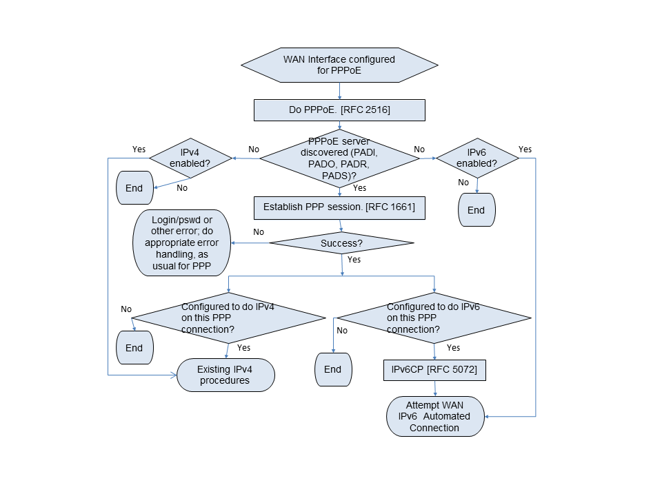{#fig:wan-pppoe}

## WAN IPv6 Automated Connection Flow {#wan-ipv6-automated-connection-flow .new-page}

This flow assumes no manually configured prefix or address.

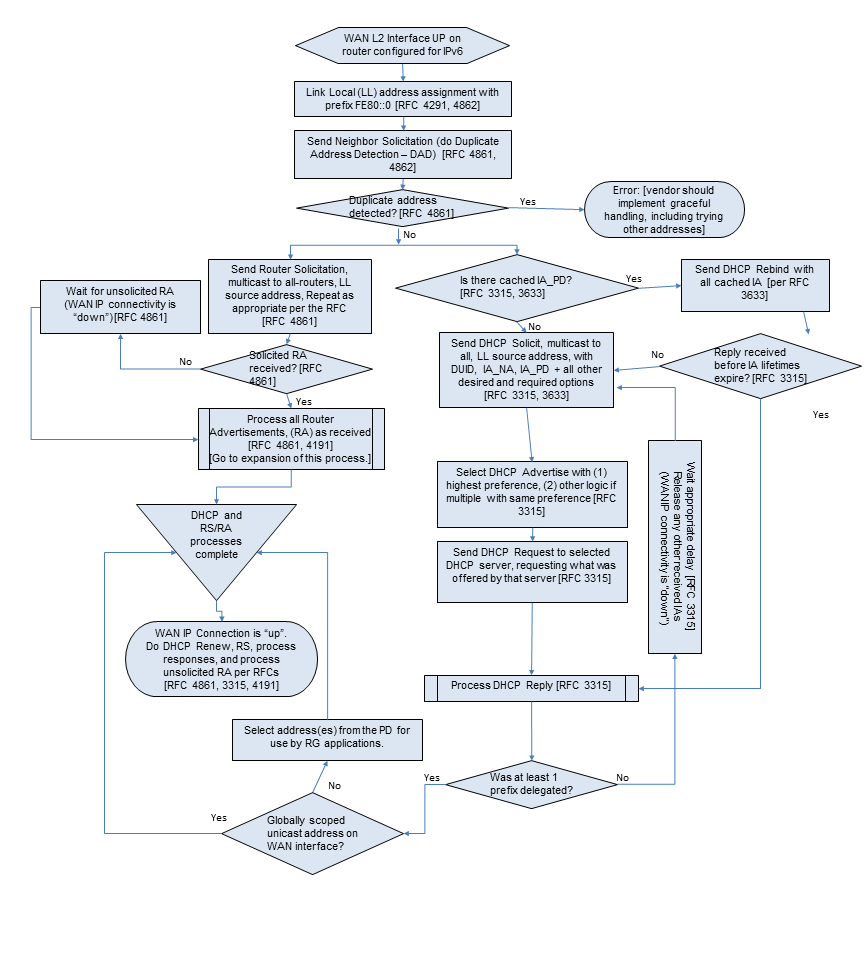{#fig:wan-ipv6}

## Receive Router Advertisement Subroutine Flow {#receive-router-advertisement-subroutine-flow .new-page}

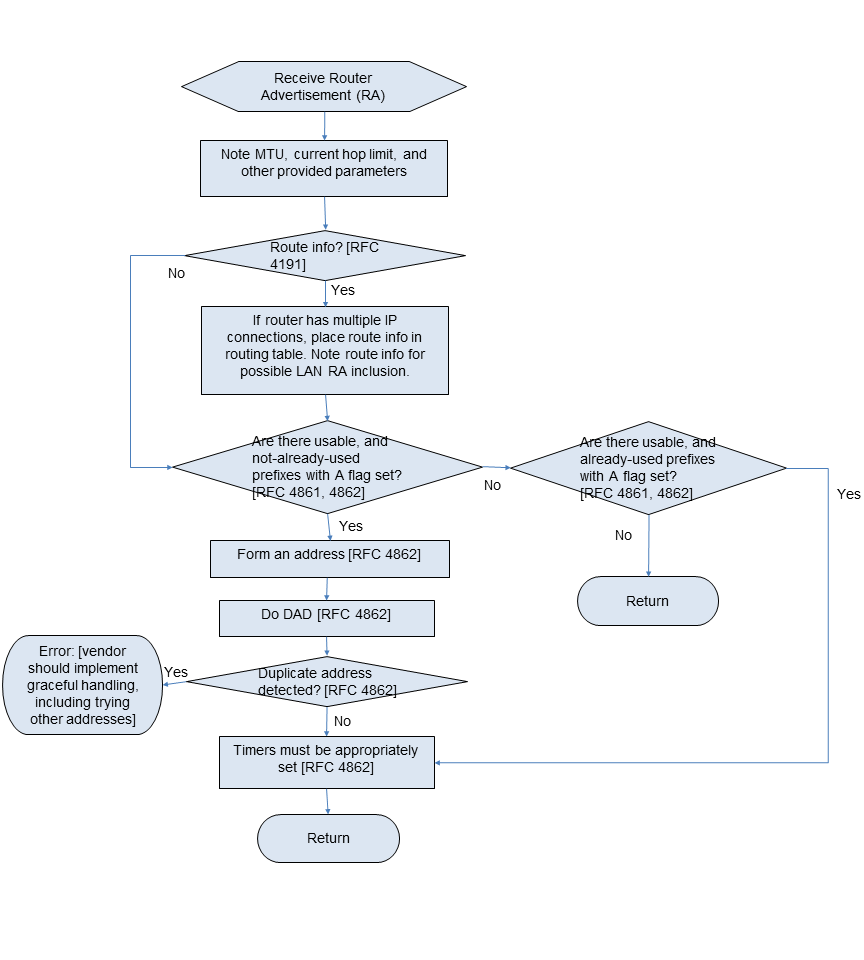{#fig:router-advertisement}

# Application Level Gateway (ALG) and Port Forwarding List {#application-level-gateway-alg-and-port-forwarding-list .appendix .new-page}

This appendix is a partial list of applications and protocols that
should work through the usage of predefined port forwarding
configurations and ALGs. It is not a comprehensive list of all
applications. It is expected that support for more applications will be
needed with time.

**D**

DNS Server

**F**

FTP Client, FTP Server, FW1VPN

**H**

H.323, HTTP Server, HTTPS Server

**I**

ICMP Echo, IIMAP Client, IMAP Client v.3, IMAP server, Internet Phone,
Internet Phone Addressing Server, IPsec Encryption, IPsec ESP, IPsec
IKE, IRC

**L**

L2TP

**M**

mIRC DCC, IRC DCC, mIRC Chat, mIRC IDENT

**N**

NNTP Server, NTP

**P**

POP Client, POP3 Server, PPTP

**R**

RDP, Remote Desktop 32Rlogin/Rcp, RTSP

**S**

SDP, SIP, SMTP Server, SQL\*NET Tools, SSH Secure Shell, SSH Server

**T**

Telnet Server

**U**

USENET News Service

**W**

Web Server, Windows 2000 Terminal Server

**X**

X Windows, XP Remote Desktop

# Example Queuing for an RG {#example-queuing-for-an-rg .appendix .new-page}

This section presents the queuing and scheduling discipline envisioned
for upstream traffic through the RG in support of future service
offerings delivered over the architecture described in TR-059.

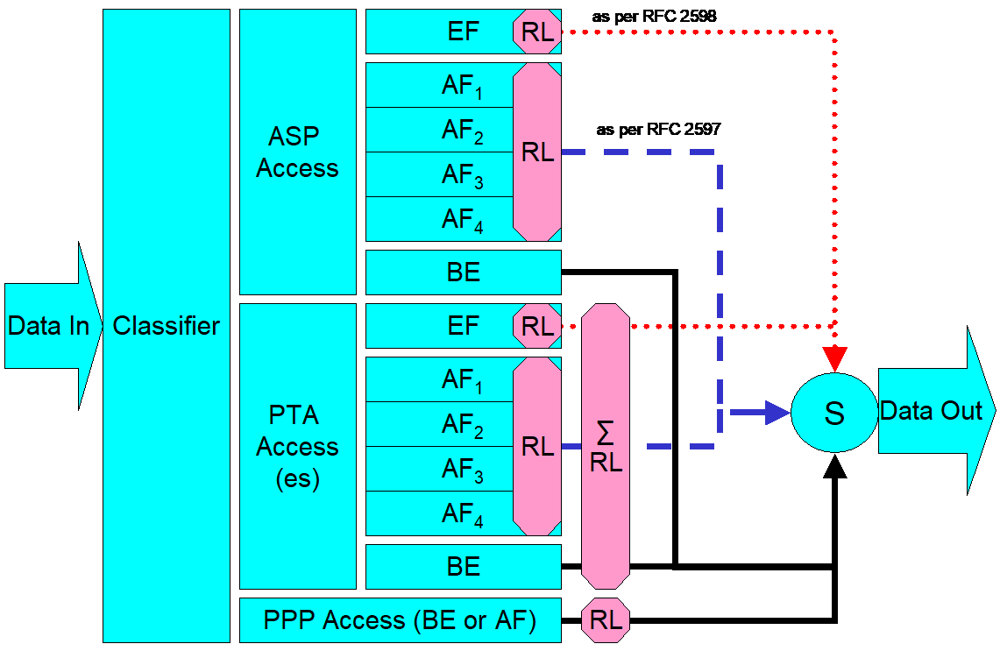{#fig:queuing-and-scheduling}

In Figure 5, the following abbreviations apply:

ASP -- Application service provider

PTA -- PPP terminated aggregation

PPP -- Point-to-point protocol

EF -- Expedited forwarding -- as defined in IETF RFC 3246

AF -- Assured forwarding -- as defined in IETF RFC 2597

BE -- Best effort forwarding

RL -- Rate limiter

∑RL -- Summing rate limiter (limits multiple flows)

S -- Scheduler

Multiple access sessions are supported in this model. However, all
traffic is classified and scheduled in a monolithic system. So, while it
might appear at first that the Diffserv queuing and scheduling might
apply only to IP-aware access, in fact all access, IP, Ethernet, or PPP
is managed by the same system that adheres to the Diffserv model.

For example, at the bottom of Figure 5, BE (best effort) treatment is
given to the non-IP-aware access sessions (PPPoE started behind the RG
or delivered to an L2TP tunnel delivery model). This queue might be
repeated several times in order to support fairness among multiple PPPoE
accesses, or it might be a monolithic queue with separate rate limiters
applied to the various access sessions.

The PTA access is a single block of queues. This is done because NSP
access typically works with a single default route to the NSP, and
managing more than one simultaneously at the RG would be perilous. The ∑
rate limiter would limit the overall access traffic for a service
provider.

Rate limiters are also shown within the EF and AF service classes
because the definition of those diffserv types is based on treating the
traffic differently when it falls into various rates.

Finally, at the top of the diagram is the ASP access block of queues. In
phase 1A of the TR-059 architecture, these queues are provisioned and
provide aggregate treatment of traffic mapped to them. In phase 1B, it
will become possible to assign AF queues to applications to give them
specific treatment instead of aggregate treatment. The EF service class
may also require a high degree of coordination among the applications
that make use of it so that its maximum value is not exceeded.

Notable in this architecture is that all the outputs of the EF, AF, and
BE queues are sent to a scheduler (S) that pulls traffic from them in a
strict priority fashion. In this configuration EF traffic is, obviously,
given highest precedence and BE is given the lowest. The AF service
classes fall in between.

Note that there is significant interest in being able to provide a
service arrangement that would allow general Internet access to have
priority over other (bulk rate) services.[^1] Such an arrangement would
be accomplished by assigning the bulk rate service class to BE and by
assigning the default service class (Internet access) as AF with little
or no committed information rate.

Given this arrangement, the precedence of traffic shown in the figure is
arranged as:

EF -- red dotted line

AF -- blue dashed line (with various precedence among AF classes as
described in IETF RFC 2597)

BE -- black solid line

# Routed Architecture -- Examples of Potential Configurations {#routed-architecture-examples-of-potential-configurations .appendix .new-page}

## Introduction

The pictures and descriptions in the following scenarios are intended to
provide examples of the interworking of many of the requirements in this
document.

Since the single PC case is a simple subset of the multi-PC case (except
when explicitly using the single PC mode of operation (LAN.DHCPS.19)),
it will not be directly addressed. The network used in this sequence of
examples has 5 PCs, which are described as being connected over
Ethernet. For purposes of these scenarios, neither the physical network
nor the nature of the attached devices is significant.

## Basic RG as Router Initiating One or More PPPoE Sessions

The four scenarios that follow build on one another to describe a number
of the capabilities required in this document. They show PPPoE being
used in all cases for WAN connectivity, with the embedded DHCP server in
the RG enabled.

### No WAN Connection

-   The router has no WAN connection up.

-   The router has been configured to give PC2 its WAN address via its
    embedded DHCP server. Since the router has no WAN connection, it
    will give PC2 a private address with a 10 minute lease time (as
    defined in LAN.DHCPS.12).

-   PC5 has been configured with a static IP address.

-   PCs 1-4 are configured to make DHCP requests. The router responds to
    all DHCP requests with IP addresses in the range of 192.168.1.64 to
    192.168.1.253 (LAN.DHCPS.8), an IP gateway address (and LAN-side
    address of the device) of 192.168.1.254 (LAN.DHCPS.14), a DNS server
    address of 192.168.1.254 (LAN.DNS.1) and an IP address lease time
    for all PCs but PC2 of 24 hours (LAN.DHCPS.11).

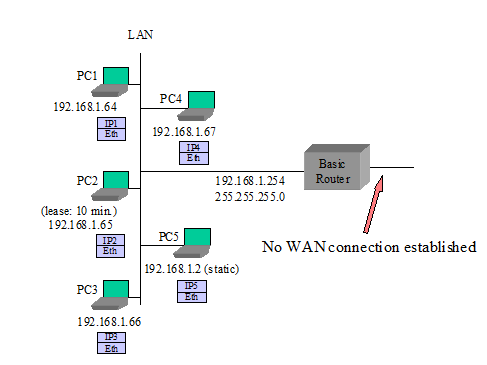{#fig:no-wan-connection}

### Router Sets Up PPPoE to an ISP

This scenario is the same as presented in the "No WAN Connection"
example above with the following exceptions:

-   The router sets up a PPPoE session to ISP -- it obtains an IP
    address and DNS server addresses via IPCP (WAN.PPP.1)

-   The router gives its public IP address to PC2 (LAN.DHCPS.18) when
    PC2's lease expires.

-   The router is configured to allow PC2 to communicate with other
    devices on the LAN (LAN.ADDRESS.8).

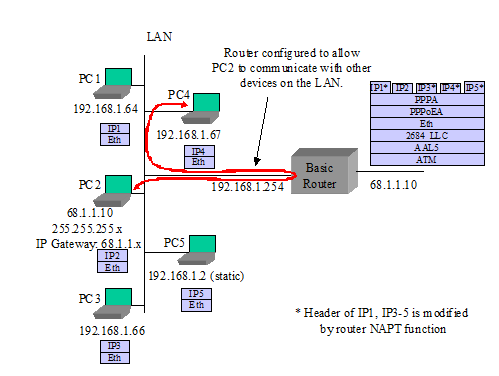{#fig:isp-pppoe}

### PC3 Sets Up Its Own PPPoE Session

This scenario is the same as presented in [III.2.1](#no-wan-connection)
with the following exceptions:

-   PC3 uses a PPPoE client to establish its own PPPoE session. While
    the private IP address from the router is still associated with
    PC3's Ethernet interface, PC3 also has a public IP address
    associated with its own PPPoE interface. Common behavior is for all
    IP traffic of PC3 to now use this PPPoE interface (WAN.PPP.10,
    LAN.FWD.5).

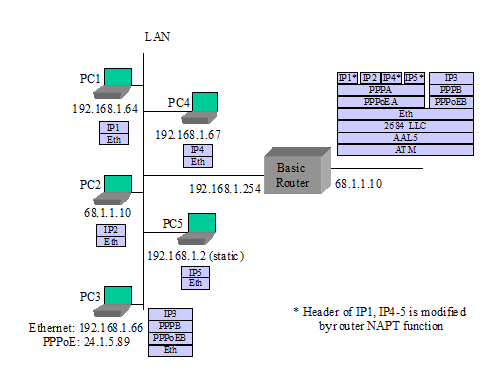{#fig:pc3-pppoe}

### Router Sets Up a Second PPPoE Session

This scenario is the same as presented in [III.2.1](#no-wan-connection)
with the following exceptions:

-   The router sets up second PPPoE session (PPPoEC). It gets an IP
    address and DNS addresses through IPCP. It gets routing information
    from RIP-2 (LAN.FWD.15), manual entry, or other mechanisms
    (LAN.FWD.8). PPPoEA remains the default route (LAN.FWD.20).

-   PC5 requests a DNS lookup for a URL. The router sends simultaneous
    URL lookup requests to DNS servers on both PPPoE connections. The
    DNS server on the PPPoEA connection fails to resolve the URL and the
    PPPoEC connection returns an IP address. The router returns the IP
    address to PC5 (LAN.DNS.3).

-   PC5 sends IP packets to the returned IP address. The router
    determines from its routing table that this goes to the PPPoEC
    connection.

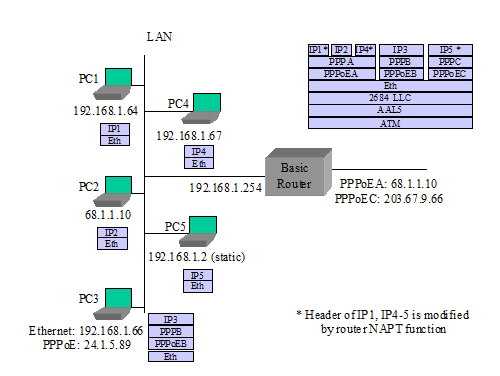{#fig:second-pppoe}

## "RFC 2684 Bridged" Mode

The next three scenarios deal IETF RFC 2684 bridged mode configuration
cases where the network is not expecting a PPP login or the router is
not doing PPP. The first case has the router using its DHCP client to
the WAN, acting as a DHCP server to the LAN, and doing routing and NAPT
to PCs on the LAN. The second case has the router not establishing a WAN
connection, and individual PCs setting up their own PPPoE sessions. In
the third case, the router's embedded DHCP server is also disabled, and
the PCs are getting IP addresses from the WAN.

### Router in IP-routed "RFC 2684 Bridged" Mode, Embedded DHCP Server On

-   The router provides an IP address to each device that it receives a
    DHCP request from.

-   PC5 uses a static IP address and does not send a DHCP request to the
    router.

-   The router has been configured to give PC2 its WAN address. When the
    router has no WAN connection, it gives PC2 a private address with a
    short lease time.

-   The router issues a DHCP request and establishes an IP session to
    the WAN (WAN.ATM.3, WAN.ATM.4, LAN.FWD.1).

-   The router gives its public IP address to PC2.

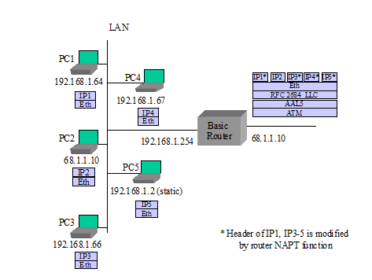{#fig:2684-dhcp-on}

### Router in Bridged Mode, Embedded DHCP Server On

-   The router provides a private IP address to each device that it
    receives a DHCP request from (LAN.DHCPS.3).

-   The router does not establish any IP or PPP sessions to the WAN.

-   No device can get a DHCP response from the WAN, since the router
    will intercept all DHCP requests that come to it.

-   PC1 and PC3 each use a PPPoE client to establish their own PPPoE
    sessions (WAN.PPP.10, LAN.FWD.5). While the private IP address from
    the router is still associated with their PC Ethernet interfaces,
    PC1 and PC3 also have a public IP address associated with their
    respective PPPoE interfaces. Common behavior is for all IP traffic
    of PC1 and PC3 to now use their own PPPoE interfaces.

-   PCs that do not establish their own PPPoE connection cannot connect
    to the WAN, but they can communicate with other PCs on the LAN.

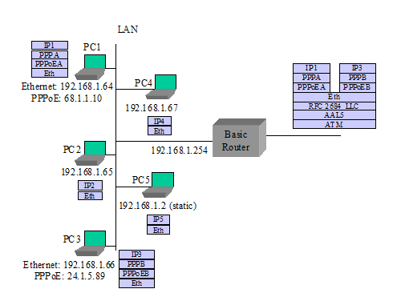{#fig:bridge-dhcp-on}

### Router in Bridged Mode, Embedded DHCP Server Off

-   The router does not establish any IP or PPP sessions to the WAN.

-   All DHCP requests are bridged onto the WAN (WAN.BRIDGE.1).

-   In this example, PC5 does not have a static IP address.

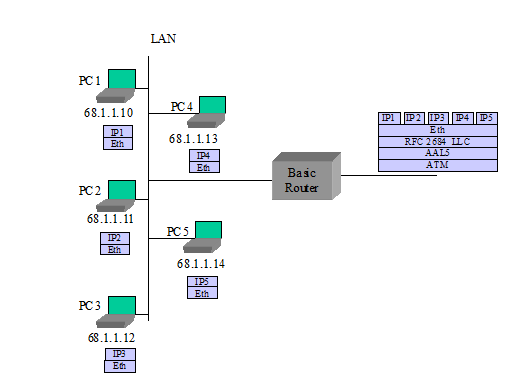{#fig:bridge-dhcp-off}

## Single PC Mode of Operation

-   The router is configured to use the single PC mode of operation
    (LAN.DHCPS.19).

-   The router's embedded DHCP server is on. The embedded DHCP server
    has only one address lease available in this case.

-   PC1 is the first device seen, so it is identified as the "single
    PC".

-   PC1 is provided with a private IP address and 1:1 NAT is performed
    between the WAN and PC1 by the router. The subnet mask sent to PC1
    is 255.255.255.0.

-   Alternately PC1 could be given the router's public address instead,
    as with PC2 in the scenarios in section
    [III.2](#basic-rg-as-router-initiating-one-or-more-pppoe-sessions).

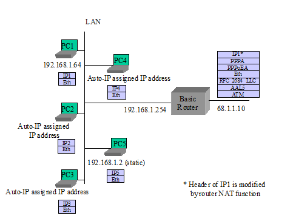{#fig:single-pc}

## Simultaneous IP and PPPoE WAN Sessions

TR-059 requirements have PPPoE and IP sessions running simultaneously
over the same PVC. Here are some examples of how this might look,
assuming the network is capable of terminating PPPoE and IP at the same
time on the same PVC.

Note: Simultaneous IP and PPPoE is not well supported in the network
today. Most equipment terminating the ATM PVC does not support both IP
and PPPoE connections at the same time.

### Router in IP-routed "2684 Bridged" Mode, Embedded DHCP Server On

-   The router provides an IP address to each device that it receives a
    DHCP request from.

-   PC5 uses a static IP address and does not send a DHCP request to the
    router.

-   The router has been configured to give PC2 its WAN address. When the
    router has no WAN connection, it gives PC2 a private address with a
    10 minute lease time.

-   The router issues a DHCP request and establishes an IP session to
    the WAN.

-   The router gives its public IP address to PC2.

-   PC3 uses a PPPoE client to establish its own PPPoE session
    (WAN.PPP.10, LAN.FWD.5). While the private IP address from the
    router is still associated with PC3's Ethernet interface, PC3 also
    has a public IP address associated with its own PPPoE interface.
    Common behavior is for all IP traffic of PC3 to now use this PPPoE
    interface.

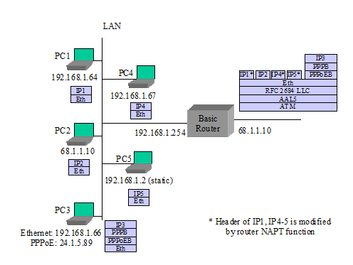{#fig:routed-2684}

### Router Sets Up IP as a Second Session

Assuming the scenario in section
[III.2.3](#pc3-sets-up-its-own-pppoe-session) as a base, add:

-   The router sets up connection IPC (LAN.FWD.19). It gets an IP
    address and DNS addresses through a DHCP client request. It gets
    routing information from RIP-2 (LAN.FWD.15). PPPoEA remains the
    default route.

-   PC5 requests a DNS lookup for a URL. The router sends simultaneous
    URL lookup requests to DNS servers on both connections. The DNS
    server on the PPPoEA connection fails to resolve the URL and the IPC
    connection returns an IP address. The router returns the IP address
    to PC5 (LAN.DNS.3).

-   PC5 sends IP packets to the returned IP address. The router
    determines from its routing table that this goes to connection IPC.

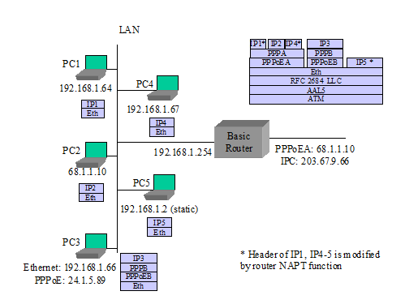{#fig:second-ip}

## Router Embedded DHCP Server Gives Out Public IP Addresses (from use of IPCP extension)

-   The router initially gives private IP addresses to PCs, before
    setting up its PPPoE session.

-   The router sets up PPPoE to ISP and gets IP address and DNS server
    addresses via IPCP. It also gets a subnet mask via an IPCP extension
    (WAN.DHCPC.1, WAN.PPP.12).

-   The router gives public IP addresses to certain PCs when they issue
    DHCP requests again (LAN.DHCPS.18).

-   PC5 is set for static IP and does not issue a DHCP request.

# Bridged Architecture -- Examples of Potential Configurations {#bridged-architecture-examples-of-potential-configurations .appendix .new-page}

## Introduction

The pictures and descriptions in the following scenarios are intended to
provide examples of the bridge interworking of many of the requirements
in this document.

The network used in this sequence of examples has 5 PCs, which are
described as being connected over Ethernet. For purposes of these
scenarios, the physical network and the exact nature of the connected
devices are not relevant.

## Managed Bridge

-   The RG will have an IP address for management as (described in
    section WAN.BRIDGE), which is obtained using a DHCP client on the
    WAN interface. This address can also be used for other gateway
    originated services such as an attached telephony device.

-   The DHCP server of the RG is configured with the appropriate IP
    address range and subnet mask by the Controller.

-   The PCs are configured to use DHCP for assignment of an IP address.
    All DHCP requests from the PCs are processed by the DHCP server
    (described in section LAN.DHCPS\] on the RG. Note that the scope of
    these addresses is specific to the service provider network
    (i.e. they may be public or private depending on the access network
    design). If private, it is assumed that the service provider has the
    NAT functionality in its network.

-   All subsequent data exchanges between the PCs and the RG are
    performed using 802.1D bridging techniques (described in section
    WAN.BRIDGE).

-   The RG filters specific message types (e.g. UPnP or DHCP) from being
    sent to the WAN (described in section LAN.FW).

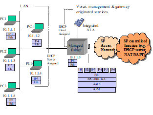{#fig:managed-bridge}

### Local Management

-   The RG may allow access to a local management interface via a
    default address (described in section LAN.ADDRESS).

## Unmanaged Bridge

-   The RG does not establish any layer 3 connectivity to the WAN.

-   All DHCP requests from the PCs are bridged to the WAN (described in
    section WAN.BRIDGE).

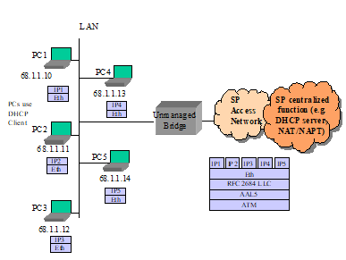{#fig:unmanaged-bridge}

### Local Management

-   The RG may allow access to a local management interface via a
    default address (described in section LAN.ADDRESS).

# Sealing Current References {#sealing-current-references .appendix .new-page}

Sealing current is also known in the telecommunications industry as
wetting current. Sealing current may be sourced by the ATU-C in certain
service providers that deploy "dry loop" DSL circuits, meaning that DSL
is delivered in the absence of typical central office or remote terminal
fed analog POTS service on the copper pair.

The following functional diagram depicts a sealing current circuit
design specified in the IF.WAN.SEALING optional module that can be
implemented on an xDSL residential gateway.

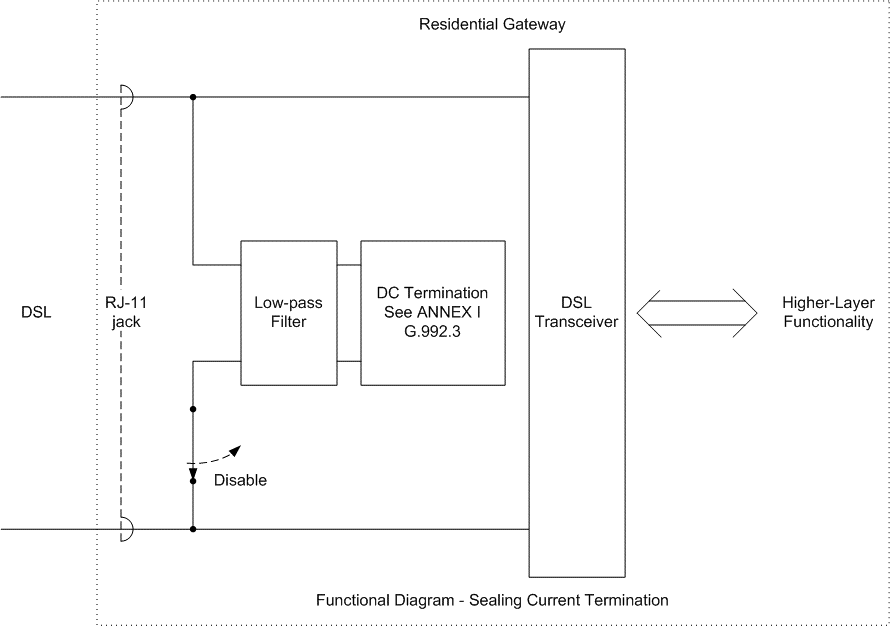{#fig:sealing-reference}

# Product Profile Template {#product-profile-template .appendix .new-page}

## Introduction

To accommodate the many different residential gateway implementations
that will be needed due to various localized market needs, LAN/WAN
interfaces, and different services that will be delivered in operators'
networks, %bbfNumber% endeavors to define a superset of general
requirements and optional modules that can be implemented on a
residential gateway.

In order to create a specific product based on the %bbfNumber%
modularized requirements, it is necessary for either the Broadband Forum
(in the form of new TR documents) or for individual network operators to
specify the following details to define a specific desired product
implementation:

1.  A filled out product profile matrix template as shown in the example
    below to indicate required modules

2.  Any line item edits to requirements (changes to current %bbfNumber%
    requirements).

3.  Any additional new requirements that are needed in the product.

4.  Any configuration defaults needed. These should refer to %bbfNumber%
    requirements that establish a different or new default value
    required in the implementation.

5.  Localized regulatory, certifications, powering and product labeling
    requirements as necessary.

## Instructions for Completing a Product Profile Template

The following instructions apply to filling out the product profile
template below:

-   Any modules marked with a check mark will be considered
    required, meaning that all MUST requirements in that section are to
    be satisfied (with the exception of any specific line item edits
    that have been made as discussed in section
    [VI.1](#introduction-2)).

-   Any modules that are *not* marked with a check MAY be implemented on
    the product, but are not considered required. Any vendor
    implementing any module, regardless of being considered required or
    not, MUST comply with all MUST requirements in the module
    (i.e. partial implementations of a module MUST NOT be provided).

-   If a module is explicitly not to be included in the product, it must
    be marked with an x mark to indicate that it MUST NOT be included.

-   For the optional LAN/WAN modules, where appropriate it may be
    necessary to specify the number or ports/lines to be implemented
    (e.g. "Qty. 4" under the IF.LAN.ETH.SWITCH to indicate 4 ports).

## Product Profile Template

  -------------------------------------------------------------------------------------
  Section                          Title                                  Required?\
                                                                          (check,x , or
                                                                          blank)
  -------------------------------- -------------------------------------- -------------
  **GEN**                          **General Device Requirements**

  DESIGN                           Design

  OPS                              Device Operation

  NET                              Networking Protocols

  NETv6                            IPv6 Networking Protocols

  **WAN**                          **Wide Area Networking (WAN)**

  ATM                              ATM

  ATM.MULTI                        ATM Multi-PVC

  CONNECT                          Connection Establishment

  CONNECT.ON-DEMAND                On-Demand Connection Establishment

  ETHOAM                           Ethernet OAM

  BRIDGE                           Bridging

  DHCPC                            DHCP Client (DHCPv4)

  DHCPC.FORCE                      Force renew

  DHCPC.BFDecho                    BFD echo

  DHCPC.BFDKA                      BFD Keep-alive

  DHCPv4                           DHCP Client (DHCPv4)

  DHCPv4.ERP                       EAP Reauthentication (ERP) for DHCPv4

  DHCPv6                           DHCP Client (DHCPv6)

  DHCPv6.ERP                       EAP Reauthentication (ERP) for DHCPv6

  IPv6                             IPv6 WAN Connection

  TRANS.6rd                        6rd Transition Mechanism

  TRANS.DS-LITE                    Dual Stack Lite Transition Mechanism

  TRANS.V4-release-control         IPv6 connectivity with content-based
                                   IPv4 release control transition
                                   mechanism

  TRANS.MAP-E                      IPv6 connectivity with content-based
                                   IPv4 release control transition
                                   mechanism

  PPP                              PPP Client

  PPP.IPv6                         PPP Client for establishment of IPv6
                                   connection

  dot1x                            802.1x Client

  DoS                              Denial of Service Prevention

  QoS                              Quality of Service

  QoS.VLAN                         VLAN based QoS

  QoS.TUNNEL                       Quality of Service for Tunneled
                                   Traffic

  IPsecClient                      IPsec VPN peer to peer

  L2tpClient                       L2tp VPN Remote Access

  PCP                              Port Control Protocol

  WAN.TUN                          WAN Tunnel

  **LAN**                          **Local Area Networking (LAN)**

  GEN                              General LAN Protocols

  ADDRESS                          Private IPv4 Addressing

  ADDRESSv6                        LAN IPv6 Addressing

  DHCPS                            DHCPv4 Server

  DHCPv6S                          DHCPv6 Server

  DNS                              Naming Services (IPv4 and general
                                   requirements)

  DNSv6                            Naming Services (IPv6)

  NAT                              NAT/NAPT

  PFWD                             Port Forwarding (IPv4)

  PFWDv6                           Port Forwarding (IPv6)

  ALG                              ALG Functions (IPv4)

  FWD                              Connection Forwarding

  IGMP.BRIDGED                     IGMP and Multicast in Bridged
                                   Configurations (IPv4)

  IGMP.ROUTED                      IGMP and Multicast in Routed
                                   Configurations (IPv4)

  MLD.ROUTED                       MLD and Multicast in Routed
                                   Configurations (IPv6)

  FW                               Firewall (Basic)

  FW.SPI                           Firewall (Advanced)

  FILTER.TIME                      Time of Day Filtering

  FILTER.CONTENT                   Content Filtering

  DIAGNOSTICS                      Automated User Diagnostics

  CAPTIVE                          Captive Portal with Web Redirection

  QOS                              LAN quality of service requirements

  SIPserver                        SIP Server

  SIPmixer                         SIP Mixer

  Interworking.UE-Authentication   3GPP User Equipment Authentication
                                   Support

  **MGMT**                         **Management & Diagnostics**

  GEN                              General

  UPnP                             UPnP

  UPnP.IGD                         UPnP IGD

  UPnP.IGD.ACRF                    UPnP IGD to allow Connection Request
                                   Forwarding

  LOCAL                            Local Management

  LOCAL.TR-064                     TR-064 Issue 2

  REMOTE.TR-069                    Remote Management (TR-069)

  REMOTE.USP                       Remote Management (USP)

  REMOTE.WEB                       Remote Management (Web Browser)

  NTP                              Network Time Client

  MGMT.DATCOL                      Data collection Requirements

  MGMT.DATCOL.WIFIDIAG             Wi-Fi Diagnostics Data Collection

  **IF.WAN**                       **WAN Interface Modules**              **Enter
                                                                          Quantity**

  ADSL                             ADSL and ADSL2+

  VDSL2                            VDSL2

  xDSL                             xDSL General Requirements

  xDSL.INP                         xDSL INP Values

  xDSL.BOND                        xDSL Bonding

  xDSL.REPORT                      xDSL Reporting of Physical Layer
                                   Issues

  xDSL.SEALING                     DC Sealing Current

  xDSL.SURGE                       AC Power Surge Protection

  ETH                              Ethernet (WAN)

  GPON                             GPON

  XG-PON                           10G PON

  XGS-PON                          XGS PON

  MoCA                             MoCA (WAN)

  **IF.LAN**                       **LAN Interface Modules**              **Enter
                                                                          Quantity**

  ETH                              Ethernet (LAN)

  ETH.SWITCH                       Ethernet Switch

  USB.PC                           USB (PC)

  VOICE.ATA                        Voice ATA Ports

  WIRELESS.AP                      Wireless: General Access Point
                                   Functions

  WIRELESS.AP.WEP                  Wireless: Wired Equivalent Privacy

  WIRELESS.AP.WPA2                 Wireless: WPA2-Personal

  WIRELESS.AP.WPA3                 Wireless: WPA3-Personal

  WIRELESS.AP.WPA2-Enterprise      Wireless: WPA2-Enterprise

  WIRELESS.AP.WPA3-Enterprise      Wireless: WPA3-Enterprise

  WIRELESS.AP.ERP-Authenticator    Wireless: ERP Authenticator

  WIRELESS.11g                     Wireless: 802.11g Access Point

  WIRELESS.11a                     Wireless: 802.11a Access Point

  WIRELESS.11h                     Wireless: 802.11h Access Point

  WIRELESS.11n                     Wireless: 802.11n Access Point

  WIRELESS.11ac                    Wireless: 802.11ac Access Point

  WIRELESS.11ax                    Wireless: 802.11ax Access Point

  HomePNA                          HomePNA (Phoneline/Coax)

  MoCA                             MoCA (LAN)

  HomePlugAV                       HomePlug AV (LAN)

  HomePlugAV2                      HomePlug AV2 (LAN)

  Ghn                              G.hn

  **SEC**                          **Security**

  GEN                              General security

  USERINTERFACE                    User Interface security

  **RGSMART**                      **Smart Residential Gateway**

  OPLAT                            Open platform Support

  OPLAT.OSGI                       Open platform Support : OSGI Open
                                   platform

  OPLAT.EE                         Open platform Support : Execution
                                   Environment

  **REGIONAL**                     **Regional Annexes**

  NA.Power                         North American Power and Environmental

  NA.LED                           North American LED Indicators
  -------------------------------------------------------------------------------------

!include back-matter.md

[^1]: This "bulk rate" service class would typically be used for
    background downloads and potentially for peer-to-peer applications
    as an alternative to blocking them entirely.
